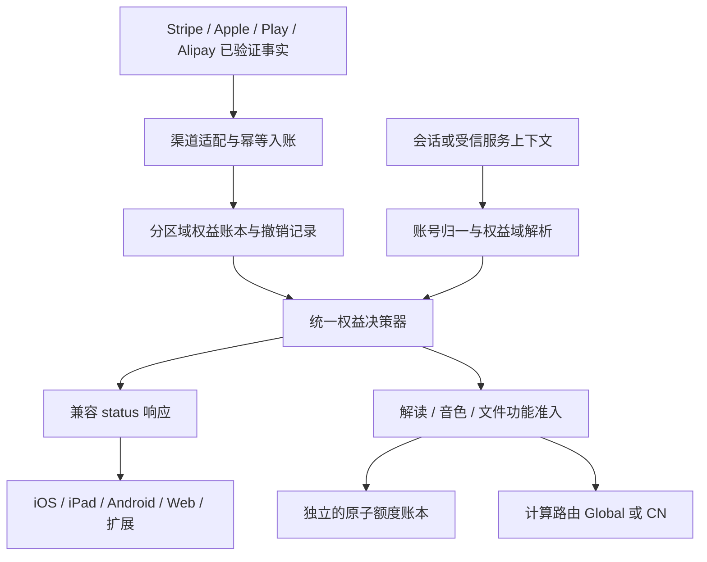

# CastReader Pro：结构性审计、统一设计与修复验收计划

> 阶段记录归档：本文保留当时的计划、验证与发布状态。2026-09-25 后续客户端修复、送审状态及用户核查结论，以 [本轮交付汇总](CastReader-Pro-Release-Closure-2026-09-25.md) 和现行 [Pro 一致性标准](Pro一致性标准.md) 为准；早期到期计时器等设想不覆盖最终移动端实现。

日期：2026-09-24。状态：结构性方案与证据基线；不是“全部修复完成”或上线回执。

**实施状态更新（2026-09-25）：** 首批后端修复已全部发布至官网、全球 API 和中国区 QuickRead，生产交叉验证通过；其他审计阶段并未因此完成。实际版本、验证与未完成边界见 [后端发布回执](CastReader-Pro-Backend-Release-2026-09-24.md)。下文早期候选状态保留为审计历史，不能当成当前生产状态；未来 periodStart 的严格拒绝暂未实施，原因见回执。

本计划替代“某个投诉账号恢复就算完成”的处理方式。投诉仅作回归样本，修复按共同原因及不变量组织。当前约束：不要求已发布客户端升级、不打断线上服务、不手工补 Pro 掩盖错误。有效试用保留 Pro；试用到期未付费撤销。

**2026-09-24 补充约束：权益正确与播放连续性同为发布门禁。** 不把会员修复变成每段、每块、每次 TTS 的同步查库；保留已验证的超时预算、请求合并、续块免重复消费和故障容错。`Unknown` 是会员事实的未知，不等于“必须暂停”。已知到期须撤销 Pro，临时查询失败则不能伪装成到期。详见[播放连续性补充合同](CastReader-Pro-Playback-Continuity-Contract-2026-09-24.md)。本补充优先于文中可能被理解为查询异常即拒绝的表述。

## 1. 当前结论与发布状态

Pro 不是一个孤立的 bool。完整链路是：**渠道支付事实 → 正确账号的权益账本 → 统一有效期判定 → 服务端功能准入 → 各客户端的状态投影**。目前这五层之间存在平行实现、地域混淆和错误语义混用。仅修 status 接口不足以保证一致。

已准备的两组兼容修复暂不作为整体方案交付：

- API PR 43 已合入 beta，源码 `2be6b41378464a4210f0ea74202db285ebd6ace8`；候选 `readout-ezjqa59aa-castreader.vercel.app` 在新增 Pro 真数据门禁失败，生产别名未切换。5 类公开会员样本通过，移动历史安装冲突探针收到 503。源码发现候选域名不在移动入口白名单；仍须以运行日志/定向测试核实该次 503 的具体来源，不能把它宣称为客户生产故障。
- 官网 PR 2，源码 `2dffb2a`；候选 `castreader-content-k8v44kbro-castreader.vercel.app` 未提升到生产。首页、中文首页、App 页、Read & Explain、Pricing、未登录 checkout 和欠费样本的 HTTP 检查通过；不等于完整跨端验收。
- 中国区未部署；没有修改客户订阅、付款、免费试用、设备归属；没有发布 Chrome/iOS/Android 新版。
- 现有候选中取消服务端权益缓存的方案仍需复核查询次数与延迟；不能仅因数据更及时就放行上线。支付渠道核验、历史对账不进入朗读或解读的实时请求路径。

## 2. 证据等级

- **线上确认**：实际配置、只读数据库或线上响应已观察到。
- **源码确认**：已确定实现存在该分支/缺口，尚不能断言每个客户都触发。
- **待验证风险**：需渠道记录、故障注入或重放才能定性；不据此批量改权益。

客户身份、令牌、支付详情只留在私有审计目录，不进本设计或公共测试夹具。

### 已执行的离线基线

- 结构一致性基线：104 项检查，75 通过、29 失败。执行真实策略/路由代码，注入合成账号与账本；失败覆盖过期判定、未来起点、身份归一、权益域与计算域耦合，以及两个 402 类清理分支。29 是重复入口在内的失败检查数，不代表 29 起线上事故。当前候选仍未全部通过。
- 连续性基线：扩展启动/缓存 19 项通过；与 CN 已捕获运行基线对应的 QuickRead 故障、任务恢复、额度准入等 38 项通过。包括内部额度服务不可用不变业务拒绝、续块不扣费、断线重连不重复消费，以及 20 个续块等待者共享一次生成。
- 上述均为本地离线测试，不是实机连续听书/真实弱网/全部版本已验收。小时级运行、实际播放间隙、线上查询量与 p95 延迟仍未测量，禁止标记 PASS。

## 3. 问题总表

| 编号 | 层级 | 发现及证据等级 | 共同原因 | 修复完成的证据 |
|---|---|---|---|---|
| P01 | 有效权益 | 同一欠费账号 `.com` 返回 Pro，`.ai`/API 返回 Free；线上确认 | 官网额外给 past_due 三天宽限，API 没有 | 同一时刻、同一账号、所有入口同一判定，含到期边界 |
| P02 | 身份 | status 会归一 provider id/email，entitlement 与 consume 直接查原 user_id；源码确认 | 展示与业务准入使用两套账号解析 | canonical ID、provider ID、已验证会话映射到同一主体；不同账号不得借设备串权 |
| P03 | 权益域/计算域 | CN QuickRead worker 的 PRO_ENTITLEMENT_URL 为本机 3000 中国账本；扩展账户页为全球账本；线上确认 | 把计算地域误当作账号权益归属 | 全球扩展经 CN 计算仍查全球权益；CN 原生用户仍只查 CN 账本 |
| P04 | 状态接口 | 历史安装归属冲突在非 Pro 时返回 409，阻断新的 false；线上及源码确认 | 增长赠额/安装归属阻塞会员主结果 | 安装冲突下 true/false 都可返回；旧账户赠额不转移、不重发 |
| P05 | 错误分类 | profile、计划名、额度或增长查询失败可让整个会员状态不可用；源码/隔离测试确认 | 辅助信息与会员事实捆绑失败 | 分别注入故障，主权益仍正确；主权益库故障明确 unknown |
| P06 | 缓存 | 后端曾缓存会员/归属；扩展还有 60 秒缓存；移动保留上次布尔值；源码确认 | 没有统一 freshness、身份代际和到期上限 | true→false→true、换账号、迟到响应、断网跨过期等序列测试 |
| P07 | 客户端 | iOS/Android 本地商店 Pro 与 serverPro 做 OR；源码确认 | “商店临时可用”和“已同步账号权益”混为最终权威 | 正式客户端新协议中两者可解释、有限期；本轮明确旧版边界 |
| P08 | 错误恢复 | QuickRead 402 类分支展示付费墙后漏 onClose/占用释放；1.2.45 源码确认 | 清理代码按错误分支散落，缺统一终止状态 | 每种错误结束后 Listen 可启动，重试不继承旧会话 |
| P09 | 渠道入账 | 官网 Stripe 处理失败返回 503，API 历史 handler 吞错 200；源码确认，实际 webhook 启用情况仍需逐商户核验 | 多套支付写入器，可靠性合同不同 | 验签、重投、重复事件、DB 失败后重放均不丢失/重复授予 |
| P10 | 乱序与退款 | Stripe 直接 upsert 事件快照；退款按 customer 撤多条订阅；普通 reconcile 又按渠道状态 upsert；源码确认，客户影响待重放 | 可重放支付事实与可覆盖状态表未分离 | 旧事件不能覆盖新权益；退款只影响对应周期/购买；对账不复活已撤销周期 |
| P11 | 多渠道/多商户 | 历史 Stripe 商户不止一个；本机 DB 配置 key 与投诉订单商户不同；线上核验 | 缺显式 merchant/environment 维度，凭据 fallback 隐蔽 | 每个购买唯一落到 provider+merchant+environment+purchase；查错商户不得视为无订阅 |
| P12 | 免费额度 | entitlement 先查余额再加一，incr 无条件加；consume 有独立判权；源码确认 | 准入与记账非原子且重复实现 | 最后一份额度并发仅一个成功；重试/续块不重复扣；Pro 不读/不扣免费额度 |
| P13 | 公共旧协议 | user_id/email/device 是可伪造提示，不能成为受保护功能的身份认证；架构确认 | 展示兼容协议承担了授权职责 | 新入口只信会话/服务端签名上下文；旧协议限制明确，不将邮箱匹配升级为认证 |
| P14 | 无身份音频 | 已发布预设 TTS 存在匿名请求；源码确认 | 服务器无法把该请求绑定到订阅者 | 本轮不破坏旧朗读；需要后续认证客户端迁移才能严格统一准入 |
| P15 | 文档/发布 | “Pro 一致性标准”仍含按 email 自动修复绑定等旧规则；候选 Pro 认证路径此前未完整验收 | 文档与执行门禁未绑定真实调用链 | 唯一合同、版本指纹、跨仓测试、不可变候选认证验收和回滚 |
| P16 | 播放连续性 | 旧实现专门保留了启动预算、会员不计免费额度、上报失败不停播、续块不重扣等保障；源码及本次 57 项离线回归确认 | 只修身份而收紧每次查询，可能把控制服务抖动重新传导到播放 | 已知有效 Pro 在注入额度故障时无误停；实时路径无新增权益查询；延迟/请求量不劣于基线 |

对新提供的邮箱，只读全球库找到账号但暂未找到关联订阅/设备绑定，中国库没有同邮箱账号；当前日志未匹配到该邮箱。**这不证明客户没有付款，也不证明复现页面用的是该邮箱**。还需核对邮件原始登录身份/支付渠道与记录，不得直接补权或撤权。

## 4. 必须保持的业务不变量

1. 身份主键是 `(accountRealm, canonicalUserId)`。IP、VPN、界面语言、LLM/TTS 计算地点均不能改变账号所属账本。
2. 默认只有经渠道验证且仍有效的已付权益、有效试用可授予 Pro。付款开始、checkout 完成、未来 periodEnd、客户端 Pro 标志都不能单独作为付款成功证据。
3. `now >= validUntil` 时该权益失效；使用服务端 UTC 时钟，明确起止区间 `[start, end)`。取消续费不抹掉已经支付且未到期的周期。
4. 同账号可有多条独立合法权益。某条失败、退款、到期不得撤掉另一条仍有效的购买。退款/撤销按购买及周期处理。
5. 状态查询、解读准入、克隆音色使用、上传文件 Reader 等必须使用同一份权益决策，不各自解释 subscription.status。
6. Pro 身份与免费额度分离：有效 Pro 不因免费额度为 0、读取失败或安装赠额冲突被误拦；非 Pro 也不能因查询异常获得无限权限。
7. 三态是 **Pro / Free / Unknown**。查询失败不能伪装 Free，也不能被持久化成已验证 Pro；但未知不等于暂停。会员事实更新与已准入的播放执行分离，容错只影响本次执行，不延长订阅或给账号补权。已有正确拒绝不因随后超时自动失效。
8. 查询不改设备归属、不合并用户、不补发权益。购买 claim 必须认证并校验购买所有者；不能靠 email 提示抢占购买。
9. 未完成渠道核验的历史行标记为待核验。不能因旧 order 账本缺失就一刀切撤掉真实付款用户，也不能无期限认可来源不明的 active。
10. 不以“无新投诉”“API 200”“单账号通过”代替完整验收。
11. 已确认 Pro 不依赖免费额度的读取或上报；播放回调、每段 TTS、每个音频片段与同一解读任务的续块不得增加同步权益查询。计量和会员后台刷新失败不暂停正在正常进行的播放。
12. 确定到期时更新会员状态，后续新任务走非 Pro 规则；已生成音频不清队列，已准入任务的恢复遵循既有边界。不借连续性把到期日顺延、把整本书无限视为一次永久授权，或新增商业宽限。旧客户端不能实现的部分列入 B。

### 已知例外与待定规则

- 用户已确认有效免费试用保留，到期未付费撤销。
- Apple/Google 已签发的有效 Billing Grace 与人工添加的宽限不同，须按平台可验证截止处理，不能暗中修改商店设置。Google 还可能有 silent grace。未来是否关闭可配置宽限另行决定。
- 人工/审核/支持授权独立分类、有期限、有来源；不计入付费。其存量处理问题已提出，未获答复前不批量撤销、不新增。
- 退款类型、争议和预付费年卡应按其支付合同落成测试，不用“凡退款就撤该 customer 全部 Pro”替代。

## 5. 目标架构



### 5.1 一个逻辑决策器，避免新增单点网络依赖

优先提取可测试的纯策略与同一数据访问接口，输入为已验证的区域主体、渠道权益事实、撤销事实及固定时钟。两个 Next.js 仓库使用同一版本的合同/策略制品，CI 校验不可变版本及摘要，禁止手工复制后各自演化。过渡期旧字段由 adapter 投影，不新增相互 fallback 的 Pro 接口。

不为了“统一”让每次 `.com` 状态查询都额外跨区请求另一个网站；共享规则与账本的归属才是统一，具体部署保留原有性能/地域边界。

建议内部决策：

```text
subject: { realm, canonicalUserId }
state: pro | free | unknown
basis: paid_period | active_trial | store_grace | explicit_grant | none
validUntil: UTC timestamp | null
reason: active | expired | unpaid | revoked | identity_unresolved | unavailable
policyVersion, decisionVersion, evaluatedAt
```

`unknown` 不返回可被旧客户端持久化的伪造 pro，也不能被机械映射成播放拒绝。已有 `pro/plan/account/额度` 类型继续兼容；新诊断字段为可选。账户/令牌、原始支付对象不进入公共响应或日志。

读路径只使用本地区域已归一的账号与有效期事实，不在请求内查询 Stripe/Apple/Play，也不拼接全历史账本。保持现有一次准入的执行边界；先利用现有缓存、并发合并和任务恢复能力。若缓存权益，必须绑定账号/realm、尊重已知截止与失效事件，不能把全禁缓存或每块重新查库当作默认正确方案。

### 5.2 账号身份与兼容接口

- 用户已明确：全球产品的官网、购买与会员对外主入口以 `castreader.com` 为准；旧 `castreader.ai` 页面不作为产品主入口验收重点。`api.castreader.ai` 保持现有 TTS/服务职责及已发布移动客户端的认证接口兼容。全球 Pro 使用同一规则与权威事实，不因两类部署而各自维护一套政策；不为统一而强制旧客户端改域名、迁移 cookie/session 或在每个音频请求中增加跨服务调用。CN 原生账号仍遵守独立 realm。
- 认证端点从 cms_ / Web session 解析 canonical 账号。客户端传入 uid/email 只能校验，不能覆盖 principal。
- 公共老 status 保留查询兼容，归一函数只读；明确账号不能继承旧设备 Pro。provider subject 需要处理跨 provider 冲突和歧义。
- 老 entitlement/consume 的请求必须经过同一归一适配器，禁止直接查 provider subject 为订阅 owner。这里仍是老协议的兼容，不宣称提供了新的强认证。
- 新的受保护业务不复用公共提示型接口当授权凭证。存量匿名/可伪造协议列入后续客户端迁移，不在本轮突然关闭导致已安装版不可用。

### 5.3 计算地域与权益域分离

- 全球 Web/扩展账户永远以全球权益为准；使用 CN 的 DeepSeek 计算不新建 CN 账号或订阅。
- CN 原生账号仍使用 CN 账本，禁止把 Global DB 复制到 CN 或反向复制。
- 兼容修复必须在受信入口区分两类请求。不能简单把现有 CN worker 的所有权益请求改到全球，也不能信任用户随意提交的 realm/header 来选择账本。
- 候选方案：旧扩展 API-key 入口与原生受认证代理入口分离，前者使用全球权益、后者保留原生权益域；保留请求/资产/续块兼容。实施前核查任务 ID、资源路径、排队、存量任务、取消、CORS，避免切换打断在途解读。
- 日志必须同时有 accountRealm 与 computeRegion，不能只打印 region=cn 后就失去判权来源。

### 5.4 支付写入与对账

按渠道建立可重放的事实处理链。唯一购买键至少包含 provider、merchant/environment 与 provider purchase ID；事件去重键含渠道事件 ID。验签后持久记录/应用成功才确认接收；内部失败可重试。

- 写入按同一购买串行化；重复事件不重复授予，旧事件不覆盖新事实。Stripe 可读取最新资源补全，退款/撤销另有持久证据，不能被 ordinary subscription active 覆盖。
- Apple 保留现有 signedDate/周期/退款处理；Play 保留购买 owner claim、RTDN 与服务端查询的已验证能力，先测试再收敛，禁止整文件替换丢回归。
- 同一 provider 的历史商户逐一核验；渠道查询 404/鉴权失败/超时属于“未能核验”，不等价于该购买不存在。
- 对账先 dry-run，输出脱敏差异及原因，绝不把待核验样本一律降级。增量补偿、重投、截止时间检查均有检查点，失败可恢复。
- 到期撤销由读取时的时间边界保证，不能依赖每天 cron 才失效。支付恢复由事件/补偿更新后在下一次成功请求生效。

### 5.5 错误与会话生命周期

- 区分终端身份无效与内部服务错误：用户会话被可靠确认失效才按既有认证策略处理；内部额度服务的 401/403、503、超时和 DNS 故障不能被解释成用户额度耗尽。后台退避恢复状态；不串行重试阻塞播放。402 只表示已确认的额度/购买准入不足，响应有稳定 reason。
- 保留 worker 已有内部查询失败容错，不将其直接替换成 503 硬拒绝；正确修复在于不要返回错误的 allowed=false。会员未知、业务准入与播放继续是不同结果，不能共用一个 bool。
- 辅助失败不阻塞已确定权益。对于老客户端不能表达 unknown quota 的限制，在兼容层明示；服务端业务准入仍查真实决策，不能据一个保守展示 0 误拦 Pro。
- QuickRead 已确定终止的路径统一调用幂等清理：取消生成/预取、释放播放器 ownership、清定时器/监听、复位 UI。可恢复的续块超时/断线先保留任务和已播进度，不因一个 5xx 就销毁可恢复任务。会话代际防止旧错误清理掉新播放。

## 6. 无前端发版的能力边界

本轮能完成：统一各在线服务的账号/账本/过期规则，修复服务端错误分类、增长冲突干扰和消费准入，兼容旧协议，核验支付事实与补偿链；已发布客户端下一次成功刷新可取得一致结果。

本轮不能通过服务端保证：离线设备立刻清除旧 bool、已运行 JS 自动补上遗漏的 onClose、本地 StoreKit/Play OR 立刻服从数据库、匿名音频按账号强制拦截。服务器添加字段也不会使旧二进制自动解析。

因此验收分为：

- **A：无需前端发版的服务器一致性**，本轮上线目标。
- **B：客户端状态机与严格同步闭环**，可在本轮准备补丁与测试，但发布另列；未发布前不得报告“所有端任何时刻绝对一致”。

新客户端目标：账号+登录代际绑定快照；携带 validUntil/revision；明确已到期立即失效；未知只在已验证有效期内提供有界体验；登录/切号/前台/购买/恢复/临近截止刷新；旧响应不能写入新账号。Pro→Free 时重新启用朗读额度计时。新购买本地临时权益必须绑定原账户、交易和明确截止，并尽快服务端校验，不再无限 OR。

## 7. 实施顺序与停止门禁

| 阶段 | 工作 | 交付与继续条件 |
|---|---|---|
| 0：冻结基线 | 记录各生产域名、source SHA、实际环境账本、worker 路由；盘点所有判权与写入入口；保留客户证据 | 来源清单、差异表；客户个案结论分已确认/待核验 |
| 1：先建立失败证据 | 统一合成夹具及固定时钟；重现权益差异，同时保存启动预算、弱网容错、续块恢复、调用频率的现有基线 | 每条修复有失败测试、连续性有保护测试；没有用真实客户改账制造测试 |
| 2：决策核心与兼容层 | 提取统一策略/主体归一；status、entitlement、consume、clone/Reader 准入接入；辅助失败隔离 | 所有 adapter 对同一事实一致，原 API 字段兼容；未上线 |
| 3：入账与支付恢复 | 多商户校验、幂等/乱序/退款对账；保留 Apple/Play 既有保护；先本地与沙盒 | 支付事实→账本→决策的完整测试；dry-run 无未解释差异 |
| 4：地域与旧 worker | 分离权益域/计算域；验证扩展全球账号经 CN 计算；保护 CN 原生链路 | 两域正负例、错误/恢复、续块资源、在途播放验收通过 |
| 5：候选验证 | 不分配生产域名的不可变候选；受认证链路验收；离线/候选故障注入与长播；采样只读影子对比，不能每次播放双查生产库 | 全矩阵通过；查询频率与延迟未恶化；现有 TTS/Voice/Kindle 回归通过 |
| 6：可回滚上线 | 单写者核对最新生产基线，分模块切换已验证产物；增加字段/表须向后兼容 | 每次切换立即回读；错误增长或有效用户误拦即回滚 |
| 7：上线核验 | 所有入口同一合成状态矩阵 + 已有真实记录只读抽样；记录运行窗口与版本 | 提交清单、测试回执、部署/回滚 ID、未解决边界；无需客户反复重登 |
| B：客户端后续 | 生命周期统一清理、有限期快照、账号代际、到期计时和本地购买同步 | 单独客户端验收与发布；不混入本轮“无需发版已完成” |

任何阶段发现新的账本/规则冲突，先补入矩阵与统一合同再改；不添加按邮箱、设备或用户 ID 的特例。

## 8. 可执行验收矩阵

测试 oracle 来自业务规则，不能由被测实现自身生成预期。固定 UTC 时钟，所有客户标识使用合成值。每条记录保存 caseId、主体域、渠道事实、入口、预期/实际、代码 SHA、产物 ID、时间、结果。未执行标为 NOT_RUN，不算通过。

| 组 | 必测序列/输入 | 要求 |
|---|---|---|
| E 权益 | 已付月/年、有效试用、未订阅、试用转付失败、普通续费失败、未到期取消续费、已到期取消、paused/unpaid/incomplete、空/非法截止、未来起点、边界前1ms/等于/后1ms | 统一状态和截止，无凭未来 end 放行 |
| M 多权益 | 一笔过期+另一笔有效；一笔退款+另一渠道有效；同账号多商户；升级替换 token | 不误撤另一有效购买，不重复消费 |
| I 身份 | canonical、Google/Apple subject、同/不同 email、旧设备另属他人、缺邮箱 Apple/手机号、退出/换号、迟到响应、同邮箱不同 realm | 无串权、无自动转移；认证主键优先 |
| R 地域 | Global账号+Global计算；Global账号+CN计算；CN账号+CN计算；无效跨域 session | 前两者权益相同；CN独立；错误会话明确拒绝 |
| F 故障 | 核心DB超时、profile/额度/计划名/增长失败、API 401/403/429/503、非法JSON、DNS超时、链路恢复 | unknown 与 free 分开；已验证Pro不被免费余额误拦 |
| Q 额度 | 0/1/多份额度，20并发争最后一份，相同请求重试、SSE断线、续块/预取、跨日、Pro降级 | 原子、幂等、无负余额/双扣、Pro不扣免费额度 |
| W 支付 | 重复通知、乱序、写库失败重投、通知丢失对账、退款后对账、旧周期退款、新周期恢复、商户/环境错配 | 渠道→账本→决策可重放，回滚不丢支付事实 |
| C 客户端 | 登录即Pro/Free、后台到前台、断网到期、换账号竞态、本地已购服务端未入账、长时间播放中到期 | 区分 A/B 边界；B 未发版不得冒充已修复 |
| L 播放 | 402/401/429/5xx/取消/失败/完成后再次Listen和Explain；旧请求迟到；连续翻页/预取 | ownership仅属当前会话，终止释放且恰好一次 |
| D 发布 | 当前与候选 source比对、旧客户端DTO解析、受认证真实候选链路、无写入影子对比、失败回滚演练 | 未验收产物不能拿生产域名；新旧版本兼容 |
| A 连续性 | 已确认 Pro 连续听书、自动翻页/解读续块；期间状态/额度服务慢响应、掉包、DNS失败、503、断线恢复；跨已知到期点 | 正确权益与不中断分别断言；查询异常导致的 pause/清队列/误付费墙为 0；已确认到期不延长权益 |

覆盖入口：官网 account/web-status/status；API status；移动 status/v2；旧 entitlement 和 consume；Global/CN QuickRead（单次、extract-plan/fast-block0、续块）；clone admission；Web/扩展上传文件 Reader；iOS/iPad/Android/Chrome/Safari 的现有版本。

**完成标准**：服务器范围涉及的每个入口和每个状态组合无未解释差异；有效用户 false negative=0，失效用户 false positive=0；连续性故障注入没有由权益查询引起的误暂停；没有新增逐段/逐块同步查询；生产回读与候选为同一产物；前端 B 的限制逐项公开。对于外部支付通知延迟和离线同步，给出实际可测的延迟窗口，不能用“立即/永久不出错”替代测量。不要把播放容错放行计为已授予 Pro，也不要以 Pro 判定正确掩盖播放变慢或中断。

## 9. 核查入口与参考

- 私有个案证据：`reports/bob-pro-ipad-audit-20260924/`。现有 README 顶部已更正早期只查 API 却推广到 `.com` 的错误结论；当前文档优先于历史段落。
- 官网：`castreader-content` 的 `src/shared/models/pro.ts`、`src/shared/pro/entitlement-policy.ts`、`status-handler.ts`、`handle-stripe-webhook.ts`、`reconcile.ts`、`src/app/api/pro/entitlement/*`。
- API：`readout-web` 的 `src/shared/models/pro.ts`、`apple-storekit-pro.ts`、`google-play-pro.ts`、`src/app/api/mobile/pro/status/v2/route.ts`、`src/shared/quickread/mobile-quickread-proxy.ts`。
- 扩展交付源码：`readout-desktop` 的 1.2.45 产品提交 `658789e`、交付记录 `f57d8fc`；本机 Chrome 实际安装仍为 1.2.44，因此不声称已在本机官方商店 1.2.45 重现。重点文件 `listen-gating.ts`、`quickread-client.ts`、`quickread-overlay.ts`、`content.ts`。
- CN worker 实际 source：`1660a11` 对应 runtime，`regional-routing.mjs` 将权益与计算地域绑定；线上 server.mjs SHA256 `b155806c93c4b098bdc3f6a44ddd2d596d6a7bed5be776af171b4426197ce0b0`。部署目录名仍需结合文件摘要，不能单独充当完整构建证明。
- iOS/iPad：ProManager / ProBackendService / QuotaManager；Android 发布源码 `09e2ddd` 中 ProManager 已有账号 generation 防迟到响应，不能把 iOS 的缺口直接推广到 Android。
- Stripe 不保证事件顺序且可能重复投递：[官方 webhook 文档](https://docs.stripe.com/webhooks)。
- 支付状态与订阅事件：[Stripe subscriptions](https://docs.stripe.com/billing/subscriptions/webhooks)。
- 商店宽限与终止：[Apple 官方配置说明](https://developer.apple.com/help/app-store-connect/manage-subscriptions/enable-billing-grace-period-for-auto-renewable-subscriptions)、[Google Play 生命周期](https://developer.android.com/google/play/billing/lifecycle/subscriptions)。
