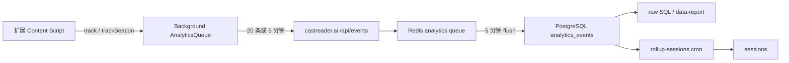
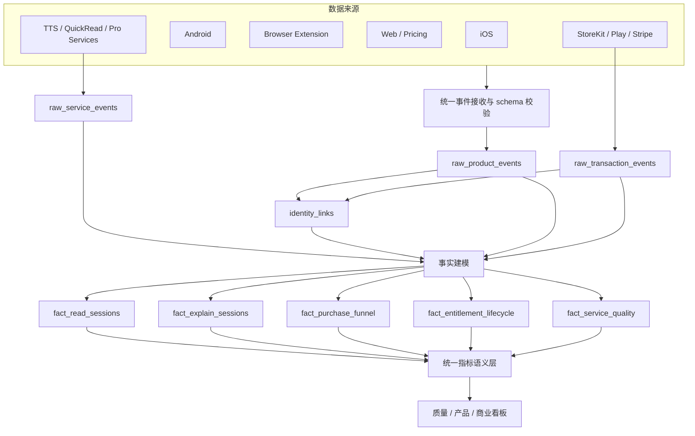

# CastReader 跨端数据中台与埋点架构

> 状态：目标架构 v0.3，2026-07-14。移动端 v1 已在 iOS、Android 与后端工作区完成实现和隔离环境验收；生产迁移、部署和真机商店验收尚未完成。具体合同与结果以 `docs/analytics/mobile-events-v1.json`、《移动端埋点合同与验收 v1》和《移动端埋点验收报告 2026-07-14》为准。

## 1. 结论

CastReader 已经有一套可用的扩展匿名埋点和 PostgreSQL 原始事件表，也已经能通过 `device_id`、`funnel_id` 和 Stripe metadata 串起部分付费意图。但它目前仍是“扩展分析系统”，还不是跨端数据中台。

正确的演进方向是：

1. 统一后端事件信封、身份语义、服务端事实和指标定义。
2. 每条事件强制标记 `client_platform`、`client_variant`、`product_area` 与 `surface`。
3. 朗读、解读、付费和权益使用统一会话与事实模型。
4. 扩展和移动端保留各自的入口、界面和故障阶段，不强行共用全部事件。
5. 先修数据可靠性、隐私和付费链路断点，再给移动端增加埋点。

## 2. 本次审计范围

本次检查了三个当前工作区：

- `readout-desktop`：浏览器扩展事件产生、匿名身份、队列、朗读 / QuickRead / Reader / Pro 付费墙。
- `readout-web`：`/api/events`、Redis 缓冲、PostgreSQL、session rollup、分析脚本、Pro 状态兼容端点和已设计的付费漏斗。
- `castreader-content`：当前 `castreader.com` 登录、Pricing、Checkout、Stripe webhook 与 Pro 权威站。

三个仓库都存在未提交改动，因此本文区分：

- **工作区设计**：本地代码已经表达但未必部署的能力。
- **线上事实**：通过公开只读接口或现有生产快照可以验证的行为。

最初策略审计没有修改上述仓库。随后实施阶段已修改 iOS、Android 和 `readout-web` 工作区，但没有部署后端、执行生产数据库迁移或写入生产数据；所有数据库 E2E 均使用完成后删除的独立 schema。

## 3. 当前扩展数据链路



### 3.1 已有能力

- 扩展当前事件联合类型共 52 个事件，覆盖：
  - 安装、更新、入口激活；
  - 朗读开始、进度、结束、停止、放弃和恢复；
  - 提取失败、TTS 错误和首音性能；
  - QuickRead 点击、生成、播放、完成和错误；
  - 上传文件 Reader；
  - 额度、付费墙、升级点击和导航结果。
- 发布检查已能比较扩展事件联合类型与 `readout-web` 的服务端白名单。本次检查为扩展 52 个事件全部包含在服务端 90 项白名单中。
- `device_id` 是安装级随机 UUID，保存在 `chrome.storage.local`。
- `session_id` 是页面级会话，`read_id` 串联一次朗读，`quickread_id` 串联一次解读，`funnel_id` 串联一次升级意图。
- 扩展自动补充时区、Locale、浏览器和版本。
- 客户端队列失败后最多持久化 200 条，服务端优先进入 Redis，再批量写 PostgreSQL。
- 付费墙到 Web 的跳转会携带 `device_id`、`funnel_id`、`src`、套餐和账号 hash 提示。

### 3.2 当前数据能回答的问题

- 用户从哪个扩展入口开始尝试；
- 哪些站点和提取器更容易失败；
- 朗读首音速度、完成比例和错误情况；
- QuickRead 从点击到播放完成的阶段转化；
- 哪种扩展付费墙触发了升级点击；
- 同一扩展安装是否在后续日期再次使用。

### 3.3 当前不能可靠回答的问题

- 同一账号在 iOS、Android、扩展和 Web 的统一使用情况；
- 一次移动端内容导入如何转成朗读、解读、留存与付费；
- 扩展用户从 Pricing、登录、Checkout 到 Stripe 成功的完整归因；
- 续订、取消、退款之前发生过哪些产品体验；
- 基于“有效阅读”而不是 `session_start` 的跨端留存；
- 所有事件是否都符合统一隐私属性白名单。

## 4. 当前后端结构与断点

### 4.1 `readout-web` 数据接收层

`POST /api/events` 当前执行事件名白名单校验，把其余属性作为任意 JSONB 直接保存。生产优先写 Redis，`flush-analytics-events` 每 5 分钟落库。

当 Redis 不可用时，生产默认丢弃高频使用事件，只允许少量付费漏斗事件直接写 PostgreSQL，以保护 Pro 状态接口不被数据库连接风暴拖垮。`feature-database.md` 记载生产 Redis 尚未配置时，扩展行为数据会以 degraded 模式主动丢弃。因此，Redis 是否已经配置是数据可信度的 P0 前提，不能只看接口返回 HTTP 200。

### 4.2 原始表仍是扩展专用模型

当前 `analytics_events` 的主要字段是：

```text
id, device_id, event, properties, extension_version, created_at
```

主要问题：

- 字段名 `extension_version` 无法自然表达 iOS、Android、Web 和 macOS；
- 没有强制 `client_platform`、`product_area`、`surface`；
- 没有 `event_id` 唯一键，客户端或 Redis 重试可能重复计数；
- 没有独立的服务端接收时间，无法准确分析离线和延迟上报；
- 没有顶层 `backend_user_id` 或受控身份映射，普通行为只能按设备分析；
- 服务端只校验事件名，不校验每个事件允许的属性和类型；
- 文档声称 Raw 只保留 30 天，但未找到执行删除或分区过期的生产任务；
- 未找到账号删除时清理可关联产品事件的完整链路。

### 4.3 `sessions` 聚合层不适合作为中台事实层

当前 rollup 只回看最近 30 分钟，并按 `device_id + 时间顺序 + session_start` 推断会话。现有 `data-report.ts` 已明确注明 `sessions` 因 cron gap 丢失约 94% 数据，所以正式报告重新读取 raw events。

这意味着：

- 长朗读、离线补报和超过 30 分钟后到达的事件可能无法正确归入原会话；
- `read_id`、`quickread_id` 等更可靠的关联键没有成为 rollup 主键；
- 聚合器只理解扩展朗读，不理解移动端内容、解读和付费会话；
- 当前 `sessions` 不能作为未来统一看板的事实源。

### 4.4 指标口径已经发生分叉

- 扩展文档和 `data-report.ts` 用 `session_start` 计算扩展入口留存；
- `/api/analytics?metric=retention` 仍使用 `reading_start`；
- 产品新策略要求使用“再次完成有效阅读”计算价值留存。

三者回答的问题不同，必须分别命名：

- `extension_activation_retention`：再次触发扩展入口；
- `reading_start_retention`：再次开始朗读；
- `meaningful_reading_retention`：再次完成有效阅读，作为跨端核心留存。

禁止继续把三个数字都叫 D7 留存。

## 5. 付费和权益链路现状


### 5.1 已经正确的部分

- 扩展付费墙生成独立 `funnel_id`，并在墙曝光、升级点击和导航结果中复用。
- `device_id` 与账号提示会随 Pricing URL 进入 Web。
- Checkout 需要登录账号，并检查扩展账号 hash 是否与 Web 登录邮箱一致。
- Checkout 与 Subscription 都保存 `device_id`、用户和套餐 metadata。
- Stripe webhook 验签后写入统一 subscription 表；`castreader-content` 在数据库失败时返回 503，让 Stripe 自动重试。
- 设备与后端用户可以通过 `pro_device_link` 关联。

### 5.2 当前关键断点

`readout-web` 工作区已经设计了完整的 `pricing_view → login → checkout_started → checkout_completed → pro_activated` 事件合同，但当前 `.com` 权威站没有等价的数据写入实现：

- Pricing 页面读取 `device_id` 和 `src`，但没有完整保留和记录 `funnel_id`；
- `/api/pro/checkout` 未把 `funnel_id`、`src` 等归因字段写入 Stripe metadata；
- `.com` Stripe webhook 更新权益，但未写 `checkout_completed`、`pro_activated`、`payment_failed` 等分析事实；
- 现有 2026-07-13 快照中有付费墙、升级点击和 Pricing 事件，但未形成稳定的 server-side 完成与激活闭环。

因此，目前不能用扩展 `upgrade_clicked` 的用户数除以 subscription 数量，得到可信的端到端转化率。

### 5.3 `.com` 与 `.ai` Pro 合同线上不一致

2026-07-14 使用全新匿名 UUID 进行只读验证：

- `castreader.ai/api/pro/status` 返回 `pro-entitlement-v1`、email-primary 与 debug 合同字段；
- `castreader.com/api/pro/status` 仍返回旧的简化结构，没有上述合同字段。

代码也显示：

- 扩展当前调用 `.com` 的 status / listen-track；
- iOS 当前调用 `.ai`；
- `.com` 与 `.ai` 的身份解析、email 兜底、用量 subject 和数据库过载保护实现存在明显差异。

这不仅是权益一致性问题，也会让“Free / Pro、账号、额度、平台”分群无法统一。数据中台建设前，必须先确定唯一 Pro 合同实现，再让两个域名只做路由兼容。

## 6. 隐私与安全现状

当前扩展文档宣称不采集完整 URL、标题和正文，但工作区代码仍可能发送：

- `url_path`；
- 截断后的 `page_title`；
- 安装时最多 500 字符的 `referrer_url`。

这些字段可能包含文档名、邮件主题、账号路径、查询参数或内部资源标识，与 CastReader 已定义的隐私边界不一致。服务端目前没有逐事件属性白名单，会原样写入 JSONB。

此外，后端审计发现仓库中仍存在需要轮换和移除的硬编码敏感凭据历史。具体值不应进入策略文档、报告或普通日志。

实施新埋点前必须完成：

1. 删除完整 URL、path、页面标题和 referrer URL，改为受控 `content_source`、`site_class` 和 host 类别。
2. 建立服务端逐事件属性 schema，未知属性拒收或丢弃并计数。
3. 建立真实的数据保留、删除和账号删除联动任务。
4. 轮换已暴露凭据，禁止分析脚本包含生产 secret。
5. 明确额度身份、风控身份和产品分析身份的受控映射，不在各端无限传播同一个长期 ID。

## 7. 目标：统一数据层，不统一所有产品交互

### 7.1 后端统一的部分

以下内容必须跨端一致：

- 事件信封和字段类型；
- 匿名身份、登录身份和受控关联规则；
- 朗读、解读、付费、权益的会话 ID 语义；
- 服务端请求、交易和 entitlement 事实；
- 成功、取消、阻断、失败的结果枚举；
- 有效阅读、首次价值、留存和付费指标定义；
- 数据保留、访问、删除和隐私清洗；
- 生产、测试和开发环境隔离。

### 7.2 端内保留的部分

扩展端保留：

- toolbar、page panel、划词、LLM 回答、Webmail、站点原生按钮；
- DOM / Canvas / OCR 提取与高亮方法；
- Kindle / WeRead / Google Docs 等站点诊断；
- 浏览器、站点和 extension 版本维度。

移动端保留：

- 相机、相册、文件、Kindle 书架、粘贴文本、历史恢复；
- OCR、PDF / EPUB / DOCX 解析；
- App 生命周期、权限、前后台和系统购买流程；
- iOS / Android 商店和本地即时权益状态。

两端不需要使用完全相同的 UI 点击事件，但最终都要归一到相同的价值阶段：

```text
content_intent
→ content_ready
→ playback_started / explain_first_block_started
→ meaningful_reading
→ retained_value
→ paywall_exposed
→ purchase_started
→ entitlement_activated
→ post_purchase_value
```

## 8. 统一事件信封 v2

未来所有客户端与服务端事实使用同一顶层结构：

| 字段 | 必填 | 说明 |
| --- | --- | --- |
| `event_id` | 是 | 客户端或服务端生成 UUID，数据库唯一，用于幂等 |
| `event_name` | 是 | 受控事件名 |
| `event_version` | 是 | 单事件 schema 版本 |
| `occurred_at` | 是 | 事件实际发生 UTC 时间 |
| `received_at` | 服务端 | 接收时间，用于延迟与离线上报 |
| `environment` | 是 | `production / staging / development / test` |
| `client_platform` | 是 | `ios / android / browser_extension / web / macos` |
| `client_variant` | 是 | 如 `chrome / edge / firefox / safari / app_store` |
| `client_version` | 是 | App 或扩展版本 |
| `client_build` | 可选 | 商店 build 或构建号 |
| `anonymous_id` | 是 | 第一方匿名分析 ID |
| `backend_user_id` | 可选 | 登录后服务端归一化用户 ID |
| `app_session_id` | 是 | 端的一次使用会话 |
| `content_session_id` | 按需 | 一份内容的处理与消费生命周期 |
| `read_session_id` | 按需 | 一次朗读会话 |
| `explain_session_id` | 按需 | 一次解读会话 |
| `purchase_attempt_id` | 按需 | 一次商店 / Checkout 尝试 |
| `funnel_id` | Web 付费按需 | 跨扩展与 Web 的升级意图 |
| `product_area` | 是 | `read_aloud / explain / reader / account / billing` |
| `surface` | 是 | 受控 UI 或服务入口 |
| `entry_point` | 按需 | 用户从哪里进入当前链路 |
| `properties` | 是 | 逐事件 schema 审核后的属性 |

`source` 当前被同时用于网页、Reader、付费入口和流量来源，语义过载。v2 中拆成 `client_platform`、`content_source`、`surface`、`entry_point` 和 `acquisition_source`，禁止继续增加新的 `source` 含义。

## 9. 数据中台逻辑模型



建议的核心表：

- `raw_product_events`：校验后的客户端行为；
- `raw_service_events`：TTS、QuickRead、上传和 Pro 请求结果；
- `raw_transaction_events`：Stripe、StoreKit、Play 的服务端生命周期事实；
- `identity_links`：匿名身份、设备、后端用户的有目的、可删除关联；
- `fact_content_sessions`：内容意图、就绪、来源、长度桶和结果；
- `fact_read_sessions`：真实播放、首音、有效分钟、完成和停止原因；
- `fact_explain_sessions`：首块、后续块、mark、完成和错误阶段；
- `fact_purchase_funnel`：触发、曝光、发起、成功、取消和失败；
- `fact_entitlement_lifecycle`：激活、续订、宽限、取消、到期、退款；
- `metric_definitions`：指标版本、分子、分母、生效日期和负责人。

初期不必马上引入大型数仓。PostgreSQL 加受控 raw 表、幂等键、增量建模任务和只读语义视图即可形成第一版中台。关键是合同与事实统一，而不是先购买 BI 工具。

## 10. 事件分层原则

### L0：客户端意图事件

描述用户真实做了什么，例如选择文件、发起朗读、点击升级。不能作为服务成功或交易成功的权威。

### L1：客户端体验结果

描述用户实际看到或听到什么，例如阅读器就绪、首音播放、首块播放、错误提示、付费页展示。

### L2：服务端执行事实

描述接口和后台任务结果，例如 TTS 返回首段、QuickRead 生成完成、Pro 身份解析结果。必须使用 correlation ID 与客户端体验去重。

### L3：交易与权益事实

描述 Checkout 完成、续订、付款失败、取消、到期和退款。只能由 Stripe / App Store / Play 服务端通知或校验产生。

### L4：派生业务事实

由上述事实计算首次价值、有效阅读、留存、转化和购买后价值。客户端不得直接上报 `is_retained=true` 之类的派生结论。

## 11. 分阶段迁移顺序

当前本地进度：P1 与 P2 已完成代码及隔离环境验收；P0 仅完成移动端所需的 `event_id` 幂等、严格 schema 和隐私白名单部分；P3 尚未开始。生产状态不能因本地通过而标记完成。

### P0：先让现有数据可信

1. 确认生产 Redis 缓冲已配置，并对 queued、inserted、dropped、lag 建立监控。
2. 统一 `.com` 与 `.ai` 的 Pro 合同和身份解析实现。
3. 在 `.com` 保留 `funnel_id/src/plan/trigger`，写入 Checkout 与 Subscription metadata。
4. 由 `.com` webhook 产生 `checkout_completed`、`pro_activated`、`payment_failed` 和取消 / 退款事实。
5. 增加 `event_id` 唯一键与接收时间，解决重试重复和延迟上报。
6. 移除 URL path、页面标题、完整 referrer，并启用逐事件属性 schema。
7. 落地保留期、删除和访问审计；移除与轮换仓库敏感凭据。

### P1：建立兼容的 v2 接收层

1. 保留现有 `/api/events` 服务旧扩展，不破坏已发布版本。
2. 新增 v2 信封或在入口完成规范化，所有新端必须传平台和会话字段。
3. 旧扩展事件在服务端补 `client_platform=browser_extension`，不要要求旧客户端发版后才能分析。
4. 建立事件 schema registry、合同测试和发布门禁。
5. 用 `read_session_id / explain_session_id / purchase_attempt_id` 增量生成事实表，不再靠 30 分钟窗口猜测。

### P2：移动端最小埋点

只覆盖：

- App 会话与内容入口；
- 内容就绪 / 取消 / 失败；
- 朗读首音、有效播放和结束；
- 解读首块和结束；
- 付费页、StoreKit 发起和客户端结果；
- 服务端 entitlement 和交易生命周期。

不做自动 screen tracking、全文采集或 Session Replay。

### P3：统一指标和看板

1. 质量看板：来源成功率、首音 / 首块、错误和节点。
2. 产品看板：首次价值、WMRU、有效留存、恢复与完成。
3. 商业看板：触发到权益激活、购买后价值、续订、取消和退款。
4. 所有指标默认按 `client_platform` 拆分，同时提供跨端登录用户视图。

## 12. 验收标准

进入移动端埋点开发前，至少满足：

- 任意事件都有唯一 `event_id`，重复发送只计一次；
- 任意事件都能明确识别平台、版本、产品域和 surface；
- 未知事件或未知属性不会静默入库；
- Collector 能报告接收、拒绝、排队、落库、丢弃和延迟；
- 扩展朗读、QuickRead 和 Web 付费均能用显式 ID 闭环；
- `.com` 与 `.ai` 对相同身份返回一致的 Pro 核心结果和合同版本；
- 付费可从 `funnel_id` 连接到服务端权益激活；
- 原始事件不存在正文、OCR、文件名、页面标题、完整 URL 或 URL path；
- 删除测试账号后，可关联事件按规则删除或去标识；
- `extension_activation_retention` 与 `meaningful_reading_retention` 名称和口径不再混用。

完成这些基础工作后，再讨论具体 SDK 或 BI 工具。当前最需要的是统一合同、可靠事实和可解释分母，而不是增加更多点击事件。
