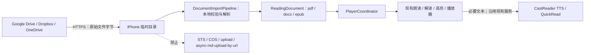

# CastReader iOS 云盘接入完整规划

> 范围：Google Drive、Dropbox、Microsoft OneDrive
> 状态：iOS 客户端实施与本地验收已完成；生产 OAuth/法务配置及真实账号真机验收仍为发布前置条件
> 日期：2026-08-09
> 实施更新：2026-08-10

## 0. 实施状态（2026-08-10）

本规划的 iOS 客户端范围已经落地，当前实现保持本文确定的权限和数据边界：

- 加号面板已加入 Google Drive、Dropbox、Microsoft OneDrive，包含首次披露、连接状态、脱敏账号、更换账号、解除关联和隐私说明复看。
- Google 使用 `drive.file` + PKCE 的原子授权/官方 Picker；Dropbox 使用 SwiftyDropbox 只读 scope；OneDrive 使用 MSAL + delegated `Files.Read`。
- Dropbox/OneDrive 已实现原生目录、搜索、分页和 OneDrive 多 drive 切换；Google 保持官方 Picker，不申请 restricted `drive.readonly`。
- 三家下载均写入受保护、排除备份的设备临时目录，只允许 PDF、DOCX、EPUB；Google Docs/Dropbox 可导出文档按实际 DOCX/PDF 路由。
- `DocumentImportPipeline` 已成为云盘、本地文件与分享入口的统一设备端导入路径；云盘固定使用禁止后端 fallback 的策略，复用现有阅读器、朗读、解读、播放器、高亮、自动滚动和手写标注。
- 云盘历史使用 `remoteReference`，不持久化原始文件 payload 或内容封面；重开时绑定原账号、获取最新 metadata、重新下载，并按 revision/格式生成新的内容会话。
- 账号切换为两阶段事务，含进程崩溃恢复、旧 OAuth 回调隔离、解绑 epoch/CAS 防回写、候选账号取消清理和 provider 撤销结果的诚实提示。
- 资源上限按实际格式执行：PDF 200 MiB、DOCX 40 MiB、EPUB 120 MiB；下载流、ZIP 条目/总展开量、PDF OCR、DOCX/EPUB 解析均支持取消和资源限制。
- 云盘原文件字节、provider token 和预授权下载 URL 不进入 CastReader 的 STS/COS/upload 路径；朗读/解读所需文本仍按现有 TTS/QuickRead 数据流处理，并在授权前披露。

仍不能由客户端代码代替的生产发布条件：

1. 在独立 Google Cloud 项目、Dropbox App Console、Microsoft Entra 中填入正式 client/app 配置并完成真机回调验证。
2. 完成 Dropbox Production approval/放量安排，以及 Microsoft 租户与个人账号矩阵验证。
3. 更新公开隐私政策和授权披露，使其准确覆盖 Google Drive/Dropbox/OneDrive、TTS/QuickRead 子处理方、正文保留期限、删除和人工访问规则。当前线上隐私政策未完整覆盖该数据流，完成前不得打开生产云盘入口。
4. 用正式测试账号执行三家授权、取消、换号、解绑、token 过期、管理员策略、共享文件和大文件的真机 E2E；占位凭据环境只能完成客户端与模拟器验收，不能证明生产 OAuth 可用。

### 0.1 最终客户端验收记录（2026-08-10）

本轮已按“原文件不上 CastReader 云端”的边界完成实现、自测、故障注入、独立代码审查和界面复核。验收结果如下：

- 云盘核心、三家 provider、授权回调、账户切换、撤销队列、历史重开、下载限制、取消竞态、错误恢复和 no-upload 网络契约：`124 / 124` 通过，`0` 失败。
- 云盘集成、文档历史、OCR 与 EPUB 相关回归：`73 / 73` 通过，`0` 失败。
- 排除既有 StoreKit 模拟成交套件后的 App 单元测试：共 `660` 项，`659` 通过、`1` 条件跳过、`0` 失败。
- 加号页三家入口和授权前隐私披露 UI 自动化：默认浅色字号 `1 / 1` 通过；深色模式 + 辅助功能超大字号 `1 / 1` 通过。后者同时录屏并逐帧复核，云盘列表可滚动、披露正文可完整滚动阅读，继续连接、取消和隐私政策入口均可达。
- Debug 与 Release 的通用 iOS Simulator 构建均通过；新增 MSAL 2.14.1 MIT 许可已同时写入 vendored package，并作为 `MSAL-LICENSE.txt` 进入应用产物。
- `CloudStorage.xcstrings` JSON 与 `xcstringstool` 编译通过，覆盖 `de / en / es / fr / hi / it / ja / pt-BR / zh-Hans` 九个语言；`Info.plist`、entitlements、Xcode source/resource 唯一注册和 `git diff --check` 均通过。

支付套件另做了 120 秒有界诊断：16 项中 13 项通过；`testPurchase_unlocksPro`、`testRestorePurchase`、`testExpiry_revertsToFree` 在 iOS 26.5 模拟器上因 `SKTestSession` 初始化立即返回 `SKInternalErrorDomain Code=3`，随后无法建立购买确认场景而超时。该故障只影响模拟器 StoreKitTest 的成交事务模拟，与云盘调用链无共享代码或失败信号；正式发布回归仍应在可正常工作的 StoreKit 环境补跑这 3 项。

这里的“客户端验收完成”不等于“生产云盘已启用”。正式 client/app 配置、开发者后台审核、公开隐私政策和真实账号真机矩阵仍是硬性发布门槛；当前占位配置会安全地让 provider 显示为未配置，不会伪装成可用或导致启动崩溃。

## 1. 结论先行

首版建议同时规划三家，但不要为了界面看起来完全一致而使用相同的授权方式：

| 云盘 | 首版选择体验 | 最小权限 | 推荐程度 |
|---|---|---|---|
| Google Drive | 点击后打开 Google 官方移动 Picker，在系统浏览上下文里选择一个文件，再回到 CastReader | `drive.file` | 推荐。最低权限、审核成本最低 |
| Dropbox | 绑定后进入 CastReader 原生 SwiftUI 文件浏览器 | Full Dropbox + 三个只读 scope | 推荐 |
| OneDrive | 绑定后进入 CastReader 原生 SwiftUI 文件浏览器 | delegated `Files.Read` | 推荐 |

Google 的体验与参考图会有一个有意保留的差异：连接状态可以长期保存，但选择新文件时仍由 Google 官方 Picker 展示整个 Drive。Google 最新移动 Picker 只允许 `drive.file`，并要求 `prompt=consent`；如果要在 CastReader 内原生列出整个 Google Drive，就必须申请 restricted `drive.readonly`，同时承担受限权限验证和年度安全评估。首版不建议走这条高风险路径。

其他核心决策：

1. 每个 provider 首版只绑定一个账号，支持“更换账号”和“解除关联”。云盘账号与 CastReader 登录账号相互独立。
2. 三家只申请读取权限，不申请创建、修改、删除、移动或上传权限。
3. 原始 PDF、DOCX、EPUB 的字节只走“云盘服务 → 用户 iPhone”，不调用 CastReader 的 STS、COS、文件上传或 URL 转存接口。
4. 下载完成后进入统一的本地导入管线，继续复用现有 `ReadingDocument → PlayerCoordinator → ReaderHostView → ReadAloud/Explain`。
5. “原文件不上 CastReader 云端”不等于完全离线：开始朗读或解读后，抽取出的必要文本仍会按现有产品逻辑发送到 CastReader 的 TTS/QuickRead 服务。授权前必须向用户准确披露这一点。
6. 云盘历史记录首版只保存远程引用、版本和当前文库已有的基础元数据，不自动永久保存一份完整原文件；再次打开时从原云盘重新下载最新版。
7. 不增加新的 Pro 门槛。云盘文件进入阅读器后，继续使用当前免费额度和 Pro 规则。

## 2. 产品目标与边界

### 2.1 首版目标

- 在首页底部加号打开的导入面板中增加“云端文件”区域。
- 展示 Google Drive、Dropbox、Microsoft OneDrive 三个独立入口。
- 第一次点击完成账号授权；以后点击直接进入该 provider 的选文件流程。
- 支持文件夹浏览、关键词搜索、分页和单文件选择；Google 由官方 Picker 提供这些能力。
- 支持：
  - 可搜索 PDF；
  - 扫描 PDF，继续使用当前 Vision OCR；
  - `.docx`；
  - `.epub`；
  - Google Docs，导出为 DOCX 后进入现有流程；
  - Dropbox 中允许导出为 PDF/DOCX 的 cloud-only 文档。
- 选中文件后显示下载、校验、解析进度，并允许取消。
- 文件打开后，朗读、解读、词级高亮、自动滚动、手写标注、音色、倍速、额度和播放器全部复用现有实现。
- 文库可以显示云盘来源的阅读记录；再次打开时校验账号、远程文件与版本。首版不额外承诺当前本地文件也没有的通用跨启动阅读进度恢复。

### 2.2 首版不做

- 不支持旧版二进制 Word `.doc`；产品文案应写“Word（DOCX）”，不能笼统承诺所有 Word 文件。
- 不支持 XLS/XLSX、PPT/PPTX、ZIP、音视频或任意未知格式。
- 不在 CastReader 内修改、重命名、移动、删除或上传云盘文件。
- 不做整个云盘的后台同步、内容索引或自动扫描。
- 不做批量选择；首版一次选择一个文档，避免多个大文件并发解析和播放器打开竞态。
- 不承诺密码保护 PDF、IRM/敏感度加密 Office 文档、DRM EPUB。
- 不做永久离线副本。后续若增加“保存到本机”，必须是用户明确操作，并配套删除、容量和保留期限说明。
- OneDrive 首版不提供“与我共享”全量 Tab，也不承诺完整 SharePoint/Teams 文档库。

## 3. 与当前代码的连接点

当前工程已经具备完整阅读能力，云盘不应成为新的渲染类型：

- `Views/MainTabView.swift` 的中间加号通过 `ImportRouter.openQuickImport()` 打开首页导入面板。
- `Views/Home/HomeView.swift` 的 `ImportOptionsSheet` 负责来源选择，`handleImportedFile` 负责现有本地文件分发。
- PDF 走 `DocumentBuilder.fromPDFWithOCR`，DOCX 走 `WebReaderView`/mammoth，EPUB 走 `EpubNativeEngine`。
- `PlayerCoordinator.open` 创建同一套 `ReadAloudViewModel` 与 `ExplainViewModel`，并打开 `ReaderHostView`。
- `ReadingSourceKind` 当前表示渲染格式，而非文件来自哪里。因此不要新增 `.googleDrive`、`.dropbox`、`.oneDrive` case。

必须先修正的两个现状：

1. `HomeView.handleImportedFile` 对未知格式会进入 `ImportViewModel.uploadFile`。云盘导入必须使用严格白名单，任何不支持或校验失败的文件都在设备上报错，绝不能落入这个上传 fallback。
2. `HomeView.handleImportedFile` 与 `MainTabView.openSharedItem` 各有一套 PDF/DOCX/EPUB 解析分支。应先抽出公共 `DocumentImportPipeline`，让本地文件、分享扩展和三个云盘共用一个入口。

## 4. 用户体验

### 4.1 加号面板

在现有“拍摄 / 照片 / 文件 / 链接 / 文本”下面增加独立区域，不把三家塞进 `ImportSource.allCases`：

```text
云端文件

[Google Drive 图标]  Google 云端硬盘       已连接 · a***@gmail.com  >
[Dropbox 图标]       Dropbox               未连接                  >
[OneDrive 图标]      Microsoft OneDrive    工作账号                 >
```

行状态：

- 未连接：副标题“未连接”，点击后先展示数据使用说明，再进入 OAuth。
- 已连接：显示本地保存的脱敏账号信息或显示名称，点击直接选文件。
- 正在连接/刷新：行内 spinner，禁止重复点击。
- 凭据失效：显示“需要重新连接”，点击进入重新授权。
- 已连接行尾提供 `…` 菜单：
  - 更换账号；
  - 解除关联；
  - 查看隐私说明。

解除关联使用确认框。确认后执行 provider-specific 断开、删除本机 active association，并取消正在进行的浏览、搜索、下载和解析任务；默认保留阅读历史基础元数据，但再次打开会要求连接原账号。菜单可另提供“同时删除本机云盘阅读记录”。远程撤销失败时只能确认“已从此设备断开”，不能谎称 provider 端授权一定已撤销。

### 4.2 首次连接

```text
点击 provider
  → CastReader 数据使用说明
  → 用户点击“继续连接”
  → Google：一次原子化的“授权并选择文件”
  → Dropbox/OneDrive：授权成功后进入原生文件浏览器
```

Google 移动 Picker 会在同一轮回调中返回授权 code 和 `picked_file_ids`；不能先虚构一个“已绑定但尚未选择任何文件”的通用授权步骤，再立即发起第二次 Picker。上层把这一轮建模为 `authorizeAndPick()`，成功后同时更新连接状态并返回文件。

若用户取消授权，返回加号面板，不显示错误弹窗；只有网络、配置、管理员策略或服务错误才显示可操作错误。

### 4.3 后续点击

- Google Drive：打开系统浏览上下文中的 Google Picker；Google 账号登录状态通常可复用，但 Google 仍可能再次展示同意或选账号界面。
- Dropbox：直接进入 CastReader 原生文件浏览器根目录。
- OneDrive：直接进入 CastReader 原生文件浏览器默认 drive 根目录；多 drive 账号可在标题菜单切换。

更换账号后不得静默覆盖原账号关联。先显示“当前连接为 A，是否改为 B”，确认后生成新的 account key；旧账号历史记录继续保留，但标记为“需连接原账号”。Dropbox 使用 candidate `tokenUid` 后确认切换；OneDrive 强制交互式 `.selectAccount`，因为清除 App token 并不等于清除浏览器/Authenticator SSO 会话。

### 4.4 Dropbox / OneDrive 原生文件浏览器

参考截图的结构，但首版聚焦选文件：

- 顶部：关闭、provider 标识、账号/drive 菜单。
- 内容区：文件夹优先；文件显示图标、名称、类型、修改时间、大小。
- 底部或顶部固定搜索框；输入防抖，搜索结果按稳定文件 ID 去重。
- 面包屑或原生返回栈，保留每层滚动位置。
- 分页懒加载，不递归预扫整个云盘。
- 只让 PDF、DOCX、EPUB 和明确可导出的 cloud-only 文档可点；其他文件灰显并说明原因。
- 单击支持的文件即开始导入；长按不提供云盘写操作。
- 下载页显示文件名、阶段、进度和“取消”。阶段统一为：
  - 正在获取文件信息；
  - 正在下载；
  - 正在检查文件；
  - 正在解析 PDF / Word / EPUB；
  - 正在准备阅读器。

### 4.5 Google Drive 的推荐体验

Google 首版不绘制自己的 Drive 文件树。官方移动 Picker 在默认系统浏览上下文里提供 Drive 视图、搜索、预览、MIME 过滤和 Shared drives，返回选中的 `picked_file_ids`。

连接状态仍显示在加号面板中，并可保存此前选过的文件引用。这里的“已连接”表示 CastReader 持有仅能访问用户明确选择文件的 `drive.file` 凭据，而不是 CastReader 可以读取整个 Drive。

如果未来产品坚持实现与 Dropbox/OneDrive 完全一致的应用内 Google 浏览器，应单独立项：可以先在隔离 staging project/test users 下开发验证，但改用 `drive.readonly` 后，完成 restricted-scope verification、CASA 安全评估和后端数据流审核之前不得公开生产发布，也不能把它作为首版的隐藏切换项。首版推荐的 `drive.file` 本身是 non-sensitive scope，只走基础 OAuth/品牌生产配置。

## 5. 三家能力与权限

### 5.1 Google Drive

推荐实现：

- 独立 Google Cloud project 和独立 iOS OAuth client，不复用当前 CastReader Google 登录的 client/token。
- 使用系统浏览上下文 + Authorization Code + PKCE；每次请求生成新的高熵 verifier 和随机 `state`。
- 唯一 scope：`https://www.googleapis.com/auth/drive.file`。
- OAuth 契约固定为 `response_type=code`、`access_type=offline`、`prompt=consent`、`trigger_onepick=true`、`code_challenge_method=S256`，并使用与 iOS OAuth client 精确匹配的 redirect URI。
- 首版 `allow_multiple=false`。
- MIME 过滤：PDF、DOCX、EPUB、Google Docs。
- 用 `about.get` 获取显示账号和稳定 `permissionId`，不额外申请 profile scope。
- Picker 返回 file ID 后先调用 `files.get` 获取最小元数据、`capabilities.canDownload`、`version`、`modifiedTime`、`driveId` 和 `resourceKey`；后续需要时用 `X-Goog-Drive-Resource-Keys` 传播 file ID/resource key。
- Shared drives 的 metadata 与 `alt=media` 请求都带 `supportsAllDrives=true`。
- 普通文件用 `files.get?alt=media` 直接下载到设备临时目录；blob 版本使用 `version + modifiedTime`，可增加 `md5Checksum/headRevisionId`，Google Docs 使用 `version + modifiedTime`。
- Google Docs 用 `files.export` 导出 DOCX；10 MB 是同步 `files.export` 的输出限制。首版超过时明确提示，不静默降级为不完整文本；新版 `files.download` 长任务作为技术 spike/fallback 评估，通过真实账号验证后再承诺。
- 首版不承诺 Drive shortcut。快捷方式自身 MIME 是 `application/vnd.google-apps.shortcut`，与目标 MIME 不同；若真机契约测试确认 Picker 行为后启用，必须加入 shortcut MIME、解析 `targetId/targetMimeType/targetResourceKey`、携带 resource key，并对目标格式再次走白名单。

必须使用独立 Google Cloud project 的原因：Google token revocation 可能撤销同一 Cloud project 下多个 client 的授权。Drive 解绑不应连带退出 CastReader 的 Google 登录，也不能影响 Pro 身份。生产与 staging/test 也建议分项目；OAuth Testing 状态下 refresh token 的有效期限制要纳入真机测试。

### 5.2 Dropbox

推荐实现：

- 使用官方 SwiftyDropbox SDK，Authorization Code + PKCE + refresh token。
- Dropbox App Console 选择 Full Dropbox；App Folder 无法浏览用户已有文件。
- 最小 scopes：
  - `account_info.read`；
  - `files.metadata.read`；
  - `files.content.read`。
- 首版不申请 `sharing.read`。已挂载共享文件夹仍通过常规目录树显示。
- `listFolder` + `listFolderContinue` 做分页；`searchV2` + continue 做搜索。
- `searchV2` 有 10,000 条结果上限、索引延迟及跨页重复/遗漏可能；UI 按 file ID 去重，并提示搜索不到时可返回目录浏览。
- 使用 `FileMetadata.id` 作为远程主键，`rev` 作为内容版本，不能用可变路径作为主键。
- Business Team Space 连接后通过 `getCurrentAccount` 取得 root namespace，并用 `withPathRoot(.root(rootNamespaceID))`；遇到 `invalid_root` 时重新获取 root、重建 client、丢弃旧 cursor 并只重试一次。
- `isDownloadable=true` 时直接落盘下载；否则只在 `exportInfo` 明确提供 PDF/DOCX 时导出。
- 使用 SwiftyDropbox multi-user setup，显式持久化当前 active `tokenUid`。更换账号时新授权先作为 candidate；用户确认后切换 active 再撤销旧账号，取消则只清 candidate，避免 SDK 重启后从多个缓存 token 中选错。
- 解绑调用 SDK `client.auth.tokenRevoke()`；成功、失败或超时后都清除对应 `tokenUid` 和本机 active association。

由于首版不申请 `sharing.read`，只显示已挂载的共享/团队文件夹，不显示未挂载共享文件夹、收到的共享列表或共享链接入口。

Dropbox Production approval 不一定能在零用户阶段提前完成。发布策略应是：能 early review 时尽早提交；否则做分阶段放量、linked-user 监控和 50 用户前 kill switch，并在触发官方窗口时立即完成审核。应用材料需准确说明为什么必须使用 Full Dropbox、只读权限、隐私政策和品牌信息。

### 5.3 Microsoft OneDrive

推荐实现：

- 使用官方 MSAL for iOS/macOS 处理登录、token cache 和静默刷新；Graph REST 使用 `URLSession`。
- Entra 应用支持“任意组织目录中的账号和个人 Microsoft 账号”。
- authority 使用 `common`，应用是 public client，不配置或内置 client secret。
- 首版只请求 delegated `Files.Read`；不申请 `Files.ReadWrite` 或 `Files.Read.All`。
- 使用 MSAL account 已有的本地显示信息，不为头像/资料额外请求 `User.Read`；资料缺失时只显示“已连接”，不能保证一定取得邮箱或友好名称。
- 根目录和子目录使用 Graph drive/items children API；完整消费 `@odata.nextLink`，不能自行拆改 skip token。
- 只把具有 `file` facet 的 item 视为可下载文件；`folder` 和 `package` 不得仅凭扩展名进入下载，`remoteItem` 还要检查嵌套目标 facet。
- 搜索结果若是 `remoteItem`，后续用目标 `driveId + itemId` 尝试下载，不能使用外层 wrapper ID。
- 内容下载 API 会 302 到短时预授权 URL。跨 host 跟随重定向时不得携带原 Graph `Authorization` header；预授权 URL 不持久化、不写日志。
- 始终 `$select=cTag,eTag`，内容版本优先 `cTag ?? eTag`；`cTag` 只随内容变化，避免仅重命名就错误重置阅读会话。远程主键必须包含 `driveId + itemId`。
- 标题菜单中的 drive 列表只来自 `/me/drives`，不能把它描述为 SharePoint/Teams 库发现器；组和站点的 drives 属于后续范围。

首版只保证访问用户自己的 OneDrive。个人 Microsoft 账号可尝试读取共享项；工作/学校账号中的 `remoteItem`、共享快捷方式及组织共享内容不作保证，目标返回 403 时灰显并提示权限不足。Microsoft 的 `/me/drive/sharedWithMe` 已弃用，并计划在 2026 年 11 月停止返回数据；因此不设计一个即将失效的“与我共享”全量入口。完整共享、SharePoint/Teams/组织库属于后续 `Files.Read.All` 增量授权与企业同意项目。

## 6. 技术架构

### 6.1 数据流与禁止边界



硬性约束：

- provider access token、refresh token、临时下载 URL 永远不发送到 CastReader 后端。
- 原始文件字节永远不进入 `/sts`、`/upload`、`/async-md-upload-by-url` 或任何新增 CastReader 文件存储接口。
- 云盘路径只接受明确支持的格式；未知格式在本地失败。
- TTS/QuickRead 发送的是现有阅读能力所需的文本内容，不是原始容器文件。这个边界需要通过自动化网络测试验证，而不只依赖代码评审。

### 6.2 建议模块

```text
CloudStorage/
  CloudStorageModels.swift
  CloudStorageProvider.swift
  CloudConnectionStore.swift
  CloudImportCoordinator.swift
  GoogleDriveProvider.swift
  DropboxProvider.swift
  OneDriveProvider.swift

Import/
  DocumentImportPipeline.swift
  DocumentFormatValidator.swift
  ImportSession.swift

Views/CloudStorage/
  CloudFilesSection.swift
  CloudPrivacyDisclosureView.swift
  CloudFileBrowserView.swift
  CloudImportProgressView.swift
  CloudAccountMenu.swift
```

建议按能力拆分 provider 接口，不强迫 Google 和另外两家遵守错误的固定顺序：

```swift
enum CloudSelectionCapability: Equatable, Sendable {
    case authorizeAndPickInSystemBrowser
    case persistentConnectionAndNativeBrowser
}

protocol CloudStorageProvider: Actor {
    nonisolated var id: CloudProviderID { get }
    nonisolated var selectionCapability: CloudSelectionCapability { get }

    func connectionState() async -> CloudConnectionState
    /// 本机关联始终清理；结果另外说明 provider 端撤销是否确认。
    func disconnect() async -> CloudDisconnectResult
    func download(
        _ item: CloudItem,
        as exportFormat: CloudExportFormat?,
        to destination: URL,
        progress: @escaping @Sendable (CloudDownloadProgress) -> Void
    ) async throws -> CloudDownloadReceipt
}

protocol CloudAtomicPickerProvider: CloudStorageProvider {
    /// Google：一次系统流程同时返回授权结果与用户明确选择的文件。
    func authorizeAndPick() async throws -> (CloudAccount, CloudItem)
}

protocol CloudBrowsableProvider: CloudStorageProvider {
    /// Dropbox / OneDrive：可持久连接，随后在 App 内浏览。
    func ensureConnected() async throws -> CloudAccount
    func list(folder: CloudFolder?, cursor: CloudCursor?) async throws -> CloudPage
    func search(_ query: String, cursor: CloudCursor?) async throws -> CloudPage
}
```

Google 实现 `CloudAtomicPickerProvider`；Dropbox/OneDrive 实现 `CloudBrowsableProvider`。Google 每次选择新文件都可能再次展示授权页并刷新 token，UI 不能承诺后续点击一定“无授权页面直达”。

### 6.3 核心模型

```swift
enum CloudProviderID: String, Codable, Sendable {
    case googleDrive
    case dropbox
    case oneDrive
}

struct CloudAccount: Codable, Equatable, Sendable {
    let provider: CloudProviderID
    let stableAccountKey: String       // provider account ID 的本机 SHA-256
    let displayName: String?           // 仅本机展示
    let maskedEmail: String?           // 仅本机展示
}

struct CloudItem: Identifiable, Equatable, Sendable {
    let provider: CloudProviderID
    let accountKey: String
    let driveID: String?
    let id: String
    let name: String
    let mimeType: String?
    let size: Int64?
    let modifiedAt: Date?
    let revision: String?
    let kind: CloudItemKind
    let exportOptions: [CloudExportFormat]
}

struct CloudDocumentOrigin: Codable, Equatable, Sendable {
    let provider: CloudProviderID
    let accountKey: String
    let driveID: String?
    let remoteItemID: String
    let revision: String?
    let originalName: String
    let mimeType: String?
}

struct CloudDownloadReceipt: Equatable, Sendable {
    let localURL: URL
    let effectiveFilename: String
    let effectiveExtension: String
    let effectiveMIMEType: String
    let effectiveFormat: SupportedDocumentFormat
    let exportFormat: CloudExportFormat?
    let finalRevision: String?
    let byteCount: Int64
}

struct CloudDisconnectResult: Equatable, Sendable {
    let localAssociationRemoved: Bool       // 设计上始终为 true
    let remoteRevocation: RemoteRevocationStatus
}

enum RemoteRevocationStatus: Equatable, Sendable {
    case confirmed
    case localOnlyProviderSemantics
    case failedRetryable(code: String)
}
```

Google Docs 默认明确传 `.docx`；Dropbox cloud-only 文档按 `exportOptions` 预先选择唯一受支持格式。普通 blob 传 `nil`。进度回调只发送 DTO，由主线程 view model 节流更新 UI；若实现偏好 structured concurrency，也可用 `AsyncThrowingStream<CloudDownloadEvent>` 表达 progress/receipt。

设计原则：

- `ReadingSourceKind` 继续是 `.pdf/.docx/.epub` 等渲染格式。
- `ReadingDocument` 增加可选 `origin` 和 `persistencePolicy`，而不是增加 provider source kind。
- 稳定文档 ID：`SHA256(provider | accountKey | driveID | remoteItemID)`。
- `documentID` 保持 `SHA256(provider | accountKey | driveID | remoteItemID)` 的稳定文档语义，用于 History/Mini Player/绑定书库比较。
- 另建内容会话 key：`documentID | finalRevision | effectiveFormat`。同一远程文件更新后历史项不重复，但不同 revision 或导出格式必须重建全部阅读状态。
- `PlayerCoordinator.Session` 同时保存 `documentID` 与 `contentSessionKey`；现有 `Session.id` 可继续返回稳定 `documentID`，不能直接改义。`contentSessionKey` 单独用于新旧 VM 判断、`MainTabView` 的 `ReaderHostView.id` 和 `ReaderHostView` 内部 reader surface identity。只改 coordinator 的比较条件不足以清掉旧 WebView、高亮或 VM 状态。
- Google Docs/Dropbox cloud-only 文档必须按下载后的 `CloudDownloadReceipt.effective*` 字段路由，不能继续使用远端原始名称和 provider 原生 MIME。
- 文件名、路径、邮箱和原始 provider ID 不进入 analytics；必要稳定值先在设备上哈希。

### 6.4 独立导入会话

当前首页使用全局 `importScenario/importMode/importAnalyticsContext`，异步 PDF/EPUB 完成较晚时存在旧任务覆盖新任务的风险。云盘接入前新增由长生命周期 coordinator 管理的 `ImportSession`：

```swift
struct ImportSession: Identifiable, Sendable {
    let id: UUID
    let epoch: UInt64
    let scenario: ExplainContentType?
    let mode: ReaderMode
    let analyticsContext: AnalyticsContentContext?
    let startedAt: Date
}

actor ImportSessionCoordinator {
    private var current: ImportSession?
    // begin / cancel / isCurrent / finish
}
```

每个授权、选择、下载、解析回调都携带 session ID + epoch。取消、选择新文件、切换账号或解绑后，旧 session 即使完成也不能写 token、完成埋点或调用 `PlayerCoordinator.open`。

为使这些值安全跨 actor，实施时也给 `ReaderMode`、`ExplainContentType`、`CloudItemKind`、`CloudExportFormat`、cursor/page/error 等纯值类型补 `Sendable`；若 SDK 类型不能 Sendable，只在 provider actor 内持有，跨边界转换为自己的 DTO。

完成时必须保留当前 `finishImport` 的现有语义：

- 将 `scenario?.rawValue` 注入 `ExplainViewModel`；
- `scenario != nil || mode == .explain` 时自动播放；
- study 场景继续调用 `StudyBoostStore.recordStudySession()`；
- 继续使用同一个 `AnalyticsContentContext` 完成 `sourceOpened → confirmed → processing → ready/failed/cancelled` 漏斗。

OAuth → 浏览器 → 下载 → Reader 跨越多个系统/SwiftUI 界面，任意一个 sheet 的 `onDismiss` 都不能直接判定导入取消；只有 `ImportSessionCoordinator` 的终态才能完成或取消漏斗。Home 继续维持单一 `HomeSheet` 状态机，避免多个 sheet 相互吞掉。

## 7. 统一本地导入管线

### 7.1 单一入口

`DocumentImportPipeline` 输入：

- security-scoped 或临时文件 URL；
- `CloudDownloadReceipt` 中下载完成后的有效文件名、MIME、实际格式、最终版本和字节数；
- `CloudDocumentOrigin?`；
- 当前 `ImportSession`；
- 明确的 `transportPolicy`：

```swift
enum ImportTransportPolicy: Equatable, Sendable {
    /// 只允许 PDF/DOCX/EPUB 本地处理；未知格式直接失败。
    case deviceOnlySupportedDocuments
    /// 仅供现有本地导入保持当前未知格式后端 fallback。
    case allowExistingBackendFallback
}
```

云盘永远固定为 `.deviceOnlySupportedDocuments`。

输出仍是现有 `ReadingDocument`：

- PDF → `DocumentBuilder.fromPDFWithOCR`；
- DOCX → `.docx` + 原 `fileData`，进入 mammoth；
- EPUB → `DocumentBuilder.fromEPUB`；
- 未来本地 TXT/MD 也可迁入同一服务，但不属于云盘首版支持矩阵。

这次抽取的是三处重复的 PDF/DOCX/EPUB 共同分支，调用者为：

- 首页系统文件选择器；
- Share Extension / `openSharedItem`；
- Google Drive；
- Dropbox；
- OneDrive。

图片 OCR、TXT/MD、URL、粘贴文本继续走现有本地入口；Home 对未知本地格式的既有后端 fallback 也只在 `.allowExistingBackendFallback` 下保留。公共 pipeline 不得为了“统一”而删除现有本地能力，也不得让云盘借由同一个 API 获得 fallback 上传能力。

本地 file importer 的 security-scoped resource 生命周期由 pipeline 所有：进入异步读取前 `startAccessingSecurityScopedResource()`，直到字节读取/解析完成后才在 `defer` 中对称释放，调用方不得提前停止访问。

成功条件按格式定义。PDF/EPUB 可检查解析结果；DOCX 在首次构建时 `paragraphs` 本来就是空数组，必须以通过容器校验且存在有效 `fileData` 为成功条件，不能用通用 `ReadingDocument.isEmpty` 拒绝 DOCX。

### 7.2 格式校验

不能只信扩展名，也不能只信 provider MIME：

| 格式 | 扩展/MIME | 内容校验 |
|---|---|---|
| PDF | `.pdf` / `application/pdf` | 文件头 `%PDF-`，PDFKit 可打开 |
| DOCX | `.docx` / OOXML Word MIME | ZIP 中存在 `[Content_Types].xml` 与 `word/document.xml` |
| EPUB | `.epub` / `application/epub+zip` | ZIP mimetype 与 `META-INF/container.xml` 合法 |

还必须检查：

- HTTP 状态、响应 Content-Type 和 Content-Length；
- 不能把 HTML 登录页、JSON 错误体或 provider 错误页当文档；
- 文件大小与下载字节一致；
- 下载结束后以 provider 最终响应的 revision/eTag/version 为准，而不是只信下载前 metadata；支持条件请求时使用条件下载。前后版本冲突时重新取 metadata 并重试一次，仍冲突则采用明确返回的最终版本或提示用户重试；
- 临时目录可用空间；
- 云盘声明和内容冲突时以安全失败为主，不尝试上传给后端“识别”。

### 7.3 下载与内存

- 使用 `URLSessionDownloadTask` 或 SDK 的 destination URL API，边下载边写临时文件；禁止 `data(for:)` 整块下载。
- 大文件 IO 和解析在 actor/后台任务执行，只将进度和最终文档切回 MainActor。
- 下载前按远端 size 做磁盘预检，未知 size 则边下载边执行上限检查。
- 同一 session 同时只有一个下载和一个解析任务。
- 若构建后的 `ReadingDocument` 已完整持有所需 Data，构建成功后即可删除临时文件；只有未来 URL-backed reader 才把文件生命周期延长到阅读会话结束。
- 取消、失败、会话失效、解绑、后台遗留和下次冷启动时清理临时文件。
- 临时文件启用 iOS Data Protection，标记排除 iCloud/iTunes 备份，并放入专用 session 目录以便崩溃后回收。
- DOCX 当前需要 raw data、base64、JS ArrayBuffer 和解包结果同时存在，内存峰值最高；EPUB 图片也可能多份驻留。因此上线前必须在最低支持设备上做内存基准。

建议以远程配置承载最终上限。首轮压测可从以下安全值开始，而不是把它们写成永久产品承诺：

| 格式 | 首轮硬上限候选 | 原因 |
|---|---:|---|
| PDF | 200 MB | 原始 Data + PDFKit/OCR 页面渲染 |
| DOCX | 40 MB | base64 + WebView + mammoth 解包内存放大 |
| EPUB | 120 MB | ZIP、图片资源和段落模型可能多份驻留 |

最终数值必须由真实大文件和旧设备 profile 决定；Google Docs 的 10 MB export 限制优先于 CastReader 自身上限。

## 8. 历史、版本与本地缓存

当前 `HistoryStore.record` 会把 PDF/DOCX/EPUB 完整 `fileData` 写入 `Documents/History/<id>.payload`。云盘接入后建议引入：

```swift
enum DocumentPersistencePolicy: Codable, Equatable, Sendable {
    case localPayload
    case remoteReference
}
```

`ReadingDocument` 的新增参数必须有兼容默认值：`origin: CloudDocumentOrigin? = nil`、`persistencePolicy: DocumentPersistencePolicy = .localPayload`。这样保留现有所有 initializer 调用和合成 `Equatable`；本地文件行为不变。

- 系统文件/分享导入：维持 `.localPayload`，行为不变。
- 云盘导入：使用 `.remoteReference`。

必须区分两个决策：

- **硬约束**：原始文件不得上传到 CastReader 服务端。
- **本方案的产品选择**：云盘文件也不默认做设备永久快照，而用 remote reference 保持内容新鲜、降低本地副本和合规负担。代价是离线或解绑后不能立即重开。这不是“不上传服务端”自然推导出的唯一方案，产品如果更重视离线可用性，可以在实施前改选“本机快照”，但要重新评估空间、版本、版权、provider 条款和删除体验。

云盘历史只保存：

- provider、哈希后的 account key、drive ID（如需要）、remote item ID；
- 文件名、格式、版本、修改时间；
- 当前 `HistoryRecord` 已有的创建/最后打开时间等基础元数据；
- 不保存 access token、refresh token、临时下载 URL、全文、解读正文或完整原文件 payload。

`.remoteReference` 还必须跳过当前 `HistoryStore.generateCover`，使用 provider badge + 格式占位图；revision/格式变化时删除旧派生封面或缓存。否则即使不保存 payload，仍会从 PDF 首页/EPUB 图片持久化一份派生 JPEG，与上面的最小化承诺冲突。

`HistoryRecord` 新字段必须全部 optional/default，或提供向后兼容的自定义 `init(from:)`。不能直接加入新的非可选 Codable 字段，否则任一旧记录缺字段会导致整个现有 `index.json` 解码失败。迁移测试至少覆盖升级前 index、混合本地/云盘记录、未知 provider 和损坏单条记录。

再次打开：

1. 检查 provider 是否仍绑定同一账号。
2. 静默刷新 token。
3. 获取远程元数据。
4. 若版本未变，重新下载并进入同一稳定文档 ID。
5. 若版本已变，下载最新版、更新标题/格式/版本、清理旧封面与派生状态，并用新 `contentSessionKey` 重建完整视图/VM；提示“云端文件已更新，已加载最新版本”。
6. 若已解绑，显示“连接原账号后继续”；若文件删除或权限被收回，提供“从文库移除此记录”。

当前 `HistoryStore.reopen` 返回 `ReadingDocument?`，无法区分上述状态。重构为显式结果：

```swift
enum HistoryReopenResult {
    case opened(ReadingDocument)
    case needsAuthorization(provider: CloudProviderID, accountKey: String)
    case unavailable(HistoryReopenFailure)
    case failed(HistoryReopenFailure)
}

enum HistoryReopenFailure {
    case local(code: String)
    case cloud(CloudDocumentUnavailableReason)
}
```

`HistoryStore.reopen` 同时处理本地文本、照片、PDF、网页和绑定书库，所以公共结果不能只暴露 cloud error。实现可以统一改成上面的通用结果，也可以保留现有本地 reopen 并只为 `.remoteReference` 增加显式 remote 方法；无论选择哪种，现有本地路由不能被云盘错误模型破坏。

路由约定：

- Home Continue / Library：需要授权时打开对应 provider 的重连流程；删除/无权限时显示移除记录；网络失败提供重试。
- App Intent / 系统“继续阅读”：通过现有 `SystemAction` 把 App 打开到对应重连或错误页面，不能把所有 `nil` 静默退回快速导入。
- 远程记录行显示 provider badge、脱敏账号提示、远程失效/需重连状态；不显示完整邮箱或远程路径。
- 同名文件只依赖稳定 remote ID，不依赖标题；远程重命名后更新本地标题。

首版不为云盘单独新增通用播放进度持久化。当前本地 PDF/DOCX/EPUB 也没有统一的 `ReadingProgressSnapshot`；若以后需要跨启动精确续读，应作为所有本地与云盘格式共用的独立项目，定义节流写入、段落/页码/时间位置和 revision 变化后的失效策略，不能只藏在云盘连接器里。

这种策略同时避免：

- 在本机隐式保留第二份永久文件；
- 云端文件更新后长期读旧副本；
- Google Workspace 数据保留范围不清晰；
- 大文件在 HistoryStore MainActor 同步写盘导致卡顿和半写入记录。

后续如果产品需要离线阅读，必须先分别评估 provider 条款、缓存 header、版权/所有者授权和数据保留，再决定是否增加“保留离线副本”。即使用户有开关，也不代表所有 Google Workspace 文件都允许永久复制；评审不通过时 Google 保持禁用。允许时再实现原子后台写入、容量提示、版本状态、手动删除和自动过期策略。

## 9. 授权、令牌与回调

### 9.1 账号隔离

- 新建 `CloudConnectionStore`，不要复用 `AuthService` 的 Google 登录 token。
- CastReader 登录/退出不自动绑定或解绑云盘；二者身份和订阅语义不同。
- 每个 provider 首版一个账号；token key 按 provider + stable account ID 隔离。
- Google 自管 OAuth 的 refresh token 存 Keychain，access token 尽量仅驻内存。Dropbox/MSAL 的 token 完全交给官方 SDK 安全缓存；CastReader 不在 SDK 之外持久化、读取、改写或手工删除它们。
- UserDefaults 只保存 provider、脱敏显示信息和非敏感连接状态。
- iOS public client 不内置任何 `client_secret`。client ID/app key 可以在包内，但不能被当成秘密。

### 9.2 刷新与并发

- Google provider actor 内实现 single-flight refresh，避免多个请求并发刷新并覆盖新 refresh token；每次 Picker 回传的新 code/token 用 session epoch 原子替换，旧 callback 不得回写。
- Dropbox/MSAL 的 single-flight 只包裹 SDK token acquisition：分别使用 SDK 自动刷新和 `acquireTokenSilent`，不得自己实现第二套 refresh-token 逻辑。
- API 401 最多调用 provider/SDK 恢复并重试一次；MSAL `interactionRequired` 或再次失败转为“需要重新连接”。
- 429 尊重 `Retry-After`；缺失时使用截断指数退避 + jitter。
- Google `403 rateLimitExceeded` 和可恢复 5xx 使用同一退避；其他 403（权限、管理员策略、禁止下载）不得盲目重试。首版不设置 `acknowledgeAbuse=true`，被标记为恶意的文件直接拒绝。
- 只自动重试幂等的 metadata/list/search/download 请求，不自动重放授权或用户选择。
- 解绑时提升 connection epoch，所有旧请求即使返回也不能写入 token 或打开阅读器。

### 9.3 iOS 回调

回调按 SDK/系统实际入口路由，不能笼统宣称都由 SwiftUI `onOpenURL` 消费：

- Google：独立 reversed client ID/custom callback scheme；若使用 `ASWebAuthenticationSession`，通常由 session completion 直接消费回调，不再重复转发给全局 router。
- Dropbox：`db-<APP_KEY>` 和 SDK 要求的查询 schemes，按 SwiftyDropbox 当前文档转发。
- Microsoft：`msauth.com.same.castreader://auth`、`msauthv2`、`msauthv3`，在现有 `CastReaderAppDelegate` 实现 MSAL 要求的 URL forwarding。
- MSAL Keychain group 使用当前官方要求的 `$(AppIdentifierPrefix)com.microsoft.adalcache`/Xcode group 配置，并同步开发者后台 capability、entitlement 和 provisioning profile；最终以签名产物的 entitlement 验证为准。

可建立一个 callback ownership router 记录“谁拥有当前会话”，但同一 URL 只能由一个 consumer 处理，避免 completion、AppDelegate 与 `onOpenURL` double-consume。自管 Google OAuth 必须验证 `state` 和 PKCE verifier；Dropbox/MSAL 使用 SDK 的校验机制。取消与错误分开处理，并用真机验证三家应用安装/未安装、冷启动 callback 和多个回调相继到达。

非 MVP 安全增强：为 Google OAuth 评估 App Check + App Attest（先观察 metrics 再 enforcement），以及官方建议的可选 DPoP + Secure Enclave 设备密钥绑定。它们不阻断首版，但应在正式大规模放量前完成 threat-model spike。

## 10. 隐私与合规

### 10.1 授权前披露

推荐文案骨架如下，最终须由实际后端保留策略和法务复核：

> 你选择的文件将从该云盘直接下载到此设备，原始 PDF、DOCX 或 EPUB 不会上传到 CastReader 的文件存储服务。为了保持连接并让文库以后重新打开文件，本机会保存：脱敏账号显示信息、账号标识的本机派生 key、云盘/文件 ID、文件名、格式、版本和修改时间；账号信息与凭据保留到你断开连接，文库引用保留到你删除对应记录或 App 数据。开始朗读或解读时，为提供语音和 AI 功能，所需文本内容（可能覆盖你选择处理的全文）会发送给 CastReader 以及下方明确列出的 TTS/AI 服务提供商。内容仅用于提供你主动请求的功能，不用于训练或改进通用 AI 模型。下方同时说明每个接收方的用途、处理地区、保留期限和删除方式。你可以随时解除云盘关联，并删除本机记录及服务端已保留的数据。

这里不是可以原样发布的最终文案。授权前的产品界面本身必须列出或直接展开可见：实际服务提供商名称、各自接收的数据、用途、可能覆盖全文、保留期限和删除入口；不能只写笼统的“CastReader AI 服务”，也不能只把这些信息藏在隐私政策链接后面。

在可以正式使用这段文案前，必须完成后端审计并填写：

- TTS、QuickRead 及上游模型供应商；
- 正文日志和缓存是否存在、准确保留时间；
- 是否允许人工访问及例外流程；
- 删除机制；
- 是否合同保证不用于通用模型训练；
- 数据所在地区和子处理方。

人工访问的发布标准不是“披露后即可”：CastReader 员工、上游供应商和承包商不得常规查看 Workspace 文件或派生正文。只有用户针对特定数据明确同意，或处理安全事件/履行法律义务的必要例外才允许，并需要最小权限、审批、审计日志和事后复核。

安全审计还必须覆盖：传输中和静态加密、密钥与 token 保护、服务端正文/缓存访问控制，以及把文档内容视为不可信输入的 prompt-injection 防护。QuickRead 的 system instruction、工具权限、外部链接/指令隔离和越权数据外传需要专门红队与自动化测试；可以采用 Model Armor 或等效防护，但不能完全信任文档内指令。

如果 TTS、QuickRead 或任一上游服务无法确认不把内容用于训练非个性化/通用模型，或无法说清保留期、人工访问和删除机制，则 Google Drive 的朗读与解读都不得上线，因为 Google Workspace Limited Use 对派生数据同样适用。只要服务端存在正文留存，解除云盘关联和删除本机记录就不够；必须提供可验证的服务端删除路径和用户帮助说明。

### 10.2 最小化与日志

- 不把云盘文件名、路径、邮箱、原始 item ID、token、临时下载 URL、正文写入日志、崩溃附件或 analytics。
- UI 需要文件名时只保存在本机；analytics 使用 provider、格式、大小桶、时延桶和错误码。
- 稳定 item/account ID 的确定性哈希仍是可关联的假名标识，只允许作为本机 history key；不得上传 analytics、日志或崩溃系统，除非以后单独披露并通过审核。
- 生产日志对 HTTP header 和 URL query 做统一脱敏；Google file ID、Dropbox path、Graph pre-auth URL 均按敏感数据处理。
- 缩略图不是首版必要能力；不为装饰性 UI 下载额外内容。
- App Store Privacy、隐私政策、服务条款、Google Limited Use 声明、Dropbox/Microsoft 开发者后台链接保持一致。
- 公开隐私政策必须包含 Google 要求的明确 Limited Use 声明，并提供稳定公开 URL；另提供用户可访问的数据管理/删除帮助页，写清本机记录和任何服务端保留数据的删除步骤。二者都是发布验收项，不只是一条内部 checklist。

### 10.3 解除关联

- Google：调用 token revoke 后清本地 Keychain；使用独立 Cloud project，避免影响 CastReader Google 登录。网络失败时显示“已从此设备断开，远程授权撤销尚未确认”，提供重试和 Google Account“已连接的应用”管理入口。
- Dropbox：调用 SDK `client.auth.tokenRevoke()` 后清对应 `tokenUid`；即使网络失败或超时也立即删除本机 active association。
- Microsoft：调用 MSAL `signout(..., signoutFromBrowser: false)` 清应用本地缓存和 active association，不手工操作 MSAL Keychain，也不在 UI 中虚假承诺“已在 Microsoft 全局撤销”。换号使用 `.selectAccount`。
- 无论 provider 远程操作是否成功，本机都要立即停止访问并提升 epoch；失败只记录无敏感字段的诊断错误，并按 provider 提供后续动作。

## 11. 文件支持矩阵

| 内容 | Google Drive | Dropbox | OneDrive | 进入 CastReader 的格式 |
|---|---|---|---|---|
| 普通 PDF | 直接下载 | 直接下载 | 直接下载 | PDF |
| 扫描 PDF | 直接下载 | 直接下载 | 直接下载 | PDF → 现有 Vision OCR |
| DOCX | 直接下载 | 直接下载 | 直接下载 | DOCX/mammoth |
| EPUB | 直接下载 | 直接下载 | 直接下载 | 原生 EPUB 引擎 |
| Google Docs | 导出 DOCX，受 export 限制 | 若是 cloud-only 且 provider 允许则导出 | 不适用 | DOCX |
| Dropbox Paper/其他 cloud-only | 不适用 | 只在 exportInfo 支持 PDF/DOCX 时开放 | 不适用 | PDF 或 DOCX |
| 旧 `.doc` | 不支持 | 不支持 | 不支持 | — |
| Google Sheets/Slides、XLSX、PPTX | 不支持 | 不支持 | 不支持 | — |
| DRM/加密/密码保护 | 不承诺 | 不承诺 | 不承诺 | 明确错误 |

## 12. 错误与恢复

统一错误类型，provider 只负责把原始错误映射到产品语义：

| 类型 | 用户文案/动作 |
|---|---|
| 用户取消 | 静默返回，不计失败 |
| 未联网/超时 | “网络不可用”，重试 |
| token 失效 | “请重新连接该云盘”，重新授权 |
| 企业管理员禁止 | “你的组织不允许此应用访问云盘”，查看说明 |
| 文件删除/无权限 | “文件已删除或你已无权访问”，从文库移除 |
| 所有者禁止下载 | “文件所有者不允许下载”，不可绕过 |
| 429/临时服务错误 | 按 Retry-After 后重试，显示非阻塞状态 |
| 格式不支持 | 显示首版支持 PDF、DOCX、EPUB |
| 导出不可用/超过限制 | 说明 provider 限制，不伪装成解析错误 |
| 文件过大/空间不足 | 显示大小和所需空间，停止下载或解析 |
| 密码/DRM/IRM | “文件受保护，暂时无法读取” |
| 文件损坏/内容伪装 | “文件内容与格式不符或已损坏” |
| 解析失败 | 保留结构化本地错误码，可重试，不上传原文件诊断 |

Google、Dropbox、Graph 的 403/404 含义不同，不能统一当“网络失败”。下载重试只能复用未过期且安全的 URL；Graph 预授权 URL 过期后必须重新请求 `/content`。

## 13. 埋点与可观测性

建议增加三个 `AnalyticsContentSource`：

- `google_drive`；
- `dropbox`；
- `onedrive`。

导入主漏斗不新建第二套口径。三家作为新的 source/provider 属性进入现有 `sourceOpened → confirmed → processing → ready/failed/cancelled` 与 reader/TTS/Explain/quota 事件。只为现有漏斗无法表达的连接行为增加少量专属事件，例如 `cloud_auth_result`、`cloud_browser_loaded`、`cloud_disconnect_result`，并复用同一个 `AnalyticsContentContext`。

下载、校验和解析阶段作为现有 processing/failed 的 stage 字段，而不是各建一套独立成功事件。

允许字段：provider、格式、大小桶、时延桶、是否首次连接、错误类别、场景、朗读/解读模式。

禁止字段：账号 ID/邮箱、drive/file ID、文件名、路径、搜索词、正文、token、下载 URL、精确文件大小与敏感 HTTP body。

指标建议：

- 加号云盘入口点击率；
- OAuth 启动→成功率；
- 授权成功→选中文件率；
- 选择→下载成功率；
- 下载→解析成功率，按 provider/格式/大小桶；
- 选择→阅读器可用 P50/P95；
- 朗读/解读开始率；
- 重连、解绑、限流和企业管理员拦截比例。

## 14. 测试计划

### 14.1 单元与契约测试

- OAuth URL、scope、PKCE、`state`、callback ownership；Google scope 集合严格等于唯一 `drive.file`，每轮 verifier/state 唯一。
- Google Picker 必要参数、`access_type=offline`、MIME filter、同一回调的 code + picked file IDs、旧 epoch token 不得覆盖；Shared drives 请求的 `supportsAllDrives` 和 resource key。
- refresh single-flight、401 一次重试、`invalid_grant`、解绑 epoch。
- 解绑结果区分 remote confirmed、provider-local-only 和 retryable revoke failure；三种情况都立即清本机关联。
- Dropbox list/continue/search 去重、Team Space root namespace。
- OneDrive `@odata.nextLink`、`remoteItem`、302 跨 host 去 Authorization。
- MIME + 扩展 + magic/container 三重校验。
- 下载进度节流、用户取消、显式 export format 与 receipt 的 effective format/version。
- 稳定文档 ID、revision session key、账号切换。
- `contentSessionKey` 贯穿 coordinator、ReaderHost 与内部 reader identity；导出 PDF/DOCX 不同 effective format 不得复用。
- `.remoteReference` 历史写入、旧 `index.json` 迁移、混合记录、重开结果、文件更新、重命名、删除和解绑；云盘记录不得生成内容封面。
- `ImportSession` 取消后旧回调不得打开阅读器。

provider 测试使用 JSON fixture、fake provider 和 `URLProtocol`，不依赖真实账号。

### 14.2 UI 测试

- 三行未连接/已连接/失效/加载状态。
- 披露页同意与取消。
- Dropbox/OneDrive 文件夹导航、搜索、分页、返回栈、灰显格式。
- Google 外部 Picker 回调的 stub 流程。
- 下载进度、取消、错误重试和多次快速点击。
- 更换账号和解除关联确认。
- Dropbox candidate/active `tokenUid` 在切换确认、取消及杀进程重启后都正确；OneDrive 更换账号强制 `.selectAccount`。
- VoiceOver、Dynamic Type、深色模式和当前所有已发布语言。

### 14.3 真机端到端矩阵

每家至少覆盖：

- 小/大可搜索 PDF；
- 扫描 PDF；
- 纯文本 DOCX、含图片 DOCX、大 DOCX；
- 纯文本 EPUB、图片较多 EPUB；
- 重名文件、移动/重命名、远程更新、删除、权限撤销；
- 离线、弱网、下载中切后台、下载中解绑；
- 个人账号与可用的工作/学校/团队账号；
- Dropbox Team Space；
- OneDrive 企业管理员拒绝；
- Google Workspace 管理员策略和 Shared drive Picker。
- Google shortcut MIME/target 的真机契约测试；未验证前保持功能关闭。

### 14.4 “原文件不上云”验收测试

建立网络 spy/测试代理，选中带唯一字节标记的 PDF/DOCX/EPUB：

1. 断言原文件字节只出现在 provider 下载响应和本地临时目录。
2. 断言没有请求 CastReader `/sts`、`/upload`、`/async-md-upload-by-url` 或其他文件上传入口。
3. 朗读/解读时允许现有 TTS/QuickRead 文本请求，但断言请求不含原文件容器字节、OAuth token、provider URL 或 metadata。
4. 关闭/取消/解绑后断言临时文件按策略清理。

这项测试是发布阻断项。

## 15. 预计代码改动

新增或重构范围：

- `HomeView.swift`：云盘区域、单 sheet 状态机 route、独立 ImportSession；可复用现有 `BoundLibrarySourcesView` 的连接态列表、分组和断开确认交互。
- `ReadingDocument.swift`：可选 `CloudDocumentOrigin`、content session key 与 persistence policy；同步修正 `fileData` 注释，因为 PDF/EPUB 也在使用。
- `PlayerCoordinator.swift`：按稳定 document ID + final revision + effective format 判断是否复用 VM。
- `MiniPlayerView.swift` 及现有 session-ID 消费者：History 查询和绑定书库比较继续使用 `documentID`；只在需要重建内容视图的位置使用 `contentSessionKey`，避免把两种 identity 混用。
- `HistoryStore.swift`：兼容旧索引的 remote reference、显式 reopen result 和云盘封面策略；大文件本地 payload 后台原子写入也可一起修复。
- `LibraryView.swift`：provider badge、脱敏账号、需重连/已失效状态和对应操作。
- `MainTabView.swift`：`openSharedItem` 改用公共导入管线；content identity 与 Continue/App Intent reopen 路由。
- `ReaderHostView.swift`：内部 reader identity 使用 content session key。
- 系统 Continue/App Intent/`SystemAction` 相关文件：云盘需要授权或不可用时的显式路由。
- `Constants.swift`：三家 public client 配置，不包含 secret。
- `CastReaderApp.swift` / `CastReaderAppDelegate` / `Info.plist` / `CastReader.entitlements`：按 provider 分配 callback ownership、URL/query schemes、MSAL Keychain group 和签名能力。
- `ProductAnalytics.swift`：三个来源值和阶段事件。
- `Localizable.xcstrings`：所有新状态、授权说明和错误。
- Assets：按三家品牌规范加入图标，不从截图裁图。
- Xcode project/SPM：SwiftyDropbox、MSAL；Google 首版优先复用 AuthenticationServices + PKCE，不增加宽权限 SDK。

可抽取当前 `AuthService` 中 PKCE verifier、随机数、query item 和 presentation anchor 等无 token 语义的公共工具，但不能复用 CastReader Google 登录凭据。跨 actor 传递的 provider DTO 明确 `Sendable`，避免后续启用严格并发时集中返工。

所有新增 Swift 文件必须按仓库规则通过 `xcodeproj` Ruby gem 登记到 FileReference、BuildFile、Group.children 和 Sources phase，不能只放进目录。

## 16. 实施阶段与工期

下面是单名熟悉项目的 iOS 工程师净开发估算，不含三方审核等待时间：

| 阶段 | 内容 | 估算 |
|---|---|---:|
| 0. 配置与合规门槛 | 三家开发者应用、隐私数据流、后端 no-training/保留审计、Google 方案确认 | 2–4 人日 |
| 1. 公共基础 | models、provider registry、ImportSession、DocumentImportPipeline、格式校验、remote history | 5–7 人日 |
| 2. Dropbox | SwiftyDropbox、原生浏览/搜索/分页、下载/导出、解绑、Team Space | 4–5 人日 |
| 3. OneDrive | MSAL、Graph 浏览/搜索/分页、redirect 安全、解绑 | 4–5 人日 |
| 4. Google Drive | 独立 OAuth project、移动 Picker、download/export、Shared drives/resource key、解绑 | 3–5 人日 |
| 5. 产品收口 | 加号 UI、账户菜单、进度/错误、历史重开、埋点、多语言/无障碍 | 4–6 人日 |
| 6. 稳定性与发布 | 单元/UI/E2E、弱网/大文件/内存、隐私网络测试、审核材料 | 6–8 人日 |
| **合计** | 可并行一部分 provider 工作 | **28–40 人日** |

建议交付顺序：公共基础 → Dropbox（验证原生浏览器）→ OneDrive（复用浏览器）→ Google Picker → 统一稳定性与合规。Google/Dropbox/Microsoft 后台配置和审核应在第一天启动，避免代码完成后等待。

## 17. 发布门槛与完成定义

全部满足才算完成：

- 加号中三家入口、连接状态和解绑行为完整。
- 一次绑定后可再次进入选文件流程；凭据过期可以恢复或重新连接。
- 三家 PDF、DOCX、EPUB 真机导入成功，并复用现有朗读、解读、高亮、自动滚动和播放器。
- Google Docs 可按约定导出；不支持/超限情况有准确文案。
- 原始文件从未发送到 CastReader 文件接口，自动化网络测试通过。
- TTS/QuickRead 数据披露与真实后端行为一致，Google Limited Use/no-training 门槛通过。
- token 只在 Keychain/SDK cache；日志和 analytics 无敏感字段。
- 大文件、弱网、取消、重试、解绑、账号切换和旧回调竞态通过测试。
- 云盘历史按 remote reference 重开；旧索引迁移通过，版本/有效格式变化不会复用旧播放器、WebView 或高亮状态。
- Dropbox 已获可取得的 Production approval，或具备官方允许范围内的分阶段放量、linked-user 告警和 50 用户前 kill switch；Microsoft publisher 配置、Google basic OAuth/品牌材料满足生产要求。
- Google 公开隐私政策包含 Limited Use 声明，并有可用的数据管理/删除帮助页；服务端删除路径已验证。
- Google 授权前界面明确披露本机持久化的账号/文件元数据、用途、保留期和删除入口。
- TTS/QuickRead/上游不存在常规人工正文访问；允许的用户同意、安全/法律例外具备审批与审计。服务端正文/缓存静态加密，QuickRead 文档提示注入防护和红队测试通过。
- 当前所有已发布语言、VoiceOver、Dynamic Type、深色模式通过验收。
- `xcodebuild build`、相关单元测试和 UI 测试通过。

## 18. 需要锁定的产品决策

本方案给出以下默认答案，可直接作为实施基线：

1. Google 首版接受官方 Picker，而不是应用内完整 Drive 浏览器：**是**。
2. 每家首版一个绑定账号：**是**。
3. 首版一次选择一个文件：**是**。
4. 云盘历史默认保存远程引用，不保存永久离线副本：**是**。
5. Google Docs 默认导出 DOCX：**是**。
6. 只支持 Word DOCX，不支持 `.doc`：**是**。
7. 不增加云盘专属 Pro 门槛，沿用现有额度：**是**。
8. OneDrive 首版不承诺完整“与我共享”和 SharePoint/Teams：**是**。
9. 最终文件上限在最低支持设备压测后锁定：**是**。

如果第 1 项被推翻，Google 部分必须从首版拆出，先完成 restricted scope、CASA 和数据处理审核，不能仅替换 UI 实现。

## 19. 官方依据

### Google

- [Google Picker for desktop/mobile](https://developers.google.com/workspace/drive/picker/guides/desktop-mobile-picker)
- [Choose Google Drive API scopes](https://developers.google.com/workspace/drive/api/guides/api-specific-auth)
- [Download and export files](https://developers.google.com/workspace/drive/api/guides/manage-downloads)
- [Long-running files.download](https://developers.google.com/workspace/drive/api/reference/rest/v3/files/download)
- [Google Workspace export formats](https://developers.google.com/workspace/drive/api/guides/ref-export-formats)
- [Shared drive support](https://developers.google.com/workspace/drive/api/guides/enable-shareddrives)
- [Drive resource keys](https://developers.google.com/workspace/drive/api/guides/resource-keys)
- [Drive about.get](https://developers.google.com/workspace/drive/api/reference/rest/v3/about/get)
- [Google Workspace API user data policy](https://developers.google.com/workspace/workspace-api-user-data-developer-policy)
- [OAuth for native apps and token revocation](https://developers.google.com/identity/protocols/oauth2/native-app)
- [Google OAuth verification requirements](https://support.google.com/cloud/answer/13464321)
- [Google App Check for iOS](https://developers.google.com/identity/sign-in/ios/appcheck)

### Dropbox

- [Dropbox OAuth Guide](https://developers.dropbox.com/oauth-guide)
- [SwiftyDropbox](https://github.com/dropbox/SwiftyDropbox)
- [Dropbox File Access Guide](https://developers.dropbox.com/dbx-file-access-guide)
- [Dropbox Team Files Guide](https://developers.dropbox.com/en-us/dbx-team-files-guide)
- [SwiftyDropbox API reference](https://dropbox.github.io/SwiftyDropbox/api-docs/latest/)
- [Dropbox production approval](https://www.dropbox.com/developers/reference/developer-guide#production-approval)

### Microsoft

- [MSAL for iOS/macOS](https://github.com/AzureAD/microsoft-authentication-library-for-objc)
- [MSAL 2.14.1 MIT License](https://raw.githubusercontent.com/AzureAD/microsoft-authentication-library-for-objc/2.14.1/LICENSE)
- [MSAL iOS configuration](https://learn.microsoft.com/en-us/entra/msal/objc/install-and-configure-msal)
- [Microsoft Graph list children](https://learn.microsoft.com/en-us/graph/api/driveitem-list-children?view=graph-rest-1.0)
- [Microsoft Graph download content](https://learn.microsoft.com/en-us/graph/api/driveitem-get-content?view=graph-rest-1.0)
- [Microsoft Graph throttling](https://learn.microsoft.com/en-us/graph/throttling)
- [Microsoft Graph Files.Read permission](https://learn.microsoft.com/en-us/graph/permissions-reference#filesread)
- [Microsoft Graph driveItem properties](https://learn.microsoft.com/en-us/graph/api/resources/driveitem?view=graph-rest-1.0)
- [sharedWithMe deprecation](https://learn.microsoft.com/en-us/graph/api/drive-sharedwithme?view=graph-rest-1.0)
- [Microsoft publisher verification](https://learn.microsoft.com/en-us/entra/identity-platform/publisher-verification-overview)
