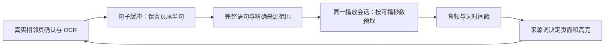

# Kindle 连续朗读架构与真机验收

2026-09-28–29。范围为当前 **iPhone Kindle 朗读**。在已验证发布基线 `9eb758b`（祖先包含 `b6dd4d7`）上增量实现，工作树为 `codex/clone-voice-credits-20260927`。后续已恢复真机并完成 r18 克隆整句复测，继续接入原生缓存页序；最新结果及尚待复验的切音色修正见 [2026-09-29 验收记录](Kindle-原生缓存页序与真机验收-2026-09-29.md)。以下保留各轮历史取证，未上传 App Store。

## 修复的问题

原实现把可视页面当作朗读边界，页末未完句没有参与下一页生成。例如现场的 “Was” 和次页 “not the raft progressing…” 分开请求。约 240 字符的硬分块还会切开自然句。大量短段在 2× / 3× 时播放得比网络生成快，即使页面预取已完成，音频仍可能停顿。

本次将正文来源、语句规划、音频队列和画面呈现分开：**翻页不结束播放会话；音频按完整语句前进，画面按正在朗读的原文词前进。**

## 模块与约束

| 模块 | 职责 |
|---|---|
| `KindleSpeechTextPlan` | 自然句边界、缩写/引号处理、长句的分句或词边界拆分。句子范围为 UTF-16；旧 OCR 分块接口保留 Character 坐标。 |
| `KindleSentenceBuffer` | 只接收同书籍、排版代次、导航代次下的已确认相邻页。保留页尾半句，与下一页句首合并一次；拒收乱序、重复和迟到页面。 |
| `KindleSpeechProjection` | 每个语音词映射到原页、原段、原词和字符范围，保留跳过脚注后的来源关系。校验正文范围一致才提交。 |
| `ReadAloudViewModel` 连续输入 | 同一 VM 追加语句，游标和请求保持连续。追加需要当前播放/账号 owner 和准确 append cursor；暂停不自动播放，失败可重试。 |
| `KindleBookViewModel` 页面适配 | 复用已发布的原生翻页确认、OCR、截图几何校验、位置恢复和导航队列。根据来源词切换页面；集成状态由单个 `KindleSentenceStreamSession` 持有。 |

分句与预取策略：

- 完整句优先；240 字符是旧接口的组合目标，600 字符是长句分块阈值。不可分割的超长单词不硬切字符，仍受 TTS 接口自身准入约束。
- 短完整句可组成约 480 字符的 TTS 批次；跨段保留双换行，标题单独保留。未完页尾不混入已提交批次，不补造标点，不模糊删除下一页前缀。
- 以**倍速折算后的可播放秒数**预取，目标窗口 24 秒。复用一个未来音频生产任务和一个前台任务，保留最多 64 段 / 4 MiB 等既有限制。
- 通常只允许一个尚未显示的已确认下一页；来源词进入该页后才解除后续取页限制。跨多个稀疏页的一条未完句有单次最多三页的获取界限。
- 原生 Next 在调用前记录尝试状态。超时后只能观察结果；不能把确认重试变成第二次 Next。弹出音色/倍速面板导致截图几何短暂变化时，只读截图最多重试三次，成功后才允许原生翻页。
- 暂停保留语句、音频及当前画面。用户按钮/滑动翻页从屏幕当前页计算目标，预取页不能导致多跳一页。字号变化取消旧代次，并重新建立 OCR / 几何。
- 页面和旧音频重资源随朗读游标释放，绝对语句编号不变。只有稳定的原生内容末位置能确认读完；抓图超时不是书末。

默认在 iPhone Kindle 启用。DEBUG 可用 `-CastReaderLegacyKindlePaging` 做旧路径对照。iPad 的多窗口重排继续使用既有播放路径；本轮没有把未验证的新会话扩展过去。其他网页阅读器、Explain 不接入新连续输入。

## 验收证据

设备为连接的 iPhone 15 Pro Max、iOS 26.7 (23H24)。所有 XCTest、安装和镜像操作都在真机完成，未使用模拟器。实际书籍为 Kindle《A Journey to the Centre of the Earth》。

| 检查 | 结果 |
|---|---|
| r16 真机 XCTest | **82 通过、0 失败、0 跳过**。包含分句、相邻页/来源范围、投影、异步追加、暂停、旧 owner、源失败重试、释放旧窗口、倍速预取、手动翻页队列、字号所有权和导航位置。 |
| r17 最终包 | 独立 DerivedData 构建通过；安装成功；没有新链路启用参数，当前 iPhone 默认进入连续会话。与 r16 的代码差异仅为保留 iPad 旧路径。 |
| 2× 连续自动翻页 | r12 实际连续 12 次，同一 VM；预取确认比来源词接管提前约 10.5–23.8 秒。 |
| 3× 音频衔接 | r15 普通音色 Heart 连续 5 页；18 次 AVPlayer 状态切换，中位 **187.5 ms**、最大 **241 ms**，没有 >600 ms 样本。23 次请求覆盖 19 个批次，按 `(paragraph, part)` 检查无重复；多出的请求为分段续传。 |
| 暂停及手动翻页 | 预取下一页后暂停保留当前画面；Next / 左滑采用已准备的相邻页。Next ×3、Previous ×2 的页键链回到净前进一页。 |
| 字号重排 | 4→5 后点击 Play，重新识别并连续自动翻过 2 页，高亮使用新布局，跨过第 32 章标题；r17 已恢复字号 4。 |
| 源页失败恢复 | 真机播放器 + HTTP fixture 验证：重试获取源页，不重新生成已完成正文；追加后仅继续一次。 |
| 完整句与特殊文本 | 完整句尾、半句、缩写、引号、Unicode、长句、标题、em dash、三页未完句均有来源范围测试。 |

r12 压力测试曾发现真实停顿：81 次切换中 6 次 >600 ms，最大 3,611 ms。修正短段合批及预取窗口后得到 r15 的上述结果。r13 曾暴露取页超前两页的竞态，已加入呈现页约束。r15 字号重排后打开音色面板时曾遇一次截图 ownership 失效误暂停，r16 已加入只读截图重试；这些失败记录也保留在报告中。

**时间口径：以上均为应用与 AVPlayer 事件时间，不是声学静音采样；不能称为任意网络、任意书籍都零停顿。** 当前实际 UI 覆盖英语书和上述设备；三页稀疏正文和书末主要由确定性测试验证，未用真实书籍遍历所有极端排版。

r17 同一 VM 已实际连续自动翻过 **15 页**，普通音色 Bella 在播放中切为克隆音色成功，面板开关没有再次触发 source-failed。75 次 AVPlayer 切换中位 208 ms，但克隆音色出现 5 次 >600 ms（最大 2,258 ms），全部位于一个批次的 `part 0 → part 1`。81 次请求按音色代次、段落和 part 检查无重复。

这不能按“停顿已修复”交付：原因是 `ClonedTTSStartup` 对每个已经规划好的 Kindle 批次再次拆出约 120 字符的快速开头，3× 时开头播完而剩余请求未完成。r18 为 Kindle 连续输入直接提供完整语句的初始 `TTSContinuation`，前台、预取及切音色后的已验证后缀都复用同一规划；已有续传优先，服务端 600 UTF-16 上限及真实剩余正文仍保留，其他入口的快速启动策略不变。r18 发起真机测试时设备变为 `unavailable`，镜像重连提示 `iPhone Not Found`。该次测试没有运行，不能记录通过；单独 iOS 真机包编译已通过（`/tmp/kindle-stream-device-r18-build.log`，`TEST BUILD SUCCEEDED`），待连接恢复后再测试和安装。

## 产物

`reports/kindle-speech-continuity-20260928/` 保存脱敏时序及指标；原始设备日志含其他历史任务内容，仅留本机临时目录，不提交。

`/tmp/kindle-stream-device-r16.xcresult` 为真机测试结果，`/tmp/kindle-stream-device-r17.log` 为最终构建日志。`bash scripts/build-voice-toc-integration.sh --check` 通过发布祖先和集成源码校验。

克隆额度购买完整验收按用户要求让位于当前 Kindle 修复，仍是独立待完成任务；本记录不宣称购买、成本或 App Store 发布已全部交付。

## 当前继续入口

r18 已在后续真机窗口中连续自动呈现 13 页，克隆音色 3× 的 33 次切换最大 258 ms，原先的 `part 0→1` 重复拆分问题已复验。原生缓存页序及字号重排继续入口已移至 [2026-09-29 记录](Kindle-原生缓存页序与真机验收-2026-09-29.md)。r5/r6 已修复切普通音色后的预取偏晚和冷启动已恢复游标无法接入连续源；设备恢复后 114 项真机回归通过，最终实书窗口自动呈现 8 个下一页，23 次 AVPlayer 间隔最大 243 ms，详见上述 2026-09-29 记录。用户最新要求将本修复与克隆额度购买合并后提交 App Store。
