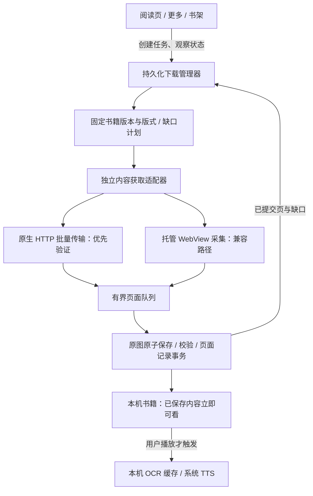

# Kindle 离线下载：后台能力与架构升级历史评审（当前不实施）

日期：2026-09-13。评审源码 `f5d6411`。本次只核对代码、既有真机证据和 Apple 文档，未改应用代码、未安装、未操作手机。

后续用户已明确收敛范围：[当前实施计划](Kindle离线下载-轻量前台交互-2026-09-13.md)采用轻量前台独占下载，优先完成进度、动态预计时间、同步动画、关闭/取消与恢复原位，再做小幅性能优化。下文独立下载管理器和原生后台路线作为远期评审保留，不是当前实施计划；包括「下载时允许继续浏览」在内的旧建议不适用于本轮。

用户约束：保存整本书；下载阶段不做 OCR；播放时本机 OCR → 系统 TTS；尽量缩短等待；正常返回、翻页、切换页面不能损坏或取消下载；明确锁屏与后台边界。

## 决策建议

采用“独立且持久化的下载任务 + 可替换内容源 + 有界流水线 + 原子保存”。优先验证能否让内容源脱离正在阅读的 WebView，使用原生 HTTP 后台传输。这个可行性问题先于大规模重构和速度承诺。

若原生内容源成立，后台传输负责已提交的网络任务，本机处理负责生成和保存可读页面；若不成立，托管 WebView 采集可以改善前台速度及操作隔离，但不能因此宣称锁屏后台整书下载已经成立。iOS 26 的持续处理任务可做条件性增强，需要验证实际依赖的 WebKit 进程，不能视为给所有 WebView 自动续命。

后台能力、整本完成时间、首次可用时间分别验收。“不丢进度、恢复后自动补齐”是可实现的可靠性目标；用户强退、网络完全断开及系统资源不足不能承诺永不中断。

## 已知事实与当前限制

1. 同一 iPhone、同一本 427 页书，图片保存任务总计 139.325 秒，首张至末张 131.002 秒，页间隔中位数 0.311 秒。前后准备、校验和恢复合计落在约 8.3 秒的差额内；只优化收尾无法把整次时间减半。逐页内部的网页渲染、桥接、存储占比还没有完整计时，不能猜定唯一瓶颈。
2. 208,724,855 字节是本机图片及快照体积，**不是网络传输量**。先前真实响应探针发现：一个 `numPage=6` 请求返回约 517 KB 的包，含 `layout_data`、`page_data`、`tokens`、`glyphs`、`manifest` 等 JSON。不能从“每次有六页数据”推导出“可直接拿到六张完整图片”，也不能推导出任意增大页数的请求一定受支持。
3. 目前链路仍是“确认当前网页页 → 取原图 → Base64 桥接 → 校验和落盘 → 写索引 → 下一页”。它在原生侧严格串行等待。源码见 `KindleOfflineDownloadCoordinator.swift:67`。
4. 每页追加都重读并重写增长中的 JSON 索引和书籍清单；最终校验又逐页通过保存页仓库重新打开资源。可优化这些重复工作，但必须保留资源和覆盖验证。
5. `KindleOfflineDownloadView.swift:65` 在视图消失时暂停；下一行对所有非 `.active` 状态也暂停。临时 inactive 与真正进入 background 未区分。任务又依赖当前阅读 VM，因此简单删除暂停回调还不足以安全支持用户随意离开页面。
6. 当前禁用自动休眠只维持前台采集，不是后台授权。之前为了 iPhone 镜像要求手机锁屏，与验证 App 在系统锁屏后的后台采集是两件事。
7. 旧扩展材料记录的是 768px JPEG、浏览器 IndexedDB 本地缓存；约 200 页捕获 20–40 秒，不含其后的整书 OCR 和推送手机。旧扩展与当前 iPhone 原图方案存在设备、图片体积、存储边界和完成标准差别，不能直接按页数承诺同速。

当前 139 秒也是一次同书测试，尚未区分在线内容缓存全冷与已预热场景。后续比较需要固定书、版式、设备和网络，并明确缓存条件。

证据：[本轮真机验收](../reports/kindle-offline-five-phases-20260912/image-only-acceptance-20260913.md)、同目录 `image-only-validation-20260913.json`；历史扩展资料为 `/Users/xuxuheng/Documents/MyProject/readout-desktop/docs/kindle-send-to-phone-pipeline-plan.md`。六页响应摘要只保留于本机 `/tmp/CastReaderKindleOfflineRendererCapabilities-v11.json`。

## 后台到底能做到什么

| 场景 | 当前版本 | 建议架构的边界 |
|---|---|---|
| 手机正常使用，App 保持前台 | 需要停留下载页 | 下载管理器托管任务；阅读页、书架、设置页只观察进度 |
| 临时弹窗、控制中心等使 scene inactive | 立即触发暂停 | 区分短暂失活与真正后台，保留任务意图；采集是否短暂停顿由源能力决定 |
| 切到其他 App 或普通系统锁屏 | 暂停网页采集 | 可独立表达的 HTTP 文件任务交给后台 URLSession；依赖 WebKit 的生成工作另行验收 |
| 网络中断 | 已存页面保留，需恢复下载 | 等待网络和分片重试，条件允许时自动恢复；已提交内容不重下 |
| 系统回收 App | 原生任务没有后台接管 | 后台传输允许独立继续；下次可执行时重新对账任务、临时文件与本机索引 |
| 用户从切换器强退 App | 停止 | 尊重系统停止语义；下次用户打开后按原保存意图恢复，明确暂停的任务不自行重启 |

Apple 的后台 `URLSession` 把传输交给独立进程，可在 App 挂起时继续；支持 HTTP/HTTPS，不支持把网页临时 `blob:` 地址当作后台下载 URL。应在前台用户启动时提交一组已知资源任务，减少每下载一个小资源就等待唤醒 App 才能提交下一个的依赖。[Apple 后台文件下载](https://developer.apple.com/documentation/foundation/downloading-files-in-the-background)

iOS 26 的 `BGContinuedProcessingTask` 适用于用户发起并在离开 App 后继续的处理任务，支持进度和过期处理，但可能被排队、终止。它的文档没有给当前 Kindle WebKit 渲染链路作保证；需要验证页面渲染、JS 回调及实际锁屏时的资源权限。对项目仍支持的较早系统也要有独立路径。[Apple 持续处理任务](https://developer.apple.com/documentation/BackgroundTasks/performing-long-running-tasks-on-ios-and-ipados)、[WWDC25 说明](https://developer.apple.com/videos/play/wwdc2025/227/)

`BGProcessingTask` 的调度时间不适合作为“现在点下载，马上完成”的保证；普通短时后台任务用于保存状态和收尾。用户强退会阻止系统自动后台拉起，不能承诺强退后仍继续。[Apple 后台执行边界](https://developer.apple.com/forums/thread/685525)

## 推荐架构

### 任务独立于界面

全局下载管理器持有任务及内容源；界面退出只取消自己的观察，不销毁任务。原生下载和阅读分别持有游标。若兼容源使用 WebView，采用独立固定版式的下载会话，验证其托管状态下仍能产图；不能把“隐藏一个 WKWebView”直接等同于后台可运行。

下载身份固定为账号/Kindle 绑定、书籍、内容版本、离线版式和任务代次。用户翻页、阅读字号变化、旋转不修改下载版式。切账号、明确暂停/取消属于真实任务边界；所有迟到回调检查代次，不能写入新任务。独立会话仍需验证 Amazon 进度上报，避免采集位置变成最远已读位置。

### 有界流水线，先释放串行等待

- 页面确认与当前可见阅读器的翻页保持顺序；一张图片与源位置绑定后，固定这份字节及身份，再交存储队列。允许下一页准备与已确认页的原生保存重叠。
- 用事件减少跨进程轮询。对已预取图片，只有能证明书籍、版式和源位置关联时才批量收取。Blob 创建顺序或内容哈希不等于页序；相同图片的两个页面记录都必须保留。
- 队列同时限制页数及字节数，小规模起步并压测调整。原生确认落盘前，生产者保留可重取资源；队列满则减速。UI 的“已保存”只统计提交成功的页面。
- 采用追加式页面记录或 SQLite 事务，避免每页重写全书清单。先写临时图片、计算摘要与格式校验，再原子发布文件并提交页面记录。不要先公布进度再异步碰运气写盘。
- 完成时检查所有预期源范围、缺口和已提交资源；通过批量读取索引减少重复解析。保留重启后、异常终止后及资源损坏时的完整核验。
- Base64 不是后台传输。桥接选择需要测量平台实际能力；若仍需 Base64，先减少往返并设置流量控制，不一次堆积整本图像字符串。

### 原生批量资源路径的放行条件

下一步先用 20–50 页验证以下问题，避免先写一个漂亮的下载管理器，最后仍卡在在线网页渲染：

1. 能否得到合法会话内、独立可请求的资源描述及真实源范围？请求是否依赖即将失效的网页状态或临时 Blob？
2. 原生下载后能否得到图片，或在不再访问在线 Kindle 的条件下确定性还原图片？仅保存排版/字形包不能标成“图片已离线”。
3. 能否枚举后续批次、固定内容版本，并验证整本覆盖？已观察的六页批次不是整本资源清单，也不证明大页数参数可任意使用。
4. 认证更新、请求过期、限流、重定向和不支持的书型能否明确处理？不能把会话错误当成书末。
5. 在普通后台及锁屏条件下，已提交网络任务是否继续、页面能否生成并发布？将“字节收到”和“页面可离线阅读”分开记录。

若通过，网络批次采用小规模自适应并发；同一个可见阅读器不并发发起多次翻页。若必须依赖不可后台运行的网页渲染，则当前条件下不能承诺纯 iPhone 的可靠锁屏整书图片下载。可继续优化前台托管采集，并单独评估用户已有桌面扩展生成图片包后同步到手机的可选路径。服务器采集同样需要内容获取能力和账号接入，不能凭空消除这个依赖，不作为默认方案。

### 用户不必等整本才开始

先保存当前页及后续小窗口，再完成整本剩余范围。复用用户已读及已确认的预取页面，减少点击“整本保存”时的剩余工作。当前仓库要求从书首顺序追加，实施此策略需要升级为按源位置记录离散覆盖和缺口；不能把“先保存的页面”直接当成书的第一页。

用户可继续浏览已经保存的部分，同时其他范围继续保存；直到完整覆盖通过才显示“整本已保存”。临时缺页清楚标识，不把首次可用时间当作整本完成时间。下载始终不 OCR；本机 OCR 仍仅由播放触发并复用结果。

压缩可以减少本地空间及桥接负担，但二次编码也消耗时间，不会减少已经收到的源数据流量。旧扩展的 768px JPEG 不直接作为默认值；先用小字、中文、脚注、图表和插图验证清晰度及离线 OCR，分别测总耗时与图像体积再决定。

## 失败恢复契约

- 持久化用户意图（继续保存/主动暂停）、任务代次、内容版本、已提交页面、缺口及重试状态。重启后先与后台系统任务对账，再补缺口，避免重复下载。
- 临时网络错误进入等待/退避重试；恢复网络后在系统允许运行时继续。不要所有错误都显示为永久“失败”，也不要用无休止重试掩盖认证或版式问题。
- 每页写入幂等。资源摘要可去重，页面出现记录不能去重。进程在确认与落盘之间终止时，只重做未提交的小窗口。
- 磁盘不足保留旧完整版本和已提交页；停止扩大队列。锁屏文件保护及认证材料的可访问性需要实机检查。
- 阅读断点与下载断点完全独立；下载未完成、继续下载和修复缺页均不能覆盖用户听到哪一句。

## 迭代顺序与验收

| 阶段 | 交付物 | 决策/退出条件 |
|---|---|---|
| 1：确定数据源和瓶颈 | 20–50 页原生批量实验；渲染/桥接/写盘分项计时；冷、热缓存基线 | 明确可否脱离在线网页生成图片，锁定后台主路线；不提前承诺秒数 |
| 2：任务与阅读解耦 | 下载管理器、固定版式、持久化意图和独立游标 | 返回、换页、旋转、进入设置不会取消或串页；同账号任务不重复 |
| 3：提高吞吐与首次可用 | 有界流水线、增量存储、预取复用、当前进度优先 | 保留整本覆盖证明；测量首批可用和整本完成两个时长；下载 OCR 次数为 0 |
| 4：后台及故障恢复 | 后台资源传输；条件性持续处理；缺口恢复与错误状态 | 锁屏、切 App、网络切换、资源过期、WebKit 回收、强退重开、磁盘不足均按契约恢复 |
| 5：真实书回归 | 普通/长书、插图、空白重复页、不同语言与版式矩阵 | 逐页内容正确、首尾无缺、阅读进度不污染；断网首次 OCR/TTS；多轮性能和可靠性数据 |

体验目标建议：点击后立即可返回；当前阅读窗口争取 3–5 秒可用；同一 427 页样本争取向一分钟内优化。这里是待测目标，不是已经证明的性能承诺；若数据源/渲染下限达不到，应依据分项计时调整。速度以明确冷/热条件的多轮结果报告，后台测试应脱离屏幕镜像和调试器的可能影响，以设备日志和页面文件验证真实状态。

本次建议的首个工作项是阶段 1 的可行性验证，随后再决定原生后台路径的实现规模。当前版本及既有已保存书籍保持不变。
