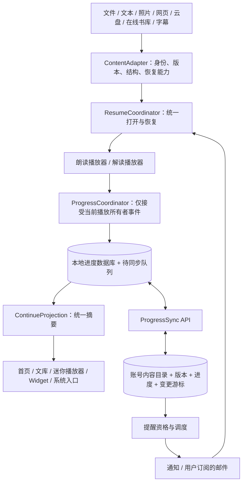

# CastReader 统一收听进度系统

> 第一阶段实施更新（2026-09-09）：`ContentCatalog`、独立进度活动数据、`ResumeCoordinator`、首页／文库／系统入口、Widget 摘要及本地提醒候选已接通。核心 106 项单元／契约和 3 项统一入口 UI、24 项长篇 UI 通过。微信读书曾因会话失效返回版权页；重新登录后，《红玫瑰与白玫瑰》和 108 章《三体全集》的旧停止点均实际恢复，首播采样分别相差约 0.052／0.034 秒。用户新反馈的阅读区高度问题也纳入回归，完整结论与来源边界以下方报告为准。具体实现、不同构建的实测证据及未交付范围见 [第一阶段报告](/Users/xuxuheng/Documents/CastReader/reports/unified-progress-phase1-20260909/README.md)。跨设备后端同步、远端通知调度及解读独立持久进度尚未实施。

> 真机平台补充（2026-09-09）：已在较新的 Kindle 基线 `33cf70a` 上建立独立整合工作树，并验证 Kindle、Google Play Books、Kobo、微信读书的真实账号续播。微信读书已实测 108 章目录、深章节跳转、句内续播和跨页后杀进程恢复；四个平台书架共用 checkpoint 显示“继续听”。逐项证据与限制见 [真机验收报告](/Users/xuxuheng/Documents/CastReader/reports/reading-resume-real-libraries-20260909/README.md)。跨设备后端同步及 App 外提醒仍是设计，不计入本机 MVP 已交付范围。

> 实施更新（2026-09-09）：本文的现状审计记录的是修改前的状态。iOS 本机朗读的可靠续播 MVP 已完成实现，并扩大到长篇 EPUB、文本、DOCX、网页、PDF／扫描 PDF、长照片与字幕的模拟器验证。最新逐项结果、修复、截图及真实第三方验收边界见 [长篇续播验收](/Users/xuxuheng/Documents/CastReader/reports/reading-resume-simulator-20260909/README.md)；此前 317 项单元／契约和 1 项 EPUB UI 的记录保留为 [首轮 MVP 验收](/Users/xuxuheng/Documents/CastReader/reports/reading-resume-mvp-20260909/README.md)。跨设备同步与提醒仍为设计方案。

日期：2026-09-09。状态：本机统一目录、进度记录、展示和恢复入口已实施，真实平台样本已恢复通过，高度／旋转追加回归以第一阶段报告为准；跨端同步和远端提醒尚未实施。

依据：本机 iOS 工作区（HEAD `b68cf34`，含已有未提交修改）、Android、Web 和扩展的相关源码，以及 Apple / Readium 官方文档。此次没有读取生产用户进度，也没有复现反馈者的设备状态；本文的“已确认”指源码行为，不等于线上所有版本的行为。

## 下一阶段实施决定：统一目录、独立进度、统一恢复（2026-09-09）

本节保留当时的分阶段实施决定。第一阶段的实际交付与当前失败项以上方实施更新及第一阶段报告为准；以下同步及远端提醒内容仍是后续方案。

### 三层主干与共享读取模型

| 层 | 权威职责 | 下一阶段接入方式 |
|---|---|---|
| ContentCatalog | 账号内稳定 item ID、来源引用及 alias、标题、正文版本；内容归档／删除状态 | 将 History 与平台元数据包装为统一内容描述；各平台仍负责获取自己的书架和正文 |
| ProgressRepository | 按 item＋模式＋内容分支保存实际停止点、有效收听时间、完成状态及修订 | 先包装已有 ReadingResumeCheckpoint，不改已验证的词锚／音频定位算法；浏览位置不覆盖停止点 |
| ResumeCoordinator | 所有继续动作的唯一入口，输出明确恢复结果 | 接管首页、文库、平台书架、Widget、快捷指令和通知入口，再分发给现有 PlayerCoordinator／Kindle 等来源适配器 |
| ContinueProjection（派生读取模型） | 从前三者读取并派生“继续听”列表、位置标签、可用动作和提醒资格 | 允许缓存快照；不成为第二份可写进度；点击时读取最新记录 |

统一的是内容身份、进度事实、状态规则和恢复动作；各来源仍保留自己的取文件、登录、章节／页面查找和渲染方式。平台页锚目前仍保留为来源定位材料，通过适配器读取，不能把“有 checkpoint”直接解释为跨设备可准确续播。

内容目录登记用户导入、明确保存或实际使用的内容；不为已绑定书架中的每本未听书伪造停止点，也不把整个书架扫描作为首页启动的前置条件。

### 状态归属必须明确

- 内容状态：可见／归档／删除。朗读和解读各自记录未开始／进行中／完成；列表状态由实际存在的模式记录聚合，未使用过的解读模式不阻止朗读内容显示完成。
- 资源可用性：按设备计算，例如本机可读、待下载、需重新登录。A 设备的“文件存在”不能同步成 B 设备的同一事实。
- 播放状态：准备、播放、暂停、缓冲，归本次播放会话；云端返回旧状态不能让当前播放器自行跳转或出声。
- 同步状态：本机已保存、待同步、已同步、冲突、失败。网络失败保留停止点，本机播放不等待同步确认。
- 提醒有独立的投递和频控日志；其候选资格读取统一内容／进度状态，不再维护另一套“这本是否未听完”。

恢复请求使用账号范围、稳定 item ID、模式／分支及 preview 或 play 意图。通知和 Widget 只携带这些定位标识，不携带权威段落下标或音频秒数。明确指定的内容不可用时保留该目标并解释原因，不替换成最近另一篇。

### 分三步交付

**第一步：统一本机目录和入口。** 建立上述接口及来源适配器；现有停止点由同一个 repository 读取，首页、文库、各平台和系统入口共用派生摘要。补齐“实际停止位置”“恢复中”“需要原文件／重新登录”等状态。所有来源逐个接入，迁移时保留原数据和旧 ID alias。

验收：同一项从首页、文库、平台书架、组件和通知打开，读取同一版本停止点；纯浏览、缓存清理、重复导入、账号切换不丢点或串号。已通过的 25 个 UI 场景和真机样本作为回归基线；第三方未覆盖分支仍单独列出，统一入口不能代替来源能力验收。

**第二步：账号同步。** 先核验现行后端 handler、鉴权和全球／中国账号边界，再落地 API 合同。使用本机优先保存、可靠 outbox、幂等操作 ID、会话序号、版本比较和删除标记。服务器确认只在事务提交后发出。云端共享记录与设备本机副本使用相同 schema；进度同步不自动同步正文。

不能在独立 JSON checkpoint 和独立 outbox 之间做不可靠双写。启用同步之前，将最新快照与待发送操作纳入同一原子事务／持久日志；后端幂等处理重试。普通心跳可以合并，但暂停、重听、删除及代际变更必须保留其顺序和语义。

冲突验收必须同时满足：A 的旧离线包不覆盖 B 的新停止点；同一有效播放会话主动回到前文时，新停止点可以后退；删除和重听后，旧设备不能复活旧状态。不能以最大百分比、客户端时间或网络到达先后来裁决。

**第三步：展示和提醒全部消费统一状态。** 本机继续入口第一步即收敛；同步成熟后增加跨设备标记和可恢复性说明，再将提醒候选、取消和点击恢复接入统一状态。已完成、删除、归档、静音等变化撤销相关待发任务；旧通知点开仍须重新校验。先整合已有本地提醒，再做账户级远端调度及去重；不同时让两套调度拥有者独立发送自动召回。

### 保住已有精度与效率

本轮已测实现是实际播放时最多约每 2 秒保存小 checkpoint，并在暂停／离开等关键点刷新。第一步保持此策略；后文早期提出的 5 秒窗口不是已交付实现，也不作为此次重构默认降级。同步心跳可暂按约 30 秒合并，暂停／切内容立即尝试上传；这些是待验证目标。

首页只查小目录和派生摘要，不为每张卡片加载全文、OCR 或生成音频。恢复成功以源位置验证及实际起播结果为准，不以进入阅读器作为成功。现有英文词锚、中文句内恢复及第三方有界页面搜索的精度差异仍需如实呈现。

本阶段不要求更换播放器、一次迁移全部客户端、引入独立微服务或全量事件溯源。后台统计、完整已听区间和精细剩余时间可后续增加，不阻塞三层主干落地。

## 1. 产品决定

**建立一个面向“用户正在听的内容”的统一系统：本机先可靠保存，账号同步负责跨端汇总，所有界面和提醒通过同一个恢复入口继续。**

用户应该得到四个明确结果：

1. 无论 EPUB、PDF、网页、照片、在线书库还是 YouTube 字幕朗读，离开后都能找到上次内容。
2. 点“继续听”，先回到正确位置，再从那里出声；看得见、听得到的是同一个位置。
3. 浏览前文、跳章节、切换朗读/解读、换音色、换设备，都不会悄悄覆盖另一种进度。
4. 提醒必须对应未完成且可恢复的内容；点开后兑现“继续”的承诺。

产品仍是帮助用户专注阅读的 TTS 工具。统一“继续听”是最近任务入口，不需要把首页改成书城，也不把所有来源改造成图书模型。

### 邮件对应的首要验收故事

用户导入一份超过 80 章的 EPUB，在第 37 章一段话中途暂停，关闭阅读器、杀掉 App，第二天重新打开。首页显示同一内容和第 37 章；打开后立即定位，点播放接着听，不要求滚过前 36 章。该测试必须包含长段落、段内多个音频片段和重新安装/跨设备的能力差异。

“重新打开历史里的同一项”与“再次从文件选择器导入相同文件”都要测试。后者需要内容身份去重，不能只修前者。

## 2. 现状审计：有哪些基础，缺口在哪里

| 范围 | 已确认的实现 | 对设计的影响 |
|---|---|---|
| iOS 本地历史 | `HistoryRecord.lastParagraphIndex`；text / epub / pdf / docx / photo 可写入；整个索引 JSON 原子保存 | 已有段落续播基础，但不是段内恢复，也不适合所有来源高频共同写入 |
| iOS 恢复入口 | `PlayerCoordinator.open` 与内容升级路径会调用 `restoreReadingPosition`；`start()` 才消费待恢复段落 | 页面打开与播放恢复是两个时点，需要明确“先定位、再出声”的准备阶段 |
| iOS 段落续播历史 | 提交 `61c47d7`，2026-08-18，已加入导入文档续播 | 不能直接断言反馈来自当前代码缺少保存；用户版本、导入路径和实际落盘仍待复现 |
| EPUB | 解析 spine 后扁平化成连续段落 ID；产物不保留每段所属的章节 href / 稳定章节锚点 | 需要补结构清单，才能显示章节、稳定重定位、避免解析变化导致错位 |
| 本地再次导入 | `ReadingDocument` 默认新 UUID；导入管线本地源沿用构建出的 ID | 相同文件重复导入可能生成另一历史项，旧进度不能自然命中 |
| 网页 | History 不把 `.web` 纳入通用段落续播 | 需要 URL 身份与内容快照/版本锚点，不能跨改版直接使用旧索引 |
| 在线书库 | WeRead / Kobo / Google Books / O’Reilly 等各有书架元数据与锚点；具体定位能力不同 | 用来源适配器接入，不能把“页面已打开”当作“精确续播已成功” |
| YouTube | 有独立缓存、片段进度、段落比例、语义版本，以及较轻的历史摘要 | 复用已有 checkpoint 设计；注意字幕时间与合成音频时间不是一个时钟 |
| 朗读与解读 | 通用 History 只存朗读段落；未见通用持久化的解读恢复记录 | 两条进度必须独立，解读还要关联生成版本、块和 marks |
| 首页和系统入口 | `HomeContinueContract` 排除 Kindle / WeRead / Google Books / Kobo / O’Reilly / YouTube；Widget 使用相同过滤后的快照 | 统一入口需要改资格判断，并先保证各来源可安全路由，不能只去掉过滤 |
| 首页卡片 | 当前主要展示封面和标题；排序依赖打开时间 | 应展示停止位置、继续动作，按真实收听排序，打开一下不应挤掉正在听的内容 |
| 本地提醒 | 真实听过至少 60 秒、离开约 24 小时后调度；权限请求在累计 180 秒后；有频控 | 可复用。但候选模型没有完成、删除、隐藏、模式或恢复能力；调度与路由范围也不一致 |
| 提醒频控细节 | 注释说每天至多一条，实际 `globalMinInterval` 是 20 小时；调度先计入尝试次数；使用全量取消 pending | 统一口径为滚动 24 小时，区分尝试/发送/打开；按业务 ID 定向撤销 |
| Web | localStorage 保存；客户端还调用旧 `/reading-progress` API，字段是 book/chapter/sentence，客户端传 userId | 不能另起一个只供 iOS 使用的新协议；迁移旧模型并核验服务端真实鉴权与部署 |
| 扩展 | `chrome.storage.local` 的进度 map，最多 20 项/30 天；URL key 只留 origin + pathname；完成率 ≥90% 不提供续播 | 可能丢弃需要继续的长期内容、混淆由 query/hash 区分的内容；90% 不能代替已完成 |
| Android | HistoryRecord 有 YouTube 摘要，未见通用文件锚点；EPUB VM 有当前段落状态；另一个 Player VM 走 VisitorService 保存段落 | 已有多个实现分支，需要逐入口接入；不能据单个旧 Player 的 saveProgress 宣称 Android 全覆盖 |

### 邮件问题的诊断边界

已确认：当前 iOS 本地文件续播只到段落；本地重复导入存在新身份路径；段落 ID 缺少持久的内容结构定位信息。

需要复现后才能判定：反馈者是否使用 8 月 18 日前的版本；是否重新导入；是否账号切换或文件缺失；是否索引写入失败；是否只是打开时画面仍在顶部；是否恢复位置在解析后不再有效。当前 `start()` 中待恢复索引不合法时会回到第一个可读段落，这类情况需要明确结果与诊断事件。

不在本轮证据范围：旧 `/reading-progress` 的线上 handler、数据库表、当前鉴权与发布版本。本机找到了调用方，但未定位可核验的现行服务端实现。不得把这个缺口描述成“后端完全没有进度”。

## 3. 统一管理的内容范围

“来源”负责获取内容，“格式”负责阅读和定位。上传到 CastReader、设备导入、分享扩展、云盘获取的同一格式，应复用格式适配器。

| 内容/入口 | 稳定身份 | 恢复定位 | 内容恢复条件 |
|---|---|---|---|
| EPUB：文件、分享、云盘 | 账号内 item；文件指纹或 provider item alias | spine href + 稳定块 ID + 句/输出单元；CFI 可作为支持时的辅助 | 本机原文件；或授权云盘重新获取；或用户开启的内容备份 |
| PDF：文本与扫描件 | 文件指纹 + 内容版本 | 页 + 文本块 + UTF-16 范围；扫描件用 OCR 版本 + 词块/归一化区域 | 原文件和同版本文本/OCR 产物 |
| DOCX / TXT / Markdown / 输入文本 | 文件/规范化文本指纹；有编辑则产生新版本 | 结构块 + 句 + 上下文校验 | 本地 payload 或已有授权的远端资源 |
| 摄像头、照片、扫描、相册 | 捕获 item + 图片指纹 | 图像页 + 固定 OCR 产物版本 + 段/词锚点 | 图片和 OCR 快照；不依赖每次重新识别 |
| 网页、浏览器扩展、分享 URL | 提取器定义的 canonical identity + 版本 | 文章/章节 + 稳定块 + 文本上下文；DOM selector 仅辅助 | 页面可访问；本地快照可选，遵循现有内容保存策略 |
| CastReader 云端上传文件朗读页 | 后端 document ID，绑定相同用户 item | 依据真实文档格式的 locator | 原上传记录仍可访问 |
| Google Drive / OneDrive 等云盘 | provider + 连接账号身份 + provider file ID | 对应格式 locator，版本由 revision/etag/export fingerprint 校验 | 同一个 provider 账号有授权；不把短效下载 URL 当身份 |
| Kindle / 微信读书 / Kobo / Google Books / O’Reilly | provider + 账号绑定范围 + book ID + edition/storefront（必要时） | provider 官方可用位置/阅读 URL + 章节；本地音频锚点作为增强 | 原平台账号仍有访问权；精度按适配器实测能力声明 |
| YouTube 字幕 TTS | video ID + 字幕语言/轨道/修订版 | 字幕 cue/源时间 + TTS rendition 的句和片段位置 | 字幕可取或已有缓存；不是原视频音轨 |
| 以上内容的解读 | 相同 item，独立 explain track | generation ID + scope/batch + block + narration locator + mark watermark | 原讲解版本仍在；失效时从该块重新讲解 |

仅导入、预览、上传处理中还没听过的内容进入“未开始”；用户明确加入的内容可进入“待听”。抓取失败的任务保留失败原因，不伪造收听进度。样例/演示默认独立标记，不参与自动召回。语音试听与克隆试听不属于内容收听进度。

## 4. 核心模型：一份内容，多个明确的状态

### 4.1 内容身份与内容版本分离

`item_id` 是账号范围内的稳定内容身份；重命名、音色变化和设备切换不改变它。`version_id` 表示具体正文版本；解析器升级还需 `structure_schema_version`，即使文件字节未变化也不能盲用旧段落下标。

本地导入先生成 UUID，计算文件 SHA-256 作为同一账号内 alias；联网 resolve 时可以映射到已有 item。移动本地进度、outbox 与快照 alias 要在一个事务完成。跨设备上传同样指纹时唯一约束负责收敛。指纹/摘要属于用户内容元数据，不放公开日志。

正文不同版本、相似标题、相同 ISBN、同一本书的不同翻译不能自动合并。格式转换后的两个文件可以由用户关联，但只有可验证的位置映射才共享续播点。URL 的 query/hash 由来源规则判断，保留影响内容身份的字段，只移除已确认的跟踪参数。

云盘与第三方书库保持“远程引用”策略。同步进度不自动上传照片、整书、OCR 正文或第三方受控正文。

### 4.2 三种位置不能互相覆盖

| 状态 | 含义 | 谁能更新 |
|---|---|---|
| `resume_locator` | 下一次应从哪里继续听 | 当前持有播放会话的播放器；或明确的“从这里听/从头开始”操作 |
| `view_locator` | 用户刚才看到哪里 | 视图滚动/目录浏览，低频本地保存；不推进收听状态 |
| `heard_ranges` | 哪些内容区间实际播放过 | 连续有效音频播放事件；用于已听覆盖率、跳过范围与完成判断 |

另存 `last_opened_at`、`last_listened_at` 和 `listened_wall_ms`。最近收听按 `last_listened_at` 排，不按打开、同步或收到旧离线事件的时刻排。设备时间不可信时保守校正/标记，不能用它裁决冲突。

`position_fraction` 是“当前位置占全文的比例”；`coverage_fraction` 是“实际已听覆盖的比例”。UI 默认显示“位置 46%”，只有能计算覆盖时才写“已听 46%”。`max(position)` 可以做辅助统计，不能替代续播点，也不能代表已听完。

### 4.3 朗读和解读各自持久化

主键：`(user_id, item_id, mode, run_id)`。

- read 与 explain 独立，内容卡片聚合显示；默认继续最近实际使用的模式。
- 解读还包含 `generation_id`、语言/讲解配置、原文范围、批次、block ID、讲解 rendition 和已经呈现的 marks。
- 选择不同原文范围或重生成讲解会创建/选择对应 generation，不把旧 block 下标套到新讲解。
- “重新听一遍”产生新 run，并更新当前 run 指针；保留上一轮完成记录与累计时长。清空历史是独立操作。
- 已生成但还没听见的内容只影响准备状态，不增加 heard_ranges。

### 4.4 状态拆分，避免一个枚举承载所有含义

`lifecycle`: unstarted / in_progress / completed / archived / deleted。

`availability`: ready / local_only / needs_download / needs_reauth / missing / changed / unsupported_here。

`playback_state`: preparing / playing / paused / buffering / ended / failed，仅会话态。

`sync_state`: local_saved / pending / synced / conflict / failed，仅同步态。

文件找不到不会把 in_progress 变成 unstarted；播放失败不会清进度；completed 可以回看且保留已完成状态，只有明确重听才建立新 run。

### 4.5 完成与时间估算

自动完成需要：已确认的全文终点事件 + 内容结构完整 + 本 run 足够覆盖。建议首版阈值 98%，并且不存在整块/整章未听缺口；阈值是产品参数，不是精确度保证。跳到末页播放结束只标记 ended，显示“已到结尾，仍有跳过的内容”；用户可“标记完成”，记录 `completion_reason=user_marked`。

在线书库的当前页面结束只是该页结束，不是整本结束。无法判断全文总量时不显示全书百分比、不自动完成，保留“第 8 章 / 本章位置”及手动完成。

剩余时间 = 已生成且待听的音频时长 / 播放倍速 + 未生成文本按该语言近期实测语速估算。估算显示“约”；只有当前章已知就显示“本章剩余约 8 分钟”。不提前合成整本书只为得出总时长。

## 5. 定位与恢复：内容位置是主锚，音频时间是可失效的增强

Readium 的 Locator 把资源、多个位置表示和文本上下文组合起来；这里借鉴模型，不要求替换现有原生阅读器。[Readium Locator](https://readium.org/architecture/models/locators/)

### 5.1 Locator v1 建议结构

```json
{
  "schema_version": 1,
  "version_id": "version-uuid",
  "structure_schema_version": 1,
  "source": {
    "kind": "epub",
    "resource": "Text/chapter37.xhtml",
    "block_id": "stable-block-id",
    "input_unit_id": "unit-12",
    "offset_utf16": 86,
    "block_fingerprint": "sha256",
    "context_fingerprint": "sha256"
  },
  "rendition": {
    "id": "rendition-uuid",
    "processed_text_revision": "sha256",
    "sentence_id": "sentence-4",
    "offset_utf16": 42
  },
  "audio_hint": {
    "asset_id": "immutable-audio-asset-id",
    "segment_id": "segment-uuid",
    "offset_ms": 17420,
    "playback_rate": 1.25
  },
  "display": { "chapter": "第 37 章", "position_fraction": 0.46 },
  "precision": "audio"
}
```

这是示意协议，非现有接口。不同 kind 使用互斥的 source 子类型；PDF 带 page，YouTube 带 track revision/cue/source_start_ms。所有 offset 明确单位，v1 跨 Swift/JS/Kotlin 统一 UTF-16，不能把 Swift `String.count` 直接当 UTF-16；Emoji、组合字符、印地语、中文需共享 fixture。

数字下标只作为同版本快速路径。稳定块 ID 由导入清单生成并存储；重解析先匹配结构/上下文，再迁移 ID。文本 hash 单独不够，重复句必须限定章节、邻近块与 occurrence；候选歧义时降低恢复精度。

云端 source 上下文默认保存指纹，不保存原文摘录；如现有授权允许本地正文，则本地可保留短 before/after 用于迁移。第三方正文与讲解缓存严格服从各来源已有持久化边界；没有跨设备精确定位材料时如实声明能力。

### 5.2 与现有 TTS 高亮的兼容

现有约束保持：**朗读画面使用 processedText，timestamps 在 processedText 内定位，不把实时词高亮映射回原文。**

需要增加持久化的 TTS rendition manifest：保存源输入单元 ID、输入修订、实际 processedText 修订、音频片段身份和句边界。源输入单元来自已知文档结构，在生成前确定；语义与片段对应来自生成时记录，不能事后拿一堆时间戳强猜原文字符。

恢复同一音频资产时直接 seek。重生成后只有 processedText 修订一致或可唯一匹配同一句时，才恢复该句；否则退到对应源输入单元起点。输入单元应有合理长度上限，并在现有流式调用中携带单元/跨度映射，避免为每句话额外发一次网络请求。服务端不支持跨度映射前，保守降级到段/单元，不宣称句级精确。

`asset_id` 必须代表不可变音频字节，缓存 key 还包含内容/模型/音色/规范化版本；缓存命中必须校验。换音色可沿用源位置，不能把原来 17.4 秒直接 seek 到新音频。倍速通常只改变播放速度，不改变内容位置。

已听覆盖也要遵守这条边界：没有可靠的输出到源跨度映射时，只把确实播完的源输入单元记为完成，单元内精细区间保留在对应 rendition 中。不能按音频时间比例猜原文字符覆盖，再把这个猜测跨音色、跨版本合并。

### 5.3 恢复结果应有类型

`exact_audio` → 同资产恢复到保存点，可按用户设置回放 1–2 秒。

`same_sentence` → 从同一句开头继续。

`same_unit` / `same_chapter` → 降级到对应单元/章节，并告知“已回到上次段落/章节”。

`needs_resource` / `needs_reauth` → 保留位置，完成取回文件/重新登录后继续。

`ambiguous` / `not_found` → 展示旧章节/页码线索、候选位置和“从头开始”；不能静默回到第一段然后报告恢复成功。

恢复回退优先向前找到安全语义边界，宁可重听一句，不跳过未听内容。长句或段落可能重播较久，这与音频精确恢复的误差指标分开统计。

### 5.4 所有入口共享的恢复管线

```text
Continue(itemID, mode?, intent=preview|play, accountScope)
  → 验证账号和 item alias
  → 读取本机 checkpoint，后台拉取该 item 的云端版本
  → 解析冲突/选择本次使用的 checkpoint
  → 来源适配器确认文件、登录和设备支持情况
  → 内容/版本/locator 校验并生成 ResumePlan
  → 先布置阅读画面、滚动和高亮位置
  → 用户点击播放时取用音频或按目标单元生成，seek 后再出声
  → 首个可听帧验证恢复位置，开始新会话写入
```

普通点标题是 preview，不自动出声；明确“继续听”、锁屏播放、系统播放意图才是 play。浏览器若受到用户手势限制，需要再点播放时保留同一 ResumePlan。

恢复和用户操作使用同一个 generation token。云端响应迟到时：尚未开始且用户未操作，可刷新准备位置；已经开始/拖动/切模式时不能突然跳位置，只提示有另一设备的记录。默认初始化的 0、空文档、加载中的索引不得写回覆盖旧进度。

## 6. 客户端结构：一个持久化入口，多个来源适配器



建议职责：

- `ContentIdentityResolver`：item/alias/version，避免重复导入割裂。
- `ProgressCoordinator`：播放所有权、输入事件、有效区间和 checkpoint，不依赖某个 View。
- `ProgressRepository`：SQLite 本机事务；正文和音频继续在各自存储中。
- `ProgressSyncEngine`：持久 outbox、重试、鉴权、批量、游标。
- `ResumeCoordinator`：得到明确 ResumePlan 和恢复精度；现有 `PlayerCoordinator` 继续掌握播放生命周期。
- `ContinueProjection`：所有展示层读取同一摘要，包括来源、模式、位置、完成与资源状态。
- `ReminderPolicy`：消费统一状态和用户偏好，不另存一套“是否听完”。

SQLite 由单写入 actor/串行队列管理，WAL + 明确的耐久性设置；checkpoint 与 outbox 同事务成功后才能显示“已保存”。现有 HistoryStore 暂保文件/封面索引，通过桥接读取统一进度，避免一次迁移同时重写文件库。

### 保存时机和效率预算（首版目标，需测量）

| 事件 | 本机 | 云端 |
|---|---|---|
| 播放中的连续 tick | 内存更新；每 5 秒持久化最新小记录 | 合并为每 30 秒一批 |
| 句/段/章节边界 | 保存边界；密集边界在短窗口合并，终点不丢 | 章节切换立即尝试，普通句段随心跳合并 |
| 暂停、来电/音频中断、耳机断开、切模式、切内容、关闭 | 立即提交本机事务，再释放旧播放所有权 | 立即尝试，失败留 outbox |
| 切后台 | 刷新本机；后台有真实音频播放时继续检查点 | 系统允许则尝试；不依赖退出回调 |
| seek / 从这里听 / 从头开始 | 保存显式位置命令，coverage 不增加 | 不与旧心跳错误合并 |
| 完成、归档、删除、重新开始 | 立即提交状态/代际变更 | 独立可靠事件 |
| 回前台、登录、网络恢复 | 先读本机，恢复当前账号队列 | 增量拉取与分批上传 |

一小时连续播放的基线约 720 次小行写入、120 次网络批次，另加少量关键事件。单条 checkpoint 目标约 1–2 KB，避免重写全历史、存全文、把每个词发到后端；实际 HTTP/TLS 与额外事件开销另计。列表每页 20–50 项，Widget 仅投影 1–3 项。

有效收听用 monotonic clock 的播放状态时长与连续媒体时间共同校验，排除 buffering、seek、预生成、失活 VM 和重复事件。倍速后的墙钟时长用于“听了多久”，媒体/文本区间用于“听到了哪里”；不能把 2x 音频时间直接计为真实投入时长。现有配额和计费仍有独立口径，本系统不改变收费逻辑。

## 7. 后端记录与读取

### 7.1 部署边界

建议在当前账号服务所处的 API 层提供 `/api/progress/v1`，使用现有关系数据库与常规后台任务。TTS 计算服务不负责永久用户进度。初版无需额外微服务、Kafka、全量事件溯源或长连接。

服务地址通过现有 `ServiceRouting`，按账号所在 realm/区域路由。全球/中国的身份和存储边界需与现有账号部署核验；不能假定字符串相同的 user ID 跨区域就是同一账号，也不能在备用 TTS 路线切换时把进度切到另一套数据。

移动端使用所选线路的 `cms_` session；Web 使用服务端验证的登录 session；扩展使用明确支持的账号 session。服务端从 session 得到 canonical user.id，不信任 body/query 中的 userId、email 或 device_id 作为授权依据。device_id 只用于设备会话识别。

### 7.2 数据表建议

| 表/实体 | 关键字段/约束 | 用途 |
|---|---|---|
| `content_items` | user_id, item_id, source_kind, format, title, persistence_policy, lifecycle, deleted_at | 用户内容目录；不保存正文大字段 |
| `content_aliases` | user_id + alias_type + scope + alias_value 唯一 → item_id | 本地指纹/旧 document ID/第三方 ID 收敛；防重复项 |
| `content_versions` | user_id, item_id, version_id, fingerprint, structure_schema, manifest_ref, total_units? | 版本与定位结构；不假设每个来源允许上传清单 |
| `progress_tracks` | user_id, item_id, mode, run_id 唯一；locator, version, revision, writer_epoch, last_listened_at, completion | 当前可直接读取的快照，当前 run 指针另有唯一约束 |
| `playback_sessions` | user_id, device_id, session_id, run_id, writer_epoch, last_seq, lease_until, base_revision | 幂等、乱序保护、当前写者与离线冲突判断 |
| `heard_ranges` | user_id, track/run/version/unit + 区间 | 仅真实收听合并的稀疏区间；完整单元压缩，保留未完成单元细粒度范围 |
| `account_changes` | user_id + change_revision；entity/tombstone | 增量同步；更新快照时同事务发布 |
| `reminder_preferences / reminder_jobs` | user_id, 时区/静默期/偏好；due_at, state, idempotency_key | 后续阶段加入；统一资格、账户频控与发送尝试 |

高频写入只更新小快照、会话序号及发生变化的区间。已听范围与音频缓存分开：音频淘汰不删除进度。保留每条 track 最近少量有效恢复点用于诊断/撤销，禁止长期保存逐词 tick。

索引：`(user_id, lifecycle, last_listened_at DESC, item_id)`；所有主查询必须以 user_id 限定。提醒 `(state, due_at)`；变更 `(user_id, change_revision)`。大版本清单和允许备份的文件用对象存储，带独立访问控制和过期策略。

### 7.3 API 合同

| API | 行为 |
|---|---|
| `POST /api/progress/v1/items/resolve` | 批量身份解析；返回 item ID、alias 与已有进度摘要 |
| `GET /api/progress/v1/continue?cursor=&limit=` | 最近未完成摘要；read/explain 同项聚合，返回设备相关 availability |
| `GET /api/progress/v1/items/{id}` | 读取具体内容、当前 tracks 和恢复所需版本引用；支持 ETag |
| `POST /api/progress/v1/sessions` | 携带 base revision；建立/接管当前播放写者，返回 epoch |
| `POST /api/progress/v1/checkpoints:batch` | 批量 checkpoint + 显式动作；逐条返回 accepted / duplicate / stale / conflict / deleted / rejected |
| `GET /api/progress/v1/changes?cursor=&limit=` | 拉取自游标以来的变更和 tombstones；游标过期返回要求重新快照 |
| `POST /api/progress/v1/items/{id}/actions` | mark_completed / restart / archive / restore / delete；带操作 ID 和预期 revision |
| `PUT /api/progress/v1/reminder-preferences` | 用户开启/关闭、时区、安静时段、稍后提醒等 |

建议 batch 最大 50 条、每条 locator 上限 8 KB；严校 mode、版本、范围、finite 数字与来源 URL allowlist。错误返回可重试属性；401 暂停当前账号队列并恢复 session，429/5xx 退避带抖动；无效内容单条隔离，不能卡住整批。

服务器 ACK 必须在事务提交后发出。每条带 `operation_id + session_id + seq + run_id + writer_epoch + base_revision`，客户端在 ACK 前一直保留可靠 outbox。收到 ACK 丢失可原样重试；同会话 seq 高水位拒绝旧写入。状态命令先于/隔离普通心跳处理；合并 checkpoint 时必须保留 coverage 并集，不能只保留最后一个区间。

### 7.4 多设备、离线与乱序的确定规则

**不使用“进度最大的赢”，也不使用“最后到达服务器的赢”。**

1. 单会话按 seq 接受；重复幂等，迟到旧 seq 不回退快照。
2. 在线开始播放时用当前 revision 建立写者 epoch；心跳续约，建议初始租约 120 秒。另一设备明确开始播放可接管；旧设备下次写入得到 stale_writer，停止自动提交并提示，而不把旧位置写回来。旧设备正在离线播放时允许继续本机听。
3. 同一有效写者的主动后退、重听也应正确保存；这就是不能取 max(offset) 的原因。
4. 离线会话记录分叉时的 base revision。联网后若云端同 track 仍等于该基线，可串行提交整个分支；若云端已被其他会话推进，保留为候选，不覆盖当前快照。
5. 只有确有两个互相矛盾的离线位置时才显示选择：“iPhone：第 37 章 / 电脑：第 42 章”。当前设备已在播放则先继续当前会话，不突然 seek。用户选定后建立新 epoch，保留另一个候选供一次撤销。
6. 同一内容版本、同 run 的 heard_ranges 可做幂等并集；不同版本未经映射不合并；累计墙钟时长按会话序号累计，并发重叠仅能作为估算，不能当计费依据。
7. restart、delete、账号切换都有代际隔离。旧 run/epoch、旧账号回调、旧 outbox 都不能复活删除内容或覆盖新一轮进度。

增量游标必须与提交顺序一致。首版可在事务内按用户串行分配 change_revision（同一用户计数行加锁），并写入快照和变更；不能直接拿可能逆序提交的全局自增 ID 当“此前已全部收到”。同一用户冲突、会话接管与快照更新用行锁/CAS。

首版建议变更日志保留 90 天；更旧的客户端强制完整同步后重放合法本地分支。删除 tombstone 与旧身份/会话失效信息的保留必须覆盖受支持的离线窗口，清理后旧客户端不得通过一般 checkpoint 重新建项。新导入创建内容是明确的新操作。

### 7.5 账号与内容可用性

本机数据库、outbox、provider 绑定和系统快照按 `realm + canonical user_id` 隔离；登出时停止旧 session、取消其提醒、清除共享表面标题。若未来开放游客，游客只写独立本机空间；登录时只迁移明确属于该游客的数据，不能猜旧账号归属。

**进度同步与文件同步是两个能力。** A 设备仅本机保存的 EPUB，其进度可同步到 B；B 没有文件时卡片显示“进度已同步，请导入原文件”，按指纹匹配后继续。重装同理。若需要真正无感跨设备接力，必须另行提供用户可见、受控的内容备份；进度系统不能暗中扩大云盘/在线书库正文上传范围。

## 8. 前端呈现与具体操作

### 首页

保留导入和拍摄入口，在上方设置“继续听”：最近实际收听的一项有醒目的继续按钮，下方最多 3 项紧凑摘要，“查看全部”进入文库的“进行中”。所有来源可出现；大规模书架仍留在各自入口，不把用户全部已购买图书混入进行中。

示例卡片：

```text
一段漫长的旅程                           EPUB · 朗读
第 37 章 · 位置 46%                      昨晚在 iPhone 收听
本章剩余约 8 分钟                        [继续听]
```

数字为界面示例，不是该邮件用户的真实记录。解读卡片显示“解读第 3/8 块”，不要把解读进度写成原文已听比例。只有一个 mode 时不放多余模式切换；两种都听过时给次要入口。

### 文库

“进行中 / 未开始 / 已完成”主筛选；来源作为次级筛选，支持标题搜索。所有筛选复用同一条 item 摘要。列表行固定展示标题、来源/格式、停止位置、模式和主动作；资源缺失直接显示恢复动作。

项目菜单提供“标记完成、从头开始、稍后提醒、隐藏/归档、删除”。隐藏只移出继续和自动提醒；删除移除账号目录与进度并通过 tombstone 同步，不删除第三方原文件。用户主动清缓存不得删除进度。

### 阅读器

进入时立即显示“上次听到：第 37 章”，加载期间保留定位意图；完成定位后再允许目标播放。目录显示当前位置；阅读器内保留“回到收听位置”，手动滚动只改变 view_locator。

暂停后可靠本机保存成功即可给短暂“进度已保存”，网络失败显示非阻断的“待同步”。不在每个 tick 弹提示，不把云端慢变成用户无法继续的原因。

长文推荐章节导航、页码/块跳转；没有可靠目录时显示段落位置，不从标题猜造 80 章。迷你播放器展开要回当前音频位置，不新建一份内容。

### 失败状态的文案

| 情况 | 用户看到 | 动作 |
|---|---|---|
| 本机没有文件 | “已保留第 37 章的进度，请导入原文件” | 导入并校验指纹；匹配后直接恢复 |
| 云盘/在线平台登录过期 | “进度已保存，重新连接后继续” | 登录同一 provider 账号，沿原 ResumePlan 继续 |
| 正文变更 | “内容已更新，已找到原位置附近”或“需要选择恢复位置” | 明确降级，保留原锚点 |
| 另一设备有冲突进度 | 展示设备与章节两个候选 | 一次选择；正常同步不弹窗 |
| 内容已完成/删除后点旧提醒 | “这篇已完成”或“这项内容已删除” | 停留说明并提供查看文库；不替用户播放另一项 |
| 当前平台不支持该来源 | “可在支持的设备上继续” | 保留记录和来源线索，不进入空白阅读页 |

## 9. App 外：先让系统入口可靠，再做低频提醒

### 9.1 被动入口优先

1. 锁屏/控制中心 Now Playing：继续当前播放会话，带相同进度；段/章时间与全书时间不能混标。
2. 桌面 Widget：最近 1–3 项、章节/位置和模式，来自 ContinueProjection。暂停、切内容、完成、同步新进度时请求刷新，不每 5 秒请求一次。
3. App Intents / 快捷指令：`continue(itemID, mode)`；显式 ID 失效不得悄悄换成最近另一项。
4. Android 对应媒体通知与快捷入口，Web/扩展对应“继续听”列表；统一协议允许支持程度不同。

WidgetKit 的刷新受系统预算和调度影响，因此点击必须重新解析最新 checkpoint，不能把组件画面中的旧百分比当最终恢复位置。[Apple WidgetKit 更新说明](https://developer.apple.com/documentation/widgetkit/keeping-a-widget-up-to-date/)

### 9.2 默认提醒策略

通知权限与“继续听提醒”产品开关分开。首次获得收听价值后说明用途，用户开启才调度；已有系统授权不代表自动同意邮件。

- 仅 in_progress、实际收听 ≥60 秒、未隐藏/删除、未静音、来源可恢复的内容。
- 最近实际收听 24 小时后才成为候选；72 小时内仍有明确意图；默认不追赶很久以前的文档。
- 过滤合格项后按 last_listened_at 排序。不要先选一个不合格的最近项，再放弃所有其他项。
- 账户滚动 24 小时至多 1 条自动召回；同内容至多 2 次、间隔至少 7 天。再次产生真实收听可产生新的资格时点，但不能突破明确的频控规则。
- 默认安静时段 21:00–09:00，使用用户 IANA 时区，处理旅行和夏令时。用户主动指定的单次提醒尊重明确时间，并受其设置约束。
- 返回、继续、完成、归档、删除、退出账号、关闭提醒后撤销对应待发任务。
- 通知按钮“继续听 / 明天提醒 / 不再提醒”；后两者不推进内容进度。
- 默认通知只说“继续上次的收听”，标题/章节展示由锁屏隐私偏好决定；不包含邮箱、token 或正文摘要。

频控建议记录 `reserved/attempted/submitted/opened/cancelled/failed`。推送平台接受不能等同用户看见，调度成功不能计为已送达。尝试次数仍可保守用于频控，避免不断补发。

### 9.3 本地与远端调度如何避免重复

第一阶段保留本地通知：只调度本设备能恢复的内容；按 `account + item + purpose` 命名的 ID 定向取消。Apple 支持系统代发已经安排的本地通知；删除 pending 请求是撤销机制。[Apple 本地通知](https://developer.apple.com/documentation/usernotifications/scheduling-a-notification-locally-from-your-app)

统一账号同步成熟后，自动召回改由服务端集中判定：发送前重新检查进度/完成/删除/静默/最近活跃状态，事务获取用户频控名额，选择一个目标设备，以持久 job 的幂等键重试。只同步 metadata、并不持有内容的设备不作为“可直接继续”目标。

同一账号使用 `reminder_authority=server|local(device_id)`，不允许本地自动召回与服务器重复生效。切到 server 前由当前本地拥有者确认取消其待发请求；其他旧版本设备未确认时不承诺账户级严格去重，可延后启用远端。离线设备也不能私自重新接管自动召回权限。

用户明确设置的离线个人定时提醒可保留本地执行，但独立分类，联网后合并取消状态。不把自动召回的离线 fallback 与服务器调度同时开启。

远端变化可能无法及时撤销一台离线设备已经安排的本地提醒；这个物理限制不能靠“发静默推送”保证消除。过渡期采用短效任务、通用通知文案和点开后复核；正式远端调度阶段以服务端资格为准。Apple 明确不保证后台推送送达，所以静默推送只能帮助刷新，不能承担正确性。[Apple 后台更新推送](https://developer.apple.com/documentation/usernotifications/pushing-background-updates-to-your-app)

### 9.4 邮件与其他外部触达

邮件仅在用户单独订阅后进入后续阶段：例如每周一次“本周待继续”，共享账号频控、完成过滤、静默和退订状态。邮件里的链接必须登录后访问当前账号内容，不携带访问凭证或把邮件地址当授权。邮件默认无需披露私密材料标题。

目前不建议为这个需求引入每日邮件、短信或大量远端推送。先验收点击后成功续播，再评估低频提醒是否提高完成率。

## 10. 迁移与实施顺序

| 阶段 | 具体交付 | 必须通过才扩展的门槛 |
|---|---|---|
| P0：解决 EPUB 反馈链路 | 复现旧/当前版本；稳定本地 item；保存版本/段内或输入单元 checkpoint；打开即定位；所有本机入口统一恢复；补暂停/中断/冷启动测试 | 超过 80 章 EPUB 冷启动后不回首章；同文件重新导入命中进度；任何降级明确可见 |
| P1：统一本机系统 | SQLite 进度库、read/explain 分轨、来源 adapter、ContinueProjection、完成/归档状态；首页/文库/Widget/提醒共用资格 | 每一种来源都有明确恢复能力；无串账号/模式；不可用资源有恢复路径 |
| P2：账号同步 | 正式核验旧 API/数据库；v1 接口、别名、outbox、冲突、游标、删除；iOS/Android/Web/扩展同契约 | 乱序/离线/重试/回退/换账号测试通过；跨设备能区分有文件与只有进度 |
| P3：外部接力与召回 | Widget 信息完善、系统意图；服务端提醒所有权与频控、用户偏好；最后再考虑邮件 | 过期提醒不播错内容；完成后不再成为候选；跨设备去重有证据 |

P0 不等后端大改；设计阶段先确定 v1 兼容字段，避免热修再制造第六套进度。当前已有的段落恢复应继承并补齐，不重写播放器的词高亮和流式播放主链。

### 迁移规则

- iOS 旧 `lastParagraphIndex` 在同一 payload/解析版本中转为 `precision=paragraph`，不凭空生成音频秒数。
- 如果旧数据没有可验证版本，恢复前校验范围和本地 payload；必要时作为低置信候选，不能默认清零。
- YouTube checkpoint 保留其语义版本，旧百分比只作为摘要；音频淘汰仍保留轻量进度。
- 在线书库现有锚点由各 adapter 包装，不把 WeRead 的页 fingerprint 当作所有来源都能 seek 的位置。
- Web 旧 book/chapter/sentence 字段保留 alias 与 legacy schema；不能把可能为“全局段落”的 sentenceIndex 直接解释成“章节内段落”。
- 扩展 20 项/30 天过期策略迁移为“可清缓存，保留进度”；旧条目只在可验证账号归属后同步，避免共享浏览器串号。
- 双写仅在有限迁移窗口内，由统一 repository 输出旧格式兼容镜像；新老写者不能并行争夺主状态。无法识别的新版本记录保留为 inert 数据，不能让一条坏数据清空整个历史。
- v1 先 shadow 比较旧新恢复结果，再按来源灰度打开。回滚关闭新 UI/云端同步仍保留数据库/outbox；不删除新进度。

### 改动落点

iOS：`HistoryStore`、`ReadingDocument` / EPUB 结构产物、`DocumentImportPipeline`、`PlayerCoordinator`、`ReadAloudViewModel` / `ExplainViewModel`、`AudioPlayerService` 的 checkpoint 事件、各 LibraryStore adapter、Home/Library/Text/PDF/Web 阅读定位、ContinueSnapshot/SystemAction/ResumeReminder。

后端/Web：现行账号 API 层新增 v1；旧 reading-progress 调用方经统一客户端迁移；核实老 handler 和区域部署后再实施兼容。不能直接将当前 Web 客户端未携鉴权的 userId 接口作为新移动端基础。

Android/扩展：各阅读 VM / PlaybackController 汇总到一个 coordinator；现有本地 History、YouTube 缓存和 progress-store 提供导入器。新建 Swift 源文件须通过 xcodeproj gem 登记传统工程的四处引用。

## 11. 验收与观测

### 正确性验收矩阵

| 场景 | 预期 |
|---|---|
| 80+ 章 EPUB 第 37 章暂停、关页、杀进程、次日冷启动 | 同 item、同章；先定位后播放；不从首章开始 |
| 长段落含多个音频 segment | 同资产恢复到保存点，不能把最后一个 segment 的时间当整段时间 |
| 同文件重导入、改文件名、分享导入、云盘重复获取 | 账号内 alias 收敛；新版本单独校验 |
| 文件已改版、解析器升级、重复句、图片段增删 | stable locator 或明确降级；不盲用数组下标 |
| 中文、英文、Emoji、组合字符、印地语；跨 Swift/JS/Kotlin | locator fixture 一致，UTF-16 边界合法 |
| 换倍速、音色、TTS 模型；缓存命中/淘汰 | 位置保持；资产不同时不复用旧秒数 |
| 页面加载、预生成、失败/额度阻断但尚未出声 | 不推进 heard_ranges，不覆盖已保存的有效恢复点 |
| 自动翻页预加载、旧 VM 回调迟到、切朗读/解读 | 只有有效所有者写；准备好下一页不等于听过 |
| 浏览前文 vs 明确“从这里听” | 前者仅改变视图；后者可以把续播点移到前面 |
| 跳到末尾、只有最后一页、在线平台未到全书终点 | 不误标已完成，不展示虚构覆盖率 |
| 解读进程被杀、切批次/范围、讲解重新生成 | 还原对应 generation/块和已出现 marks；不存在则明确从块重讲 |
| 离线一分钟后恢复；ACK 丢失；重复批次；seq 乱序 | 本机能继续；上传幂等，旧数据不回退新快照 |
| A 停在第 37 章，B 在线到第 42 章，A 旧离线包迟到 | 保留 B 当前点、A 为候选；不按到达时间覆盖 |
| 用户在当前设备主动回第 12 章 | 保存第 12 章；不被 max(position) 强行跳到第 42 章 |
| reset / delete 后旧设备上传，退出 A 登录 B 再回 A | 代际与账号隔离；不复活、不串号 |
| 同步进度但目标设备无原文件/未登录第三方 | 明确取回动作；进度保持；不声称无感续播 |
| 通知/Widget/快捷指令冷启动，item 已删/完成/账号不符 | 重新校验；绝不播放别的最近内容 |
| 听完后离开、另一设备完成后准备推送、时区变化 | 不合格候选被撤销；静默期与频控一致 |
| 多千条历史、超大 EPUB、网络高延迟、弱网 | 首页不解析所有正文；播放不等待同步；无全索引频繁重写 |

### 建议目标，非已测结果

- 正常暂停/关闭：本机写入 ACK 后，再冷启动恢复到该 checkpoint；测试资产音频 seek 误差目标 ≤1 秒。
- 突然进程终止：正常本机写盘条件下最多损失一个 5 秒 checkpoint 窗口；磁盘失败须单独暴露。句/段降级的重听长度另计，不混进精确 seek 指标。
- 版本与内容可用条件满足时，确定性测试集恢复成功率 100%；线上再分来源/入口观测，目标 ≥99.5%，不把“能打开内容”算作成功恢复。
- 已解析本机内容的恢复定位 p95 目标 <500ms；大文件解析、下载、鉴权、TTS 首音分开计时，不承诺所有来源 500ms 出声。
- 正常网络前台同账号新进度可见目标 ≤35 秒；暂停后的提交目标 ≤5 秒。离线/系统挂起不承诺实时同步。
- 串账号、恢复错内容、已删除复活、缓存清理导致进度丢失：验收必须为零。

### 埋点与诊断

`checkpoint_local_committed / checkpoint_sync_result / resume_requested / locator_resolved / first_audio_after_resume / resume_fallback / progress_conflict / completion_changed / reminder_qualified / reminder_submitted / reminder_opened / resume_after_reminder`。

共同字段：脱敏 item 标识、source/format/mode、App/adapter/schema 版本、入口、checkpoint revision、精度、fallback reason、耗时桶；不要记录正文、邮件地址、完整敏感 URL、OAuth 凭证或音频。

恢复成功需要验证“首个可听内容与 ResumePlan 一致”，不能只在调用 `open()` 时记 success。通知目标指标是点开后成功续播并有真实收听，以及完成率；点击率只作辅助。

## 12. 源码证据索引

以下是本次读取的关键位置，行号会随后续改动变化。

- [HistoryRecord 与 lastParagraphIndex](/Users/xuxuheng/Documents/CastReader/CastReader/Services/HistoryStore.swift:16)
- [首页与系统继续范围](/Users/xuxuheng/Documents/CastReader/CastReader/Services/HistoryStore.swift:188)
- [索引保存及 Widget 投影](/Users/xuxuheng/Documents/CastReader/CastReader/Services/HistoryStore.swift:560)
- [本地文件进度写入与读取](/Users/xuxuheng/Documents/CastReader/CastReader/Services/HistoryStore.swift:703)
- [PlayerCoordinator 恢复注入](/Users/xuxuheng/Documents/CastReader/CastReader/ViewModels/PlayerCoordinator.swift:107)
- [段落变更保存](/Users/xuxuheng/Documents/CastReader/CastReader/ViewModels/ReadAloudViewModel.swift:1965)
- [播放开始消费待恢复位置](/Users/xuxuheng/Documents/CastReader/CastReader/ViewModels/ReadAloudViewModel.swift:2098)
- [TextReaderView 滚动跟随](/Users/xuxuheng/Documents/CastReader/CastReader/Views/Reader/TextReaderView.swift:62)
- [EPUB 扁平段落构建](/Users/xuxuheng/Documents/CastReader/CastReader/Services/EpubNativeEngine.swift:181)
- [本地与云盘身份分支](/Users/xuxuheng/Documents/CastReader/CastReader/Utils/DocumentImportPipeline.swift:623)
- [YouTube checkpoint 模型](/Users/xuxuheng/Documents/CastReader/CastReader/Services/YouTubeCacheStore.swift:125)
- [WeRead 锚点](/Users/xuxuheng/Documents/CastReader/CastReader/Services/WeReadLibraryStore.swift:153)
- [提醒候选、策略与路由](/Users/xuxuheng/Documents/CastReader/CastReader/Services/ResumeReminderManager.swift:28)
- [现有首页继续卡片](/Users/xuxuheng/Documents/CastReader/CastReader/Views/Home/HomeView.swift:2145)
- [Widget 读取共享快照](</Users/xuxuheng/Documents/CastReader/CastReader Widget/ContinueReadingWidget.swift:39>)
- [Web localStorage 与旧 API 调用](/Users/xuxuheng/Documents/MyProject/readout-web/src/shared/lib/reading-progress.ts:1)
- [Web 恢复与保存时机](/Users/xuxuheng/Documents/MyProject/readout-web/src/shared/components/reader/reader-client.tsx:1209)
- [扩展进度存储与清理](/Users/xuxuheng/Documents/MyProject/readout-desktop/src/core/progress-store.ts:1)
- [Android 历史模型](/Users/xuxuheng/Documents/CastReader-Android/app/src/main/java/com/same/castreader/data/local/HistoryStore.kt:46)
- [Android EPUB VM](/Users/xuxuheng/Documents/CastReader-Android/app/src/main/java/com/same/castreader/ui/screens/epubreader/EpubReaderViewModel.kt:68)
