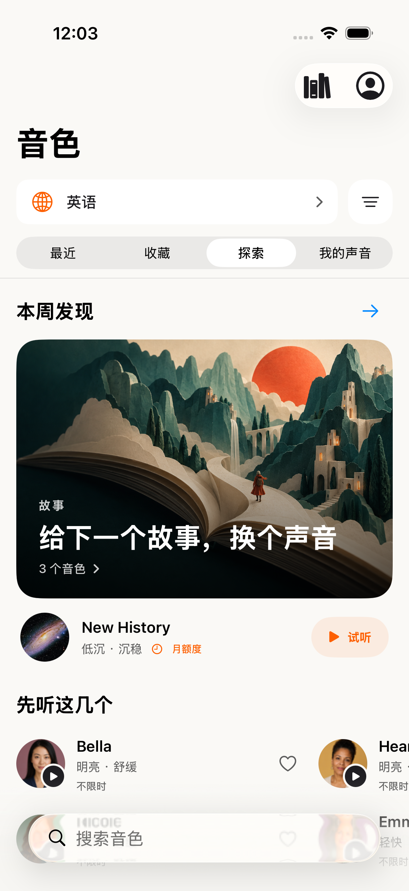
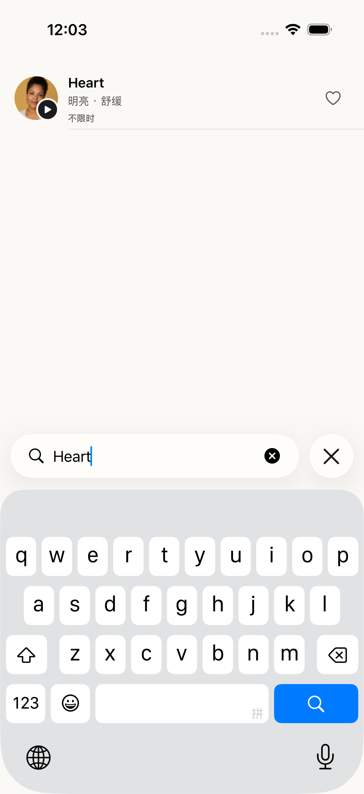
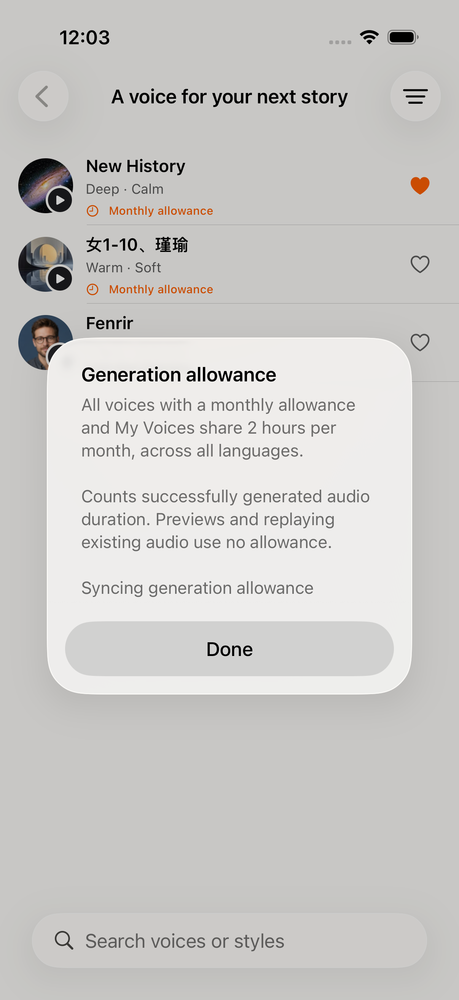

# 音色发现迭代：可周更的候选版本

本轮目标是缩短“找到喜欢的声音”的路径。产品围绕听感、使用场景、专题和收藏组织音色；引擎名称不进入选声界面。当前完成的是供验收的 iOS / 服务端候选版本，尚未替换正式入口或发布 iOS。

## 当前实现

- 精简首屏：语言与筛选同排，最近 / 收藏 / 探索 / 我的声音保留。筛选项收进单一菜单。
- 信息流包含原创专题封面、两行横向推荐、两排场景分类入口、头像卡片和紧凑音色列表。专题可进入完整列表，再按名字、风格或场景搜索、试听、收藏和选择。
- 常驻分类：日常伴读、讲解、故事、温柔、聊天感、角色感。分类依据现有标签召回，一个声音可属于多个分类；未知标签声音仍可在完整目录检索。
- 推荐参考收藏与最近使用的听感，控制同屏重复，排除实验/已退役或没有对应语言试听的推荐候选。没有热度数据时不使用“热门”表述。
- 月额度声音的推荐卡、列表、收藏均显示时钟和“月额度”。点开说明公共音色与我的声音共享 2 小时/月、跨语言共用，试听和已生成音频重播不扣量。常规声音对 Pro 显示“不限时”。
- 源样本语言不限制发现：例如韩语参考样本只要已验证英语输出，也可进入英语目录；同一个公共 ID 在切换输出语言后继续用于收藏和选择。
- 公共音色生成读取消费者服务中的持久化资源，以听者的 Pro 和月额度判定。音频身份不符、额度用尽、计费系统不可用会停止公共生成；不替换成另一个声音。
- 公共生成按 MP3 实际时长计量。英文实测具有逐词时间戳；中文实测没有逐词时间戳时使用已有整段高亮，不伪造时间轴。

## 每周运营架构

音色库和每周编排分离。音色身份、输出能力、资源和额度归目录；专题标题、布局、时间和推荐 ID 归发布清单。

每周流程：带日期和来源的文化选题 → 从已准入音色/社区投稿召回候选 → 新资源授权与试听检查 → 生成专题草稿 → 审核后定时生效 → 根据反馈迭代，必要时撤回。文化热点可以影响风格和专题，不会自动赋予新人物/角色音色的使用授权。

后端已提供草稿工具和发布清单解析：`draft / approved / withdrawn`、UTC 生效/结束时间、明确审核记录、三种展示布局、重复与不可用 ID 过滤。客户端检查语言和过期时间；坏的专题数据不会导致音色目录失效。可配置区域内容存储 URL，每周改内容不必更新 iOS 或后端代码。

当前并未启用一个自动抓取热点、生成并直接发布声音的无人审核任务。已有音色的周更编排具备定时发布能力；新的社区投稿/热点人物仍需要进入资源准入流程。

## 已验证范围

研究范围为 1,332 条公共目录记录（其中 1,323 条社区候选）和 283 条常规音色；不是将全部社区记录直接视为移动端合格音色。本轮实际准备第一批 6 个社区声音，并完成各自英语、中文输出与音频解码，共 12 段真实样本。其余音色复用同一套分批导入流程；其他输出语言仍须完成对应试听检查。

- iOS 编译成功；目录/分类/周更模型共 34 项单元测试通过。
- 两条原生 UI 测试通过：中文界面的专题搜索与选声；周更专题内真实样本播放、收藏、额度说明和切换中文后的相同音色 ID。
- 消费者候选 API 回读 289 条音色（283 + 6）及本周专题；登录后中英文实际生成成功。
- 预生成试听没有产生使用账单；两种语言写入同一个月额度桶；同请求重试不重复扣量；额度耗尽返回 429。隔离测试账号和测试订阅已清理。
- 基线校验通过。工作树以已验证的发布源码后继为基础，没有修改阅读恢复、Kindle、离线文库等子系统。

UI 测试用目录和音频属于测试 target，模拟器专用文件读取仅存在于 DEBUG；不随正式 App 打包。截图是原生模拟器验收结果，使用完整目录快照及真实生成的首批音频；不是已上线状态的截图。未对全部社区声音做人工听感甄选。

## 原生截图

## App Store 风格视觉迭代（9 月 15 日）

专题封面替换为原创纸雕故事场景，保留原生标题和入口。每个具体音色继续使用自己的头像和名字；专题画面不充当音色头像。下方采用紧凑的两排分类入口、带头像的推荐列表和卡片。

发现并修复了公共目录适配遗漏头像的问题：第一批 6 个音色的名字、原始头像 ID 和原始头像字节均与源目录一致。候选服务回读 289 条目录，6 张原头像和 1 张专题封面全部通过 HTTP 字节哈希核对。最新候选：`https://readout-cynx89jqt-castreader.vercel.app`（`b9e7e064`），未切换生产域名。此前完整额度/生成 E2E 在上一候选通过；此后变更限于头像和专题图片元数据。

原生 UI 测试使用已验证的真实样本和原始头像作为独立测试资源，不依赖模拟器的外网下载速度；Release 不包含这些测试资源。正式目录通过同一 URL 解析和图片缓存机制加载头像。

专题图片可通过 `artworkURL` 编排；新图片先部署为公开静态文件，再在每周清单中引用。图片变化使用新的文件名，避免设备图片缓存继续显示旧图。移动端无需随每周专题更新。生成提示词与资源记录见 [cover-art.md](voice-discovery-2026-09-14/cover-art.md)。
