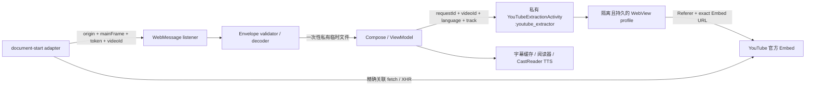
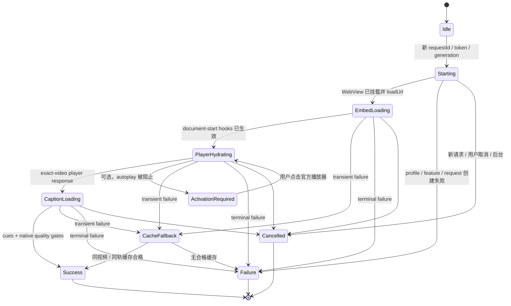

# YouTube 官方 Embed 字幕提取：Android 重构完整交接

> 文档状态：Android 实施合同（iOS 已实现、聚焦测试通过并安装真机；端到端成功取字幕待网络矩阵验证）<br>
> 更新日期：2026-08-12<br>
> iOS 真值工程：`/Users/xuxuheng/Documents/CastReader`<br>
> Android 实施工程：`/Users/xuxuheng/Documents/CastReader-Android`<br>
> 回归视频：`https://youtu.be/NHHPNMIK-fY`<br>
> 适用范围：公开视频链接 → 获取字幕 → 构建字幕稿 → CastReader TTS 朗读

本文是本次 `/watch` 页面提取改为 YouTube 官方 `/embed/{videoId}` 播放器后的完整 Android 重构合同。它覆盖播放器启动、WebView、安全边界、页面脚本、错误语义、缓存回退、用户反馈、埋点、测试和发布验收。

它**取代 Android 旧方案中的 watch/desktop/bootstrap/challenge-retry 提取链路**，但不取代已有的多语言选轨、竖屏锁定、TTS 预取合同：

- 本文：决定“如何可靠启动 YouTube 播放器并拿到字幕”。
- `docs/YouTube字幕语言切换与朗读衔接-Android对齐交接.md`：决定“拿到字幕以后如何选轨、切换和朗读”。

Android 工程当前有大量未提交改动，其中包括 YouTube extractor、adapter、UI、analytics 和测试。实施前必须先审计并保留这些改动；本文描述的是目标语义，不授权按干净基线覆盖现有文件。

---

## 1. 一页结论

### 1.1 这次真正修复的故障

用户粘贴目标视频后收到 `caption parsing timed out`，并不等于“字幕 JSON 解析太慢”。这次排查揭开了两层问题，Android 重构必须同时处理：

1. **iOS 第一版 Embed 的直接故障：** `autoplay=0` 使官方页面长期停在 `embedPreview`，目标 player response 根本没有产生，却被旧错误语义叫成 parsing timeout；
2. **Android 当前仍存在的 watch 架构债务：** `/watch?app=desktop`、desktop UA/Client Hints、`mediaPlaybackRequiresUserGesture=true`、document-start 全局暂停媒体、`googlevideo` 整域阻断和匿名首页 challenge retry 互相耦合，任何一环受网络/provider 影响都会让播放器无法稳定 hydration；
3. **双端共有的分类问题：** YouTube 的 bot verification 经常复用 `LOGIN_REQUIRED`，若先看通用 status 就会错误提示“需要登录”；
4. **双端共有的收口问题：** 页面未初始化、字幕访问失败、网络超时和真实字幕解析失败过去没有足够独立的错误语义。

旧版 `autoplay=0` 的 iPhone 真机证据表明，目标视频只停留在官方 `embedPreview`，目标 player response 没有产生。改为 `autoplay=1&mute=1` 后，iOS WebKit 真网探针已证明可以发起并精确关联目标 `/youtubei/v1/player` 请求；但当次出口被 YouTube verification 阻断，**尚未证明目标视频在真机上端到端成功取得字幕**。Android 在采用 Embed 时不能继续携带上述 watch 阻断机制，否则只是换了 URL，故障模型没有真正改变。

### 1.2 Android 目标方案

Android 必须整体改为：

```text
用户 YouTube URL
  → 只解析 11 位 videoId / startSeconds
  → 构造官方 https://www.youtube.com/embed/{videoId}
  → 直载 Embed，并发送应用身份 Referer
  → 使用真实 Android mobile WebView 身份
  → 静音自动初始化官方播放器
  → document-start 拦截目标视频的 player request/response
  → 读取 captionTracks，抓取目标字幕
  → 捕获到精确响应后进入有界 mute + pause 控制
  → native 严格校验 envelope
  → 字幕稿 + CastReader TTS
```

### 1.3 不能误解的四件事

1. **Google OAuth 不是 YouTube 网页登录。** CastReader 的 Google 授权 token 不会变成隔离 WebView 的 YouTube Cookie，也不能解除 IP/bot verification。
2. **“官方 Embed”不是“官方字幕 API”。** 官方 IFrame API可控制播放、静音和暂停，但没有返回任意公开视频字幕正文的方法；本方案对 player response / timedtext 的读取仍是未公开兼容层，必须接受它可能变化。
3. **真正的账号限制与 bot verification 必须分开。** `LOGIN_REQUIRED` 不能单独证明视频需要登录。
4. **不要偷偷回退到旧 watch 页面。** 这会重新引入旧故障并把一次失败变成两次超时。线上 kill switch 可以关闭 Embed 提取，但不能把 watch 当无条件兜底。

官方播放器为了生成目标 player/caption surface 会短暂静音初始化，可能产生少量媒体请求和 YouTube 播放数据收集。Android 不得继续宣称“完全不请求或播放视频流”；准确承诺是：全程强制静音，捕获 exact response 后按字幕证据或 1 秒上限有界暂停，不保存视频/音频流，CastReader 只用字幕文本生成朗读音频。

### 1.4 本次故障修复证据

第一版 Embed 尚未修复 hydration 时，同一目标链接的 iPhone 真机日志为：

```text
+4 ms     request started
+5 ms     navigation started
+426～9343 ms  共 36 次 player 采样，始终 actual=n/a、tracks=0
+10412 ms player_timeout
+10448 ms failed
```

这证明失败发生在播放器 hydration，不是已经拿到字幕后“解析太慢”。改造后的 iOS WebKit 真网探针为：

```text
+571 ms   exact official Embed preview
+1427 ms  video-scoped subtitle proof
+1533 ms  cueVideoById
+1796 ms  exact-video /youtubei/v1/player response，XHR 200
+1819 ms  player matched expected video
terminal  youtube_verification_required → youtube_access_limited
```

当前测试出口被 YouTube 风控，因此该次没有成功取得字幕；但新链路已经精确初始化目标播放器、捕获目标响应，并把真正原因从 `player_timeout`/假登录纠正为 `youtube_access_limited`。这是“实现与分类证据”，不是“真机成功字幕链路”的证据；Android 与 iPhone 都还必须用成功字幕样本完成设备/网络矩阵。

---

## 2. 产品范围与非目标

### 2.1 支持范围

- 用户粘贴或分享的普通公开视频；
- 人工字幕与自动生成字幕；
- 已有合同支持的九种朗读语言；
- 首次默认选轨和用户明确指定字幕轨；
- 旧字幕缓存的同视频、同轨安全回退；
- Wi-Fi、蜂窝和 VPN 出口变化下的明确分类与可重试体验。

### 2.2 明确不做

- 不索取用户 YouTube 密码；
- 不把 CastReader Google 登录 token 注入 YouTube；
- 不复制 Chrome/YouTube App Cookie；
- 不在 extractor profile 内提供账号登录页；
- 不绕过年龄、会员、私密、地区或组织权限；
- 不把用户切换 VPN 当产品解决方案；
- 不承诺所有公开视频在所有网络出口都能即时获取字幕；
- 不把 YouTube 视频音频当成 CastReader 的朗读音频。朗读始终由字幕文本生成 TTS。

### 2.3 为什么“授权登录”不能解决普通公开视频字幕

YouTube Data API 的 `captions.download` 要求 OAuth，且调用者必须有编辑该视频的权限；它适用于视频所有者/内容合作方，不适用于用户粘贴任意他人公开视频。CastReader 的普通 Google 登录也不会给 Embed 文档建立 YouTube 登录会话。因此 Android 不得新增“登录即可修复字幕”的误导流程。

---

## 3. 目标架构与信任边界



原生侧只信任同时满足以下条件的结果：

- 消息来自 `https://www.youtube.com`；
- `isMainFrame == true`；
- 当前主文档仍是本次 exact Embed URL；
- `requestToken` 等于本次随机 token；
- `requestVideoId` 与 `videoId` 都等于本次目标 ID；
- schema、大小、cue 数量、时间值、URL 字段全部通过 native 校验；
- 当前 generation/requestId 仍是活动请求，旧回调一律忽略。

页面脚本即使运行在允许来源里，仍然属于不可信输入；它不能直接写数据库、启动 TTS、打开外链或调用任意 native 能力。

Android 不得改用 `addJavascriptInterface()`：它会把 Java 对象暴露给所有 frame，无法提供本合同需要的来源与主框架证明。继续使用 AndroidX WebKit 的 origin-scoped WebMessage listener，并在回调中再次验证 `sourceOrigin`、`isMainFrame`、当前 URL 和 envelope identity。

### 3.1 请求状态机



每个请求最多提交一个 terminal result。进入 `Success`、`Failure` 或 `Cancelled` 后，任何页面消息、计时器、网络回调或旧 Activity result 都只能被忽略。`ActivationRequired` 是 Android 可选扩展，首版若不实现，直接走 `PLAYER_BOOTSTRAP_FAILED`。

---

## 4. 跨端固定合同

### 4.1 分享 URL 与 Embed URL 必须分开

`YouTubeVideoLink.canonicalUrl` 继续是普通 watch URL，用于历史、分享和“在 YouTube 中打开”。新增独立的 `embedUrl(preferredLanguage)`，只给短命 extractor 使用。

Canonical Embed：

```text
https://www.youtube.com/embed/{videoId}
  ?enablejsapi=1
  &playsinline=1
  &autoplay=1
  &mute=1
  &cc_load_policy=1
  &origin=https%3A%2F%2Fcom.same.castreader
  [&cc_lang_pref={safeCaptionLanguage}]
  [&start={nonNegativeSeconds}]
```

说明：

- `enablejsapi`、`playsinline`、`autoplay`、`cc_load_policy`、`cc_lang_pref`、`start` 与 `origin` 属于播放器合同；
- `mute=1` 是本次 iOS/Embed 实测兼容参数，不应被描述成已公开保证的字幕 API；native `setAudioMuted` 和 JS `player.mute()` 仍必须保留；
- `safeCaptionLanguage` 是给 `cc_lang_pref` 的 ISO 639-1 基础语言代码，例如 `en-US → en`、`zh-Hans-CN → zh`；地区、脚本和人工/自动轨差异仍由字幕选轨器处理，不靠这个播放器偏好参数；
- query 顺序不重要，但参数集合、单值性和值必须严格；
- canonical builder 不携带用户原链接中的 `si`、playlist、任意 query 或 fragment；
- URL parser 仍只接受严格 11 位 video ID，拒绝伪造 host、userinfo、显式 port 和歧义 ID。

### 4.2 初始请求头

Android 直载 Embed 时使用：

```kotlin
webView.loadUrl(
    embedUrl,
    mutableMapOf(
        "Referer" to "https://com.same.castreader",
        "Accept-Language" to safeHttpAcceptLanguage(preferredLanguage),
    ),
)
```

硬约束：

- `safeHttpAcceptLanguage` 保留安全规范化后的 BCP 47 标签，例如 `zh-Hans-CN`；它与只给播放器的 `safeCaptionLanguage` 是两个函数，不得混用；
- YouTube 对 Android WebView 直载 Embed 明确要求提供 HTTPS + Android applicationId 格式的 `Referer`；当前包名为 `com.same.castreader`，所以值为 `https://com.same.castreader`；
- URL 中的 `origin` 与 `Referer` 使用同一稳定应用身份，这是 **CastReader 的互操作/安全固定合同**：官方分别规定了 WebView `Referer` 应用身份和 IFrame API `origin` host-domain 约束，不应把“两者必须相等”写成 YouTube 的原文要求；
- 不使用用户 URL 作为 Referer；
- 不发送 Google OAuth token、Cookie、Authorization 或字幕正文；
- `loadUrl(url, headers)` 的额外头只作为主请求合同，不能假设所有子资源都会继承它。

### 4.3 Exact Embed 安全校验

`allowsMainFrameEmbed(url, expectedVideoId, expectedCaptionLanguage, expectedStartSeconds)` 应接受且只接受：

- scheme = `https`；
- host = `www.youtube.com`；
- 无 username/password/显式 port/fragment；
- path = `/embed/{expectedVideoId}` 或 YouTube 合法规范化后的尾斜杠版本；
- 必填参数各出现一次且值严格匹配；
- 本次有 `expectedCaptionLanguage` 时，`cc_lang_pref` 必须恰好一次且等于当次 `safeCaptionLanguage`；本次无该值时必须缺省；
- 本次有 `expectedStartSeconds` 时，`start` 必须恰好一次且等于当次规范化非负整数；本次无该值时必须缺省；
- 不存在未知参数、重复参数、空值替代或 encoded-name 绕过。

最稳妥的实现是用同一 canonical builder 产生当次预期值，对 URL 规范化后再逐项比较，而不是只验证“参数形式合法”。当前 iOS 只对这两个可选参数做单值性检查，并传入安全 BCP 47 标签；Android 应按上述更严格合同实现，同时登记 iOS parity follow-up。

主框架跳往 consent、accounts、watch、shorts、其他视频或任意外域，都不得继续携带 bridge。需要“在 YouTube 中打开”时由 native 使用 canonical watch URL 单独发 Intent。

若主框架在 adapter 来得及回传前跳往显式 `/sorry`、reCAPTCHA、异常流量/机器人验证页，应归为 `YOUTUBE_ACCESS_LIMITED`；accounts/sign-in/age/member 等明确账号门才归 `RESTRICTED`。HTTP 401/403 本身不是“用户登录即可解决”的充分证据，必须结合具体页面或 adapter 证据分类。

### 4.4 Envelope 仍使用 schema v1

不因为切换页面就重做上层字幕模型。保留现有字段与限制，并新增错误码语义：

```json
{
  "schemaVersion": 1,
  "requestToken": "per-request-random-token",
  "requestVideoId": "NHHPNMIK-fY",
  "videoId": "NHHPNMIK-fY",
  "ok": false,
  "playability": {
    "status": "LOGIN_REQUIRED",
    "classification": "sign_in_required"
  },
  "conclusivelyNoCaptions": false,
  "availableTracks": null,
  "cues": [],
  "error": {
    "code": "youtube_verification_required",
    "message": "YouTube requires verification before exposing this public transcript."
  }
}
```

Native 接收上限继续由 `YouTubeExtractionEnvelopeValidator.MAXIMUM_MESSAGE_BYTES` 控制；player response 的页面内临时 clone 单独限制为 5 MiB。不得把原始 player response 写进 envelope、日志或磁盘。

---

## 5. Android WebView 重构合同

### 5.1 当前实现与目标差异

| 能力 | 当前 Android watch 实现 | Embed 目标 |
|---|---|---|
| 主文档 | `/watch?v=...&app=desktop` | `/embed/{videoId}` |
| 浏览器身份 | desktop UA + desktop Client Hints | WebView provider 的真实 mobile 身份 |
| 启动前置 | YouTube 首页匿名 Cookie bootstrap | 直接加载 exact Embed |
| 播放策略 | `mediaPlaybackRequiresUserGesture=true` | `false`，允许 muted hydration |
| document-start | 全局 pause/mute 媒体 | 不阻断播放器；只安装捕获与约束逻辑 |
| AV 子资源 | 阻断 `*.googlevideo.com` | 不阻断播放器 hydration 所需资源 |
| challenge retry | watch/home 特定恢复流程 | 移除出关键路径，返回精确错误 |
| 字幕页面车道 | watch transcript panel/get_transcript | Embed 禁止这些 watch-only 车道 |
| 播放后清理 | 从未真正启动 | exact response 后立即 mute + pause |
| 失败 | `player_timeout`/generic restricted | `player_bootstrap_failed`/`youtube_access_limited` |

### 5.2 必须保留

- `android:exported="false"` 的专用 `YouTubeExtractionActivity`；
- production 中该 Activity 必须是可见、可互动的提取页，播放器满足第 13 节尺寸与可见性合同；
- 独立进程 `:youtube_extractor`；
- 独立且持久的 WebView data directory/profile；
- `WebViewCompat.addWebMessageListener` + exact allowed origin；
- `WebViewCompat.addDocumentStartJavaScript`；
- 随机 request token、requestId、generation/single-flight；
- 私有一次性结果文件，读取后删除；
- 42 秒 native 总 deadline 与 34.5 秒 adapter budget；
- file/content access 关闭、mixed content 禁止、multi-window/geolocation 关闭；
- third-party Cookie 关闭；first-party Cookie 可在隔离 profile 内持久化；
- Safe Browsing、render process gone、取消、后台和销毁处理；
- 仅记录安全诊断，不记录视频或字幕数据。

### 5.3 必须移除或退役

- `canonicalWatchUrl` 作为 extractor 入口；
- `ALLOW_WATCH` / `allowsMainFrameWatch` 命名和合同；
- `ANONYMOUS_SESSION_BOOTSTRAP_URL` 及首页预热；
- `YouTubeWatchRetryPolicy` 在生产提取链中的调用；
- `app=desktop`；
- 自造 desktop UA；
- `setMobile(false)` desktop Client Hints；
- 为隐藏 WebView 身份而做的请求身份伪装；
- `MEDIA_QUIESCENCE_SCRIPT`；
- 当前透明 theme、`alpha=0.01` 或等价的不可见/不可互动 production Activity；这些只能作为本地诊断工具，不得随发布包启用；
- `mediaPlaybackRequiresUserGesture=true`；
- `shouldInterceptRequest` 中的 `googlevideo` 整域阻断；
- Embed 上的 transcript panel / `/youtubei/v1/get_transcript` 等 watch-only fallback；
- 把 `player_timeout` 映射成字幕解析超时的旧语义。

旧类可以在第一步重构中暂时保留以降低 diff 风险，但不得再由 production 路径引用；第二步清理时再删除文件和测试。

### 5.4 推荐 WebView 设置

```kotlin
settings.javaScriptEnabled = true
settings.domStorageEnabled = true
settings.databaseEnabled = false
settings.allowContentAccess = false
settings.allowFileAccess = false
settings.allowFileAccessFromFileURLs = false
settings.allowUniversalAccessFromFileURLs = false
settings.javaScriptCanOpenWindowsAutomatically = false
settings.setSupportMultipleWindows(false)
settings.mediaPlaybackRequiresUserGesture = false
settings.mixedContentMode = WebSettings.MIXED_CONTENT_NEVER_ALLOW
settings.cacheMode = WebSettings.LOAD_NO_CACHE
settings.loadsImagesAutomatically = true
settings.setGeolocationEnabled(false)
settings.saveFormData = false
```

另外：

- 不设置 `userAgentString`，不覆写 User-Agent Metadata；
- 保持硬件加速，不把 extractor 强制成 software layer；
- WebView 必须加入真实 View hierarchy 并完成 layout，不能用完全 detached 实例；
- viewport 至少满足官方 200×200，下文发布方案建议播放器可见区域至少 480×270；
- 在构造 `autoplay=1` URL 前必须确认 `WebViewFeature.MUTE_AUDIO` 可用，并成功调用 `WebViewCompat.setAudioMuted(webView, true)`；不支持或调用异常时不得启动自动播放，返回 `UNSUPPORTED_WEBVIEW`；
- 保持 Android WebView Media Integrity 的平台默认身份能力，不伪造、剥离或主动退出后再指望 Embed 行为等价；
- Cookie profile 保持隔离且持久，但建议把 data-directory suffix 升级到新的 Embed 版本，避免旧 watch/desktop 缓存和 challenge 状态污染新链路；不要清除 App 其他 WebView 数据；
- 初始化新 profile 后不做 YouTube 首页 bootstrap；
- 不允许 WebView 打开下载、文件选择器、权限请求、弹窗或外部 scheme。

### 5.5 播放器必须失败关闭并保留三层静音

1. **Native 硬前置：** `WebViewCompat.setAudioMuted(webView, true)` 已成功；
2. URL `mute=1`；
3. JS 在任何 `playVideo()` 前先 `player.mute()`，捕获响应后再次 mute + pause。

这三层是 defense-in-depth，不是“任意一层成功就足够”。Native 静音能力是启动 autoplay/程序化播放的必要条件；不能证明它已生效时，要在 `loadUrl` 前失败关闭，不能拿 URL/JS 静音去猜设“大概不会出声”。`onDestroy`/完成/取消时还要执行一次 best-effort：

```js
const player = document.querySelector('#movie_player');
if (player && typeof player.mute === 'function') player.mute();
if (player && typeof player.pauseVideo === 'function') player.pauseVideo();
document.querySelectorAll('video,audio').forEach(m => { m.muted = true; m.pause(); });
```

然后 `stopLoading()`、移除 message/script handler、从父 View 移除并 `destroy()`。所有动作必须带当前 generation 检查，不能误杀下一次请求的 WebView。

### 5.6 WebView 回调与生命周期

- `shouldOverrideUrlLoading`：主框架只放行 exact Embed；其他主框架跳转终止本次提取，不能在回调中再次 `loadUrl`；
- 子资源/子框架：不做 URL 重放，不用 native HTTP 客户端代理 YouTube 请求；正常 HTTPS 资源交给 WebView；
- `shouldInterceptRequest`：不得再阻断 `googlevideo`，也不得重写 Cookie、CORS、签名或 player body；
- `onPageFinished`：只可记安全 stage，不能作为正式脚本注入点；
- `onReceivedSslError`：始终 `cancel()`，绝不 `proceed()`；
- `onReceivedHttpError` / `onReceivedError`：只让主框架错误终止请求，子资源单次失败交给 adapter 证据；
- `onRenderProcessGone`：使 token/generation 失效、销毁 WebView，按 transient runtime/network failure 收口并尝试合格缓存；
- `WebChromeClient.onCreateWindow`：返回 false；文件选择、定位、相机、麦克风、通知等权限全部拒绝；
- Activity/Compose 离开、App 后台、低内存、新请求与用户取消：先静音暂停，再移除 handler/client、View 并 destroy；
- 不调用进程级 `WebView.pauseTimers()`，也不使用全局 `AudioManager` 静音；前者会影响同进程 WebView，后者会影响 CastReader TTS 和系统其他音频。

WebMessage 回调先在主线程做字符串类型、字节上限、active request 与 source identity 快速检查，再把 JSON 解码/大 cue 处理移到后台 dispatcher；最终 terminal transition 回主线程且再验一次 generation。

---

## 6. 页面 adapter 的完整改造

Android 现有 adapter 已有许多成熟能力：fetch/XHR player 请求关联、response section merge、字幕轨解析、多语选轨、proof/timedtext、envelope 构建。应按语义移植 iOS 新增的 Embed 层，避免重写整份脚本。

### 6.1 注入顺序

在 `loadUrl` 前完成：

1. 注册 origin-restricted `WebMessageListener`；
2. 用 expected videoId、request token、语言、指定轨和 budget 构造 adapter 配置；
3. 由 `YouTubeExtractionScripts` 组合成 **一段** document-start program，固定顺序为 `main-frame guard → config → vendored bridge bootstrap → native adapter 同步 hooks → async run()`；
4. 只注册这一段 program，adapter 的同步前缀必须在任何异步等待前安装 fetch/XHR hooks；
5. 才加载 exact Embed。

Android 现有代码已采用组合脚本，继续保留可避免 provider 对多段注入顺序的差异。`addDocumentStartJavaScript` 会阻塞页面启动，组合脚本不要做同步重计算；真正的提取在异步 `run()` 中执行。iOS 内部可以保持自身注入组织方式，双端需要对齐的是上述语义顺序，不是 script 句柄数。

两端当前 vendored bridge 必须保持同一固定来源：

```text
source repository: readout-desktop
source path:       src/entrypoints/youtube-bridge.content.ts
source commit:     92d22744839bfb34c6c4f5d7152192729074919f
SHA-256:           877af9a72117d6c2afd0e303f74fe4bb03f5172e7c90ad9ac3788aeb77add02c
```

Android 当前 asset 与该 hash 一致。此次 Embed 重构修改 native adapter，不应顺手改写 vendored bridge；若以后升级 bridge，必须独立提交来源 commit、hash 和双端 fixture 变更。

在调用前必须检查 `DOCUMENT_START_SCRIPT`、`WEB_MESSAGE_LISTENER` 和 `MUTE_AUDIO` feature，并实际完成 native 静音。任一不支持/调用失败都返回 Android-native `UNSUPPORTED_WEBVIEW`，不记为播放器 bootstrap 故障。不能把 `onPageFinished + evaluateJavascript` 当正式降级，因为目标 player 请求往往已经发生；也不能在无 native 静音时启动 autoplay。Android 的 document-start script 可能进入同源子 frame，最外层必须在安装任何 hook 前先执行：

```js
if (window.top !== window.self) return;
```

不能只在异步 `run()` 开头检查；否则子 frame 已经改写了它自己的 fetch/XHR。

### 6.2 精确捕获 `/youtubei/v1/player`

fetch 与 XHR 都必须覆盖，合同如下：

1. URL origin 等于当前 `location.origin`；
2. pathname 严格等于 `/youtubei/v1/player`；
3. 从 POST body 解析对象，只读顶层 `videoId`；
4. body 大于 2 MiB、非 JSON、非对象、videoId 缺失或不等于 expected ID，全部忽略；
5. 只有请求 body 已证明是 expected ID，才 clone 对应 response；
6. response 文本上限 5 MiB，解析失败即忽略；
7. 请求关联已证明 ID 时，即使 response 缺 `videoDetails` 也可作为 exact-video response；
8. 捕获后记录受限枚举 `transport=fetch|xhr` 与 HTTP status，不记录 URL/body；
9. 立即触发第 6.5 节的有界静音/暂停控制器。

不得仅凭“响应里有 captionTracks”接受结果，也不得接受同页面其他 player 请求的响应。

### 6.3 识别官方预览壳

只接受以下 typed 路径中的 videoId：

```text
PLAYER_VARS
  .embedded_player_response
  .embedPreview
  .thumbnailPreviewRenderer
  .playButton
  .buttonRenderer
  .navigationEndpoint
  .watchEndpoint
  .videoId
```

字符串型 `embedded_player_response` 先做 2 MiB 上限再 JSON.parse。videoId 必须等于 expected ID。不能根据页面文案、任意 `<a>`、缩略图 URL 或模糊 DOM 文本判断预览。

### 6.4 有界 hydration 顺序

`autoplay=1&mute=1` 是主路径；只有确认 exact preview 后才运行一次 fallback：

1. `#movie_player` / `#player` 上的 `cueVideoById(expectedId, 0)`；
2. 没有该方法才尝试 `cueVideoByPlayerVars({videoId, video_id, startSeconds: 0})`；
3. 给 cue 至少一个 polling turn；
4. 仍无 response 时，仅点击精确官方按钮：
   - `button.ytp-large-play-button`
   - `button.ytmCuedOverlayPlayButton`
   - 必须位于 `#movie_player` 或 `#player`；
   - 必须真的是可用 `BUTTON`，不得位于 `<a href>` 内；
5. 最后才 `player.mute(); player.playVideo()`；
6. 整个 bootstrap 单次，不循环点击、不扫描通用“播放”文本。

若 Android WebView 的 autoplay 被 provider 阻止（能可靠观测官方 `onAutoplayBlocked` 时可记录安全布尔值），不要伪造用户手势；可进入第 13 节的“可见播放器 + 用户真实点击”回退设计。

### 6.5 捕获后有界暂停

响应到达时 player API 可能尚未挂到 DOM。iOS 当前的默认实现是 exact response 到达即开始 pause retry，但目标视频在当前出口被 verification 阻断，**尚未用真实成功字幕链路证明这个 pause 时点对所有 Android provider 都不会过早**。Android 应将它实现成可测试的有界控制器：

- 仅对 exact Embed + exact correlated video 执行，WebView 全程已由 native 硬静音；
- exact response 已带可用 `captionTracks`/proof 时，立即开始 pause retry；
- exact response 尚无任何字幕正证据时，最多给予 1 秒静音 hydration grace；期间一旦出现 caption track、caption module、TextTrack 或 video-scoped timedtext/proof，立即暂停；
- grace 到期无论是否出现字幕证据都必须暂停，不得为了提取无限播放；
- pause retry 最多 12 次、每次 50ms 查询 `#movie_player.pauseVideo`，每次先 mute 再 pause；
- 成功后设置一次性 `embedHydrationPaused=true`；
- 日志只写受限值 `pause_trigger=caption_evidence|grace_expired`、`paused_after_exact_response=true|false`；
- 提取成功/失败/取消的 native teardown 再做兜底暂停。

这个 1 秒是首版上限，不是官方常量。发布前必须在有字幕的受控样本上同时证明：能取得字幕、无音频泄漏、暂停后无残留播放。若探针证明“exact response 立即暂停”会截断 Android 的字幕 surface，只能在上述 native 硬静音和 1 秒上限内调整触发点，不能以放宽静音或无界播放解决。

### 6.6 Embed 上禁止 watch-only 车道

`isEmbedSurface = /^\/embed\/[^/?]+\/?$/` 时：

- 不寻找 watch engagement panel；
- 不点击 transcript panel；
- 不调用 `/youtubei/v1/get_transcript`；
- 不等待 `ytInitialData` 的 watch continuation；
- 不让这些车道消耗 adapter budget；
- 字幕只走 exact player response、官方 caption module/track 和 video-scoped timedtext/proof 路径。

多语选轨、`availableTracks`、requested-track 两道防串闸门保持已有合同不变。

### 6.7 高置信度“无字幕”仍需证据

空轨列表不能直接等于 `NO_CAPTIONS`。必须同时具备：

- exact-video player 已匹配并完成；
- playability 为 OK；
- 非 live、非 verification、非登录限制；
- 页面 online 且 ready；
- response、bridge、native TextTrack、timedtext capture 均没有字幕正证据；
- 官方 captions module 已稳定 ready，并明确返回空轨。

空状态还必须经过有界稳定窗口：至少观察 3.5 秒、取得至少 4 个样本、连续空状态稳定至少 1 秒，并在提交 `NO_CAPTIONS` 前最后复采一次。任一迟到的字幕轨、TextTrack、timedtext 或 access 异常证据都会撤销“无字幕”结论。

证据不足时返回 `caption_access` 或 `player_bootstrap_failed`，不能误报“视频没有字幕”。

---

## 7. 错误分类与用户动作

### 7.1 新增 native failure

在 `YouTubeTranscriptFailure` 新增：

```kotlin
PLAYER_BOOTSTRAP_FAILED("player_bootstrap_failed")
YOUTUBE_ACCESS_LIMITED("youtube_access_limited")
UNSUPPORTED_WEBVIEW("unsupported_webview")
```

前两个由页面证据映射；`UNSUPPORTED_WEBVIEW` 是 Android-native runtime failure，不得伪造成 adapter envelope code，也不得污染 `player_bootstrap_failed` 指标。

页面 error code 与 native failure 映射：

| 页面 code / 证据 | Native failure | 含义 | 缓存回退 |
|---|---|---|---|
| `player_bootstrap_failed` | `PLAYER_BOOTSTRAP_FAILED` | Embed 没初始化到目标播放器，不是字幕解析超时 | 是 |
| `youtube_verification_required` | `YOUTUBE_ACCESS_LIMITED` | YouTube 对当前会话/网络要求 bot verification，不证明视频需登录 | 是 |
| `restricted_video` + 明确 age/member/sign-in account 证据 | `RESTRICTED` | 视频本身需要 CastReader 不请求的账号权限 | 否 |
| `unavailable_video` + private/geo/removed 证据 | `UNAVAILABLE` | 视频私密、地区受限、已删除或不可用 | 否 |
| `adapter_timeout` / native deadline | `TIMEOUT` | 整体预算确实耗尽 | 是 |
| `fetch_timeout` / `fetch_failed` | `TIMEOUT` / `NETWORK` | 字幕请求超时或网络失败 | 是 |
| `transcript_access_*` | `CAPTION_ACCESS` | 播放器有字幕证据，但本次会话取不到正文 | 是 |
| 高置信空轨 | `NO_CAPTIONS` | 已证明无字幕 | 否 |
| `requested_track_unavailable` | `TRACK_UNAVAILABLE` | 用户选的轨不可用，保留当前会话 | 仅当前已在播会话 |
| schema/identity/size 不合法 | `MALFORMED_RESPONSE` | 本次 live/page 结果不可信 | 否；不得因此删除未读取的旧缓存 |
| native feature 缺失或无法安全静音 | `UNSUPPORTED_WEBVIEW` | 当前 System WebView/provider 不支持安全提取 | 是 |

页面轨不可用的 canonical code 固定为 `requested_track_unavailable`，与 iOS 对齐。Android 迁移期 decoder 同时接受旧 `track_unavailable` 和新 code，两者都映射 `TRACK_UNAVAILABLE`；adapter 只输出新 code。确认没有持久化旧 envelope 且一个兼容发布周期结束后，再删除 decoder alias。

### 7.2 分类顺序是硬合同

以下两个顺序必须由单元测试锁住：

```text
youtube_verification_required
  必须先于 LOGIN_REQUIRED / sign_in_required / restricted_video 通用判断

player_bootstrap_failed
  必须先于 UNPLAYABLE / unavailable 通用判断
```

原因：YouTube 的 verification response 经常带 `LOGIN_REQUIRED`；未完成的 Embed 也可能附带 generic `UNPLAYABLE`。若先看通用 status，就会再次误导用户登录，或把初始化失败说成视频不可用。

> 对齐提醒：当前 iOS adapter/envelope 主路径已经按上述顺序分类；但 native 在 adapter 回传前遇到 401/403 或 challenge redirect 的极早兜底仍可能归到 `restricted`。Android 不要复制这一宽泛兜底：401/403 + 明确 age/member/account 证据才是 `RESTRICTED`；明确 bot/sorry/reCAPTCHA 证据是 `YOUTUBE_ACCESS_LIMITED`；只有 401/403 而没有账号证据时也按暂时访问限制归 `YOUTUBE_ACCESS_LIMITED`，不猜测“登录即可”。DNS/TLS/断网仍分别走 `NETWORK`。同时登记 iOS parity follow-up。

### 7.3 UI 文案与按钮

`PLAYER_BOOTSTRAP_FAILED`：

> YouTube 播放器未能初始化或暂时限制了字幕访问，请重试或在 YouTube 中打开视频。

`YOUTUBE_ACCESS_LIMITED`：

> YouTube 暂时限制了字幕访问，视频本身可能仍可正常观看；请稍后重试或在 YouTube 中打开。

`UNSUPPORTED_WEBVIEW`：

> 当前 Android System WebView 不支持安全的静音字幕读取。请更新 Chrome/Android System WebView 后重试，或在 YouTube 中打开。

前两者都显示：

- `重试`；
- `在 YouTube 中打开`；
- `取消`。

`UNSUPPORTED_WEBVIEW` 优先显示“去更新”（仅当能解析到当前 provider 的安全应用商店页），并保留“重试”、“在 YouTube 中打开”和“取消”；不能对无 Play Store 的 OEM 构造必然可用的更新 Intent。

不得显示“登录后重试”“授权 YouTube”或“字幕解析超时”。真实 `RESTRICTED` 可以说明视频需要 YouTube 权限，但 CastReader 不请求或保存该权限。

九套 `youtube_strings.xml` 同步更新，不能只改中文/英文。

### 7.4 加载披露

加载页应说明：

> 字幕读取通过 YouTube 官方播放器完成；播放器仅在系统硬静音下短暂初始化并尽快暂停，朗读声音由字幕文本生成。

如果发布设计选择可见 Embed，native loading UI 必须放在播放器之外，不能覆盖官方播放器控件。

---

## 8. 缓存、重试和网络变化

### 8.1 可回退失败集合

`YouTubeExtractionSessionPolicy.allowsCacheFallback` 扩展为：

```text
NETWORK
TIMEOUT
CAPTION_ACCESS
PLAYER_BOOTSTRAP_FAILED
YOUTUBE_ACCESS_LIMITED
UNSUPPORTED_WEBVIEW
```

回退前仍必须验证：

- 同一 videoId；
- canonical source URL 可重新解析为同一 ID；
- 用户明确指定轨时，必须精确匹配该 track identity（包括现有合同中的 language/kind/vssId 等身份字段）；
- 用户没有明确指定轨时，对已验证的同视频缓存轨重跑现有“首选语言 → 人工/自动 → 兼容候选”排名，不得把上次偶然选中的轨当成本次必须精确命中的用户选择；
- cue 非空、数量和时间合法、有可朗读字符；
- cache key 和 track identity 合法；
- 不是 malformed 数据。

不能因为本次网络失败就拿不符合上述选轨规则或来源不明的旧字幕顶替。

### 8.2 缓存失效必须按来源和 key 精确执行

- live page/envelope 解码得到 `MALFORMED_RESPONSE` 只证明本次网络结果不可信；首版不自动用缓存掩盖该安全错误，也严禁发出广泛 `ClearCorruptTranscriptCache`；
- 只有实际读取某个 cache candidate，且该 candidate 在 schema、videoId、track identity、cue/time 或可读性校验中失败时，才删除该 candidate 的**精确 `storageKey`**；
- 某个坏 candidate 不得清空同视频其他语言/轨，更不得清空全局 YouTube 缓存；
- 实施时需修正当前 `YouTubeExtractionSessionStateMachine.failActive` 对任意 `MALFORMED_RESPONSE` 就清缓存的路径，保留现有“cache candidate 自身校验失败时按 key 删除”的路径。

### 8.3 重试边界

- 网络主文档失败或 renderer crash 可在总预算内做一次 bounded rebuild；
- verification 不做自动 reload 风暴；
- Embed bootstrap 不恢复成 YouTube 首页 + watch retry；
- 用户点“重试”时创建新 requestId/token/generation，复用隔离持久 profile；
- 后台、取消和新请求会终止旧请求；
- 42 秒后 native 一定收口，不允许页面脚本无限等待；
- 若已有合格缓存，优先快速进入阅读器并提示“使用已缓存字幕”，后台是否刷新由产品另行决定，不能阻塞朗读。

首版保持 warm extraction session 关闭：换字幕轨时重新完整初始化 exact Embed。当前 iOS 的 warm session 也未启用；不要把保活、多轨秒切或复用 proof 写成已经生效的能力。

### 8.4 VPN / IP / WebView provider

网络出口、VPN、运营商和 WebView provider 会改变 YouTube 风控结果。健壮性目标不是“绕过所有限制”，而是：

- 同一问题得到同一错误语义；
- 不再把网络/verification/播放器启动失败说成字幕解析失败；
- 缓存可用时继续朗读；
- 缓存不可用时给重试和官方打开入口；
- 日志足够判断失败发生在哪个阶段；
- 不要求用户修改 VPN 或登录作为唯一解法。

### 8.5 提取中切网

用 `ConnectivityManager.NetworkCallback` 只观察“活动默认网络是否真的变化”，不要根据 VPN 图标自行判断失败。若提取尚未终态时发生 Wi-Fi/蜂窝/VPN 路由切换：

1. 使旧 token/generation 立即失效；
2. 静音、暂停并销毁旧 WebView；
3. 等新默认网络达到 `NET_CAPABILITY_VALIDATED` 并稳定约 1 秒；
4. 以新 requestId/token/WebView 自动重试最多一次；
5. 若再次变化或失败，交给缓存/用户重试，不无限重建。

`YOUTUBE_ACCESS_LIMITED` 不做紧邻的自动 reload；连续请求可能加重风控。`RESTRICTED`、`UNAVAILABLE`、`NO_CAPTIONS` 也不自动重试。

---

## 9. Android 文件级改造清单

路径均相对 `/Users/xuxuheng/Documents/CastReader-Android/app/src`。

| 文件 | 改造内容 |
|---|---|
| `main/java/com/same/castreader/youtube/model/YouTubeModels.kt` | 保留 canonical watch URL；新增独立 Embed URL/origin builder；新增 Embed 两个 failure 与 Android-native `UNSUPPORTED_WEBVIEW` |
| `main/java/com/same/castreader/youtube/extractor/YouTubeExtractorSecurityPolicy.kt` | exact Embed URL/query/message 合同；退役 watch/home/bootstrap/googlevideo block |
| `main/java/com/same/castreader/youtube/extractor/YouTubeExtractionActivity.kt` | 可见提取页；安全 feature/mute 前置；直载 Embed + Referer；mobile identity；muted autoplay；删除旧 bootstrap/retry；完成后暂停销毁 |
| `main/java/com/same/castreader/youtube/extractor/YouTubeExtractionContract.kt` | 退役 watch challenge 的 `EXTRA_CHALLENGE_RECOVERED`；若为兼容暂留，production 永远不依赖其改写结果 |
| `main/java/com/same/castreader/youtube/extractor/YouTubeExtractorProcess.kt` | 保持独立进程；升级稳定 data-directory suffix 版本 |
| `main/java/com/same/castreader/youtube/extractor/YouTubeExtractionScripts.kt` | 删除 media quiescence；保持 `guard → config → bridge → adapter` 单段 document-start 组合 |
| `main/assets/youtube/youtube-extraction-adapter.js` | typed preview、single-shot bootstrap、fetch/XHR exact response、pause、Embed lane、两个新 code |
| `main/java/com/same/castreader/youtube/extractor/YouTubeExtractionEnvelope.kt` | 新 code 加入白名单；保持大小/cue/URL 边界 |
| `main/java/com/same/castreader/youtube/extractor/YouTubeExtractionResultDecoder.kt` | 按硬顺序分类；删除 challengeRecovered 把一切升级 restricted 的旧语义 |
| `main/java/com/same/castreader/youtube/extractor/YouTubeExtractionSessionStateMachine.kt` | 新增 failure 按合同走同源缓存；live malformed 不删缓存，坏 candidate 只删 exact key；取消仍静默 |
| `main/java/com/same/castreader/youtube/extractor/YouTubeWatchRetryPolicy.kt` | production 退役，引用清零后删除或改名为纯历史测试夹具 |
| `main/java/com/same/castreader/youtube/extractor/YouTubeExtractorSafeDiagnostics.kt` | 新 code/stage 白名单；移除 `player_timeout` 与 challengeRecovered 派生语义 |
| `main/java/com/same/castreader/youtube/YouTubeAnalyticsMapping.kt` | 新增两个 failure reason |
| `main/java/com/same/castreader/analytics/AnalyticsContract.kt` | 同步 reason 白名单 |
| `main/assets/contracts/mobile-events-v2.json` | 同步跨端 canonical contract |
| `main/java/com/same/castreader/youtube/ui/YouTubeListenUiPolicy.kt` | 新 failure 的文案、按钮和缓存状态 |
| `main/java/com/same/castreader/youtube/ui/YouTubeListenScreen.kt` | 重试/取消/在 YouTube 打开；加载披露 |
| `main/res/values*/youtube_strings.xml` | 九语本地化 |

不要直接复制覆盖 Android adapter：当前 Android 文件里已有多语、response merge、proof、Huawei/WebView 适配等未提交工作，应以函数级 diff 移植 iOS Embed 语义。

---

## 10. 建议实施顺序

### Phase 0：冻结事实

1. 保存 Android 当前 `git status` 和相关 diff；
2. 跑现有 YouTube unit tests，记录 baseline；
3. 记录测试机 WebView provider/version、网络类型，不记录外网 IP；
4. 新建实现分支或至少确保现有改动可恢复；
5. 不先删旧逻辑，先让新合同有测试保护。

### Phase 1：纯合同

1. 加 Embed URL builder；
2. 重写 security policy 单元测试；
3. 加 failure enum、envelope code 白名单；
4. 加 classifier 优先级测试；
5. 加 cache fallback 和 analytics contract 测试。

这一步不启动 WebView，便于先把语义固定。

### Phase 2：WebView runtime

1. 新 profile suffix；
2. 直载 Embed + Referer/Accept-Language；
3. 恢复 mobile provider identity；
4. 把 Activity 改为可见、可互动的官方播放器页，移除透明/`alpha=0.01` production 形态；
5. 在任何 autoplay 前完成 document-start、message listener、native mute 三项 feature gate；
6. `mediaPlaybackRequiresUserGesture=false`；
7. 移除 media quiescence 和 googlevideo block；
8. 保留 fail-closed 三层静音；
9. 清除 production watch bootstrap/retry 路径。

同时删除旧 `challengeRecovered` 对结果的污染：它曾把恢复流程中的任何后续失败强制升级成 `RESTRICTED`。Embed 架构以具体页面/player 证据分类，不再用“曾经走过 challenge retry”作为视频需要登录的证明。

### Phase 3：JS adapter

1. 移植 exact request/response capture；
2. 移植 typed preview；
3. 移植 bounded bootstrap；
4. 移植 exact response 后的有界 pause controller；
5. Embed 禁用 watch-only lanes；
6. 新错误码与 watchdog 保真；
7. 保留 Android 已有选轨、proof、response merge。

### Phase 4：UI、缓存与埋点

1. 新错误文案和用户动作，包括 WebView/provider 更新引导；
2. 同源旧缓存回退；
3. 九语；
4. analytics reason 和安全 stage；
5. 删除所有“登录可解决 verification”的文案；
6. 更新加载披露。

### Phase 5：清理与发布

1. `rg` 确认 production 无 `canonicalWatchUrl` extractor 引用；
2. `rg` 确认无 `MEDIA_QUIESCENCE_SCRIPT`、desktop UA、googlevideo block；
3. 删除/归档 WatchRetryPolicy；
4. 完成 unit、lint、instrumented、真机矩阵；
5. 灰度启用 `embed_v1`，观察分阶段指标后全量。

---

## 11. 测试合同

### 11.1 URL / 安全策略

至少覆盖：

- canonical Embed 正例；
- 带合法 `cc_lang_pref`、`start`；
- `safeHttpAcceptLanguage` 保留合法 BCP 47，`safeCaptionLanguage` 产生受支持的 ISO 639-1 基础语言；
- query 顺序变化仍合法；
- 缺必填参数、错误值、重复参数、未知参数；
- 形式合法但不等于本次 expected language/start 的 URL 被拒绝，expected 缺省时擅自带入也被拒绝；
- wrong videoId、watch/shorts 路径；
- `youtube.com.evil.example`、userinfo、HTTP、显式 port、fragment；
- percent-encoded 参数名和值绕过；
- message 非主框架、错误 origin、错误 current URL；
- token/requestVideoId/resultVideoId 任一不匹配。

### 11.2 JS adapter 合同

`YouTubeBridgeAssetContractTest` 不应只做宽泛字符串断言；至少用固定 fixture 验证：

- typed preview 只接受 exact video；
- fetch body 精确关联；
- XHR body 精确关联；
- response 缺 `videoDetails` 但请求已关联时可选中；
- 其他视频 player response 被拒绝；
- response >5 MiB 被拒绝；
- main-frame guard 位于任何 fetch/XHR monkey-patch 之前，子 frame 不能安装 hook 或发 terminal envelope；
- document-start 只有一个组合 program，顺序固定为 guard/config/bridge/adapter sync hooks/async run；
- bootstrap 单次且顺序固定；
- selector 仅匹配两个官方按钮 class；
- exact response 已有字幕证据时立即 mute/pause；无证据时最多 1 秒 grace 后必须 pause；
- Embed 不进入 get_transcript/panel；
- verification code 为 `youtube_verification_required`；
- 未匹配 player 为 `player_bootstrap_failed`，不再是 `player_timeout`；
- `postOnce` 只发送一次。

### 11.3 Native decoder / state machine

- `youtube_verification_required + LOGIN_REQUIRED` → `YOUTUBE_ACCESS_LIMITED`；
- `restricted_video + 明确年龄/会员/账号门证据` → `RESTRICTED`；
- private/geo/removed → `UNAVAILABLE`；
- `player_bootstrap_failed + UNPLAYABLE` → `PLAYER_BOOTSTRAP_FAILED`；
- 401/403 + 明确账号门 → `RESTRICTED`；401/403 无账号证据或有 bot 证据 → `YOUTUBE_ACCESS_LIMITED`；
- 新 code 通过 envelope 白名单；
- `UNSUPPORTED_WEBVIEW` 是 native failure，不映射成 `PLAYER_BOOTSTRAP_FAILED`；
- 三种新增的 cache-eligible failure 可使用合格缓存；
- 明确指定轨不能跨 track identity 回退；未指定轨时使用现有首选语言/轨排名；
- `requested_track_unavailable` 与迁移 alias `track_unavailable` 都映射 `TRACK_UNAVAILABLE`，adapter 只产生前者；
- malformed live response 不回退、不删任何旧缓存；malformed cache candidate 只删除它自己的 `storageKey`；
- CANCELLED 不显示错误、不上报 failure；
- 旧 generation 消息被忽略；
- temp result file 只消费一次。

### 11.4 UI / analytics

- 三个新 failure 都有完整用户动作；`UNSUPPORTED_WEBVIEW` 有安全可解析时才显示 provider 更新入口；
- 文案不含“字幕解析超时”或“请登录”；
- 九种语言都有资源，格式参数一致；
- `yt_extract_fail.reason` 接受 `player_bootstrap_failed`、`youtube_access_limited`、`unsupported_webview`；
- analytics 不含 videoId、URL、title、channel、token、Cookie、字幕、原始 response；
- loading disclosure 与实际 muted Embed 行为一致。

### 11.5 WebView instrumented 合同

- `DOCUMENT_START_SCRIPT` 或 `WEB_MESSAGE_LISTENER` 不支持时，不加载 autoplay URL，返回 `UNSUPPORTED_WEBVIEW`；
- `MUTE_AUDIO` 不支持或 `setAudioMuted` 抛异常时，不调用 `loadUrl`/程序化 play，不产生声音，返回 `UNSUPPORTED_WEBVIEW`；
- feature 齐备时，native mute 的调用时序早于 `loadUrl`；
- 受控有字幕视频能完成 exact player → captions/proof → cues，同时设备全程无声，pause 后无媒体残留；
- renderer crash、Activity 销毁、取消和连续请求都会使旧 generation 失效并销毁媒体。

### 11.6 构建命令

```bash
./gradlew test
./gradlew lint
./gradlew assembleDebug
./gradlew connectedAndroidTest   # 连接测试机时
```

真实 YouTube 网络测试必须 opt-in，不作为普通 CI 的确定性门禁；fixture/unit/security 测试才是 CI 硬门禁。

---

## 12. 真机验收矩阵

### 12.1 设备

至少覆盖：

- Pixel / Google System WebView；
- Samsung / Android System WebView；
- Huawei 代表机型及其当前 provider；
- 一台低内存设备，验证 renderer 回收；
- Android 版本至少覆盖最低仍活跃版本和当前主流版本。

### 12.2 网络

- 家庭/办公 Wi-Fi；
- 蜂窝；
- VPN 开与关各一组；
- 冷 profile 与已有 first-party visitor state 的暖 profile；
- 断网、慢网、切网；
- 后台/前台、锁屏、取消、连续粘贴两个链接。

### 12.3 受控视频样本集

不得用单个外部视频充当发布门禁。QA 维护一份可更新的内部配置（不在代码里硬编永久 ID），至少包含：

- CastReader 可控的公开人工字幕视频；
- CastReader 可控的公开自动字幕视频；
- 多字幕语言/人工+自动轨视频；
- 可控且确认无字幕的公开视频；
- 可控的 private/removed 样本；
- 在法务和地区允许时的 age/member/geo restricted 样本；
- live/upcoming 以及直播结束后的样本。

每个样本记录 owner、预期轨元数据、预期分类和最后复核日期。外部状态变化时先更新样本配置，不为了让测试变绿放宽 exact-video、静音或错误分类合同。

### 12.4 故障回归链接 `NHHPNMIK-fY`

`NHHPNMIK-fY` 是这次用户故障的 anti-regression sentinel，不是由 CastReader 控制的永久 fixture。常见合格结果是：

1. **成功**：捕获 exact player response，拿到字幕，播放器全程无声并有界暂停；
2. **YouTube 限制**：明确返回 `youtube_access_limited`，可重试或在 YouTube 打开。

因网络与视频都是外部状态，有具体证据的 `NETWORK`、`TIMEOUT`、`CAPTION_ACCESS`或 `UNAVAILABLE` 也可能是当次真实结果；它们不能反过来证明实现成功，成功字幕链仍必须由第 12.3 节受控样本证明。

无论该外部链接当时返回什么，以下均为不合格：

- `caption parsing timed out`；
- verification 被说成“视频需要登录”；
- exact video 未证明却返回字幕；
- 设备短暂出声；
- WebView 完成后仍播放/占用；
- 自动回退 watch 再等一次；
- 失败导致已有合格缓存无法朗读。

播放器 discovery 的内部预算建议与 iOS 对齐为约 9.5 秒；adapter 总预算仍是 34.5 秒，native 总预算 42 秒。9.5 秒后没有 exact player 证据应优先形成 `player_bootstrap_failed`，而不是把剩余 25 秒继续花在 Embed 不可能提供的 watch DOM 车道上。

### 12.5 成功链安全诊断

日志中应能看到受限字段：

```text
strategy=embed_v1
stage=navigation_started|document_started|preview_detected|player_captured|captions_ready|completed
bootstrap_method=autoplay|cue_by_id|cue_by_vars|exact_play_button|play_video
transport=fetch|xhr|none
player_matched=true|false
paused_after_exact_response=true|false
failure_reason=<whitelisted reason>
elapsed_bucket=<bucket>
```

不得出现 target URL、videoId、requestToken、标题、频道、字幕正文、proof、Cookie、response body 或用户外网 IP。

---

## 13. 可见播放器与用户手势回退

官方 YouTube 要求自动播放的 Embed 在启动时可见，且播放器超过一半区域可见；也禁止用 overlay 遮挡播放器。与此同时，本次工程事实是：不启动播放器，某些 WebView 只保留 preview，字幕 surface 不会出现。

因此本重构的 **production 合同固定为可见、可互动的官方 Embed**：

### 推荐发布形态

- 提取页展示真实官方 Embed，建议至少 480×270；
- loading 说明和取消按钮放在播放器外部；
- 自动 muted hydration 时保证播放器可见且不被遮挡；
- exact response 到达后按第 6.5 节的有界规则尽快暂停，然后进入原生字幕阅读器；
- 不改造、覆盖或伪装官方播放器 UI。

### Provider 阻止 autoplay 时

- 保留同一个 exact Embed WebView；
- 显示“点按播放器以读取字幕”的解释；
- 用户真实点击官方播放按钮后继续捕获；
- 不能用 native 按钮调用 JS `.click()` 冒充用户手势；
- 用户拒绝时可取消或在 YouTube 打开。

这一真实点击流程是 **Android 重构建议**，不是当前 iOS 已交付能力；当前 iOS fallback 仍是 bounded 的精确官方按钮程序化点击或 `playVideo()`。Android 若落地 `activation_required`，需新增状态机与 UI 测试，不能假称已从 iOS 原样移植。

iOS 当前用于验证 hydration 的“已附着但透明的 live window”只能作为工程证据，**不能自动被当成 Android 的政策合规证明**。完全隐藏、`alpha=0.01`、遮挡控件或不可互动的自动播放不在本文 DoD 内；若未来想改成该形态，必须另立方案并重新完成 YouTube 政策/法务评估，不得作为本次实现中的隐藏开关。

---

## 14. 稳定性与合规边界

### 14.1 哪些是官方稳定面

- `https://www.youtube.com/embed/{videoId}`；
- IFrame Player API 的 `playVideo`、`pauseVideo`、`mute` 与事件；
- `enablejsapi`、`origin`、`autoplay`、`playsinline`、字幕偏好等公开参数；
- WebView 直载 Embed 时提供 app identity `Referer`；
- Android OS WebView 与 WebView Media Integrity 身份机制。

### 14.2 哪些是兼容层而非官方字幕 API

- monkey-patch page-world fetch/XHR；
- `/youtubei/v1/player` response 结构；
- `PLAYER_VARS.embedded_player_response.embedPreview` 内部结构；
- `captionTracks.baseUrl`、proof 与 signed timedtext 参数；
- `#movie_player` 的非公开方法和 DOM class；
- 从播放器内部响应提取字幕正文。

这些部分必须由 fixture、错误分类、缓存和灰度保护，不能承诺永久稳定。官方 IFrame API 文档的公开方法列表没有任意公开视频字幕正文接口；这是依据官方 API surface 作出的工程判断。

### 14.3 发布保护

- 加策略版本 `embed_v1`；
- 可以 server-config kill switch，但不自动回旧 watch；
- 分 5% → 25% → 100% 灰度；
- 关注成功率、bootstrap failure、access limited、native timeout、平均耗时、cache fallback；
- 按 WebView provider major、Android major、网络类型聚合，不采集精细设备指纹；
- `player_bootstrap_failed` 或 native timeout 突增时暂停灰度；
- DOM/内部 API 改变时通过 adapter 版本修复，不在 native 层堆字符串特判。

官方参数文档明确说明 `autoplay=1` 会在页面加载时产生播放数据收集与共享；加载披露、隐私评审和发布说明必须与这一事实一致。

### 14.4 Android WebView Media Integrity 隐私评审

YouTube 官方 IFrame 文档说明，Android WebView 中的 Embed 可通过 Media Integrity 自动向 YouTube 发送经证明的 app identity，其中包括包名、应用版本、签名证书和 Google Play services 生成的设备证明 token。官方同时说明这些数据用于 app/device integrity，经加密、不向第三方分享，并在固定保留期后删除；平台提供 app identity 配置和 opt-out。

因此 Android 发布前必须：

- 把上述数据类别与 Embed/autoplay 播放数据一起纳入隐私评审和用户披露；
- 默认保留平台身份行为，不伪造包名/签名；
- 若产品决定 opt-out，必须作为独立隐私/兼容性变更评估，并重跑整个 provider/网络矩阵；不得假设 opt-out 后播放器身份、成功率和风控结果不变。

---

## 15. iOS 真值锚点

Android 实施时以语义对齐为主，不逐行翻译 Swift：

> 锚点来自 2026-08-12 的 iOS working-tree 快照，当时包含未提交实现。下表的 symbol/语义是权威索引，行号只是定位提示；后续文件漂移时用类型和函数名搜索，不以旧行号为合同。

| iOS 文件 | 真值内容 |
|---|---|
| `CastReader/Models/YouTubeTranscript.swift:19`、`:914` | Embed builder、origin、新 failure |
| `CastReader/Services/YouTubeTranscriptService.swift:26`、`:578`、`:1278`、`:1357`、`:1458`、`:1637` | exact Embed 安全策略、分类顺序、WebKit 设置、Referer、message 校验、teardown |
| `CastReader/Services/YouTubeWebScripts.swift:191`、`:267`、`:737`、`:1262`、`:1685`、`:3338` | request/response correlation、typed preview、bootstrap、pause、无字幕证据、Embed lane |
| `CastReader/Services/YouTubeRouteCenter.swift:263`、`:318` | 官方打开和新错误文案 |
| `CastReader/Views/YouTube/YouTubeExtractionOverlay.swift:124` | 新失败动作与加载披露 |
| `CastReader/Views/MainTabView.swift:795`、`:1156` | 缓存回退和 failure reason 映射 |
| `CastReader/Services/ProductAnalytics.swift:573`、`:800` | analytics 合同与 reason 白名单 |
| `CastReaderTests/YouTubeTranscriptServiceTests.swift:57`、`:862` | URL、安全、Referer、分类合同 |
| `CastReaderTests/YouTubeWebScriptsTests.swift:16`、`:927`、`:1059`、`:1507` | fixture、bootstrap、fetch/XHR、bot 分类合同 |

iOS 本次聚焦回归共 82 个 YouTube 相关测试：81 个通过、1 个显式 opt-in 真网测试跳过；实现已编译并安装到 iPhone。目标视频在当前测试网络触发 YouTube bot verification 时被分类为 `youtube_access_limited`，不再返回 caption parsing timeout，也不再误导为“登录即可解决”。最终 exact-response 证据来自 iOS WebKit 真网探针，当次未取得字幕；不得将这一记录引用为真机端到端成功证明。

---

## 16. Definition of Done

Android 重构只有同时满足以下条件才算完成：

- [ ] production extractor 主文档为 exact official Embed，不是 watch；
- [ ] initial request 带正确 app identity Referer；
- [ ] current URL 的 video/language/start 都与当次 expected canonical Embed 严格一致；
- [ ] 使用真实 mobile WebView identity；
- [ ] 不再有首页匿名 bootstrap、desktop UA/hints、media quiescence、googlevideo block；
- [ ] production Activity 中的官方播放器可见、可互动、尺寸合格，无透明/`alpha=0.01` 隐藏路径；
- [ ] document-start、message listener、native mute 缺一即 fail-closed 为 `UNSUPPORTED_WEBVIEW`，绝不先加载 autoplay；
- [ ] muted autoplay 可 hydration，exact response 后按字幕证据/1 秒上限有界 pause；
- [ ] fetch 与 XHR 都做 request-body exact video correlation；
- [ ] Embed 不运行 watch transcript/get_transcript 车道；
- [ ] verification 与真实 restricted 分开；
- [ ] bootstrap failure 与 timeout/unavailable 分开；
- [ ] 三个新增 cache-eligible failure 支持经严格 video/选轨校验的缓存回退；
- [ ] malformed live response 不删旧缓存，坏 cache candidate 只删 exact `storageKey`；
- [ ] UI 提供重试、打开 YouTube、取消，不要求登录或改 VPN；
- [ ] 九语和 analytics canonical contract 全部对齐；
- [ ] 单元、lint、debug build、instrumented tests 通过；
- [ ] 受控的人工字幕、自动字幕、多轨、无字幕和限制样本完成设备/网络矩阵；
- [ ] 故障链接 `NHHPNMIK-fY` 不再产生假 parsing timeout/假登录、错视频或声音泄漏；
- [ ] 无设备出声、无残留播放、无敏感日志；
- [ ] 可见播放器、autoplay 数据和 Media Integrity 完成政策/隐私评估；
- [ ] 灰度指标和 kill switch 可用，且 kill switch 不回退旧 watch。

---

## 17. 官方资料

- [YouTube Embedded Players and Player Parameters](https://developers.google.com/youtube/player_parameters)
- [YouTube IFrame Player API Reference](https://developers.google.com/youtube/iframe_api_reference)
- [YouTube API Services – Required Minimum Functionality](https://developers.google.com/youtube/terms/required-minimum-functionality)
- [YouTube Data API – Captions: download](https://developers.google.com/youtube/v3/docs/captions/download)
- [Android WebViewCompat](https://developer.android.com/reference/androidx/webkit/WebViewCompat)
- [Android WebSettings](https://developer.android.com/reference/android/webkit/WebSettings)
- [Android WebView `loadUrl` with additional headers](https://developer.android.com/reference/android/webkit/WebView#loadUrl(java.lang.String,%20java.util.Map%3Cjava.lang.String,%20java.lang.String%3E))
- [Android WebView native bridge security](https://developer.android.com/privacy-and-security/risks/insecure-webview-native-bridges)
- [AndroidX ProcessGlobalConfig / isolated WebView data directory](https://developer.android.com/reference/androidx/webkit/ProcessGlobalConfig)
