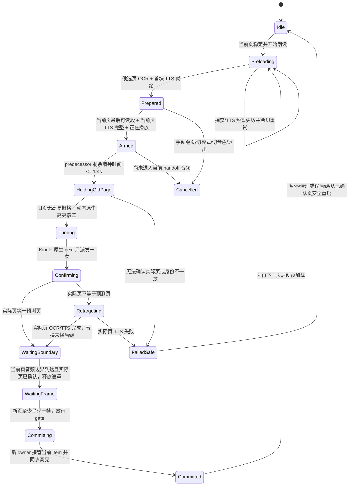
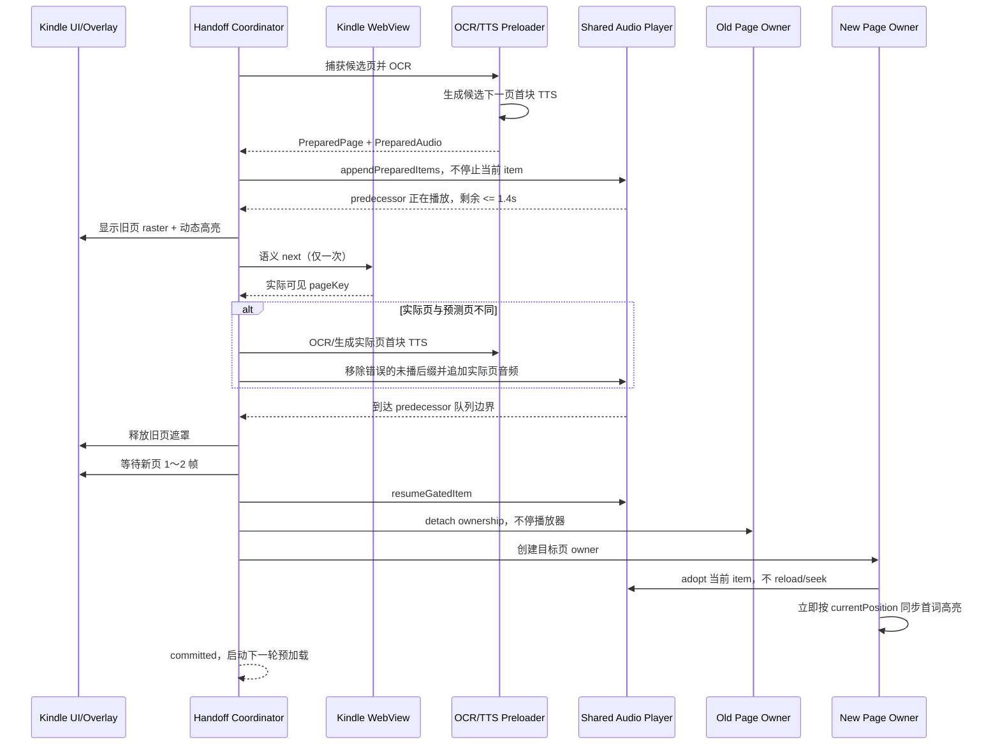

# iOS Kindle 跨页朗读衔接与预加载实现——Android 移植指南

> 文档用途：说明 CastReader iOS 当前已经落地并经过 Kindle 真机多页验证的“下一页预加载 + 连续音频队列 + 自动翻页 + 跨页高亮接管”方案，供 Android 端按同一思路实现。
>
> iOS 代码基线：`788c7cf`（`Fix Kindle continuous page handoff timing`）
>
> 文档日期：2026-07-26
>
> 主要读者：Android Kindle 朗读开发、播放器开发、WebView/Compose 开发、测试与日志分析人员。

---

## 1. 结论先行

iOS 当前方案解决的不是一个单独的“提前请求 TTS”问题，而是一条完整的跨页事务：

1. 当前页开始朗读后，后台提前捕获 Kindle 后续页面。
2. 对候选下一页完成 OCR，建立页面身份、文本指纹和文字坐标。
3. 提前生成候选下一页第一个朗读块的 TTS，并保留词级时间戳。
4. 当前页最后一个音频段进入队列后，把下一页已经生成好的音频追加到同一个播放器队列尾部，不停止当前音频。
5. 当前页尾音频剩余约 `1.4s` 时，在旧页视觉遮罩下提前执行一次 Kindle 原生下一页操作。
6. 翻页后不相信预加载时猜测的页面，重新确认 Kindle 实际显示的页面。
7. 如果实际页与预测页不同，删除尚未播放的错误候选音频，重新为实际页生成首块音频。
8. 当前页音频真正结束前，旧页画面继续显示；当前页结束后才释放旧页遮罩。
9. 即使遮罩已释放，下一页音频也不能立刻播放，必须再等下一页视图至少呈现一帧。
10. 新页建立新的朗读 ViewModel/页面所有者，但复用同一个播放器和已经开始的音频，不清空队列、不重启当前音频。
11. 新所有者接管后立即按播放器当前时间同步词级高亮，避免跨页首词没有高亮。

这套方案的核心不是“提前翻页”，也不是“提前生成音频”，而是：

> 把页面预加载、TTS 预加载、播放器队列边界、Kindle 实际页确认、视觉切换和高亮所有权切换组织成一个可确认、可纠偏、可取消的跨页事务。

如果 Android 只做“下一页 OCR/TTS 提前生成”，但翻页时仍然执行 `stop → clearQueue → load → play`，用户依然会听到停顿；如果只把下一页音频追加到队列，却不做视觉遮罩和页面确认，就会出现提前翻页、旧页显示时读新页、读错预测页、首词高亮丢失等问题。

---

## 2. 必须先明确的实现边界

### 2.1 当前 iOS 已实现的“跨页断句衔接”是什么

当前稳定实现是“页面边界上的连续衔接”：

- 当前页最后一个 TTS 音频和下一页第一个 TTS 音频在同一播放队列中连续播放。
- Kindle 页面在正确的音频边界附近切换。
- 当前页最后一句没有读完时，用户仍看到旧页和旧页高亮。
- 下一页音频开始前，下一页已经真实可见。
- 下一页首块音频由新页面的朗读状态接管，词级高亮继续工作。

### 2.2 当前 iOS 没有实现的内容

当前稳定版本**没有**把“当前页末尾的不完整句子”和“下一页开头的句子剩余部分”重新拼接成一个跨页语义句，再作为一个 TTS 请求生成。

从当前代码可以看到，朗读队列仍然是 page-only：

```text
KINDLE read queue page-only current=<page-key> currentChunks=<count>
```

构造当前页文本队列时也明确不把预测下一页文本拼进当前页语义块，`hasCrossPageBridge` 为 `false`。

因此本文中的“跨页断句衔接”准确含义是：

> 在分页 OCR 和分页 TTS 的前提下，让两页的朗读在听觉、翻页时机、画面和高亮上连续，而不是语义级合并两页残句。

这个边界必须告诉 Android。Android 第一阶段应完整复刻当前已验证方案，不要把“语义级跨页合句”混入同一版本，否则会同时增加文本去重、跨页字符路由、时间戳拆分和回退难度。

真正的语义级跨页合句可作为后续增强，见本文第 20 节。

---

## 3. 用户侧验收口径

实现完成后，用户应该观察到：

1. 当前页最后一句读完之前，不应该直接看到下一页。
2. 当前页最后一句读完之后，不应该还长时间停留在旧页。
3. 下一页第一句话开始发声时，下一页必须已经显示出来。
4. 页面之间不应因为重新创建播放器或重新请求首段 TTS 而产生明显空白。
5. 当前页最后几个词继续正常高亮。
6. 下一页首词到后续词继续正常高亮，不能整句无高亮。
7. 自动翻页一次只能前进一页，不能因为超时重试而跳过一页。
8. 预加载猜错下一页时，不能朗读猜错页面的内容。
9. 改变字号、布局、主题、语言或音色后，不能继续使用旧页面或旧音色的缓存。
10. 用户手动翻页、退出 Kindle、切换模式或切换音色时，旧异步任务不能在稍后把过期结果写回。
11. 预加载失败时可以退化成等待，但不能读错页、重复读或跳页。
12. 后台播放或锁屏播放时，页面所有权与音频所有权仍应保持一致；恢复前台后不能回到旧页高亮。

安全性优先级如下：

```text
读对页面 > 不跳页/不重复 > 高亮正确 > 翻页时机正确 > 无缝程度
```

当系统无法同时满足所有条件时，宁可短暂停顿，也不能播放未经确认的新页面音频。

---

## 4. 为什么这不是普通的预加载

普通预加载通常是：

```text
预测下一项 → 下载/生成资源 → 下一项开始时使用缓存
```

Kindle 跨页朗读多了四个不稳定因素：

- Kindle 的下一页是 WebView 内部状态，不是 App 自己掌握的列表索引。
- Kindle 可能持有多张懒加载页面图片，DOM 中“相邻元素”不一定就是用户下一次实际看到的页。
- 自动翻页是非幂等动作；调用两次就可能跳过一页。
- 音频、WebView 页面、OCR 覆盖层和高亮 ViewModel 是四个不同的异步时钟。

所以 iOS 没有把预加载候选当成事实，而是把它当作“可加速、但必须在提交前验证的推测”。

完整事务可以抽象为：


---

## 5. iOS 组件职责

### 5.1 `KindleBookView`

文件：

`CastReader/Views/Kindle/KindleBookView.swift`

它是 Kindle 跨页事务的总协调者，负责：

- 当前页和候选页捕获；
- OCR 文档构建；
- 页面与 TTS 缓存；
- Kindle 原生下一页操作；
- 视觉遮罩；
- 实际页确认和错误预测重定向；
- 音频队列门控；
- 旧/新 `ReadAloudViewModel` 所有权切换；
- 预加载 epoch、取消、重试和日志。

Android 端应该有一个职责相同的独立协调器，例如：

```kotlin
KindleContinuousHandoffCoordinator
```

不要把全部逻辑堆进 `KindleViewModel.onAllComplete()`。

### 5.2 `AudioPlayerService`

文件：

`CastReader/Services/AudioPlayerService.swift`

负责：

- 保存完整音频队列；
- 在不停止当前 AVPlayerItem 的情况下追加预生成音频；
- 在具体队列项开始前执行 gate；
- 保留被 gate 拦住的队列索引；
- 条件满足后重新尝试这个队列项；
- 只删除尚未播放的错误预测后缀；
- 在发布新 segment 前把播放时钟归零。

Android 对应 `AudioPlaybackService` / ExoPlayer 层必须增加等价能力。仅在 ViewModel 层缓存音频还不够。

### 5.3 `ReadAloudViewModel`

文件：

`CastReader/ViewModels/ReadAloudViewModel.swift`

负责：

- 判断当前页是否已经进入最后可读段落；
- 判断当前页 TTS 是否全部生成完成；
- 维护 segment → 页面段落 → 词时间戳 → 高亮坐标的映射；
- 旧页在连续切换时只放弃所有权，不停止播放器；
- 新页接管已经开始或即将开始的队列项；
- 接管后立即用播放器当前时间同步高亮。

### 5.4 `KindleWebScripts`

文件：

`CastReader/Services/KindleWebScripts.swift`

负责从 Kindle WebView 中：

- 观察 blob URL / 页面资源；
- 提取页面内容 key；
- 获取候选页面快照；
- 获取当前可见页面状态；
- 触发 Kindle 自身的语义“下一页”行为。

关键原则是：

> 页面捕获脚本可以用于预测和观察，但实际翻页必须走 Kindle 自己的语义下一页行为。

### 5.5 纯状态契约

文件：

`CastReader/Models/KindleModels.swift`

`KindleContinuousPageHandoffContract` 和 `KindleContinuousVisualTurnContract` 把关键判定做成纯函数，便于单元测试，避免业务代码里出现相互矛盾的布尔条件。

Android 应直接复制这种“纯契约 + 有状态协调器”的结构。

---

## 6. 关键数据模型

### 6.1 已捕获并完成 OCR 的候选页

iOS：

```swift
private struct KindleCachedPage {
    let afterKey: String
    let page: CapturedKindlePage
    let document: ReadingDocument
    let startParagraphIndex: Int
}
```

字段含义：

- `afterKey`：从哪一页之后捕获到这个候选，用来防止把其他翻页周期的候选误用到当前页。
- `page.key`：候选页面内容身份。
- `page.pixelFingerprint`：页面图像像素特征，用于防止同一个 key 下页面渲染已经变化。
- `document`：OCR 后的统一朗读文档，包含段落、词和坐标。
- `startParagraphIndex`：下一页首个可读段落。

Android 建议：

```kotlin
data class KindlePreparedPage(
    val sourceAfterKey: String,
    val pageKey: String,
    val pixelFingerprint: String,
    val textFingerprint: String,
    val documentId: String,
    val document: ReadingDocument,
    val startChunkIndex: Int,
    val captureSessionId: Long,
    val layoutSignature: String,
)
```

### 6.2 已预生成的下一页首块音频

iOS：

```swift
private struct KindleAudioPrefetch {
    let pageKey: String
    let textFingerprint: String
    let voiceID: String
    let paragraphIndex: Int
    let segments: [AudioSegment]
}
```

缓存至少必须绑定：

```text
pageKey + textFingerprint + voiceID
```

Android 建议再带上：

```text
language + speedGenerationPolicy + TTS engine/version
```

播放倍速通常由播放器处理，不一定影响生成缓存；但如果 Android 的 TTS 服务把 speed 写进生成请求，就必须纳入缓存键。

### 6.3 一次正在进行的连续跨页事务

iOS：

```swift
private struct KindleContinuousReadHandoff {
    let serial: Int
    let oldKey: String
    var target: KindleCachedPage
    let previousSnapshot: ...
    var paragraphIndex: Int
    var segments: [AudioSegment]
    var segmentIDs: Set<String>
    let predecessorSegmentID: String
}
```

Android 建议状态：

```kotlin
data class ContinuousHandoff(
    val serial: Long,
    val epoch: Long,
    val oldPageKey: String,
    var predictedTarget: KindlePreparedPage,
    var confirmedTarget: KindlePreparedPage? = null,
    val predecessorMediaId: String,
    var appendedMediaIds: Set<String>,
    var semanticNextDispatched: Boolean = false,
    var audioBoundaryReached: Boolean = false,
    var visibleSurfaceConfirmed: Boolean = false,
    var targetFingerprintMatched: Boolean = false,
    var oldPageHoldReleased: Boolean = false,
    var newPageFramePresented: Boolean = false,
    var phase: HandoffPhase,
)
```

推荐 phase：

```kotlin
enum class HandoffPhase {
    ARMED,
    CAPTURING_VISUAL_HOLD,
    TURNING_UNDER_HOLD,
    RECONCILING_TARGET,
    WAITING_AUDIO_BOUNDARY,
    WAITING_NEW_PAGE_FRAME,
    COMMITTING,
    COMMITTED,
    CANCELLED,
    FAILED_SAFE,
}
```

不要仅靠零散 Boolean 推导整个状态，否则非常容易在快速翻页、暂停/恢复和网络重试时进入不可能状态。

---

## 7. 页面身份为什么不能只看一个 key

Kindle Web 页面并不是普通分页 API。以下情况都可能让“页面 key 相同”但内容实际不再相同：

- 字号变化；
- 行距、页宽、屏幕旋转变化；
- Kindle 主题变化；
- WebView 重新布局；
- 图片懒加载前后；
- blob URL 重新创建；
- 页面缓存复用；
- OCR 语言变化。

所以 iOS 在不同阶段组合使用：

- 当前/候选页面 `key`；
- `afterKey`；
- 页面 `pixelFingerprint`；
- OCR 文档 `textFingerprint`；
- 文档语言；
- 页面布局和捕获 session；
- 当前音色 `voiceID`；
- 文档实例身份 `document.id`。

Android 不应把 `pageKey` 当作数据库主键一样绝对可信。建议采用三级身份：

1. **导航身份**：`afterKey → candidatePageKey`。
2. **视觉身份**：`pageKey + pixelFingerprint + layoutSignature`。
3. **朗读身份**：`pageKey + textFingerprint + language + voiceID`。

任何一级不匹配，都只能重新确认或重新生成，不能直接播放。

---

## 8. 预加载管线

### 8.1 触发时机

当前页已经建立稳定的 live page key 后，iOS 调用：

```swift
startCachingNextPage(afterKey: liveKey)
```

触发不是等到最后一句才开始。页面刚进入可朗读状态，就尽早在后台做后续页捕获。

触发前检查：

- 当前没有正在执行真实翻页；
- 当前 `afterKey` 非空；
- 没有相同 `afterKey` 的重复缓存任务；
- 当前页没有进入失败冷却期；
- 当前 preload epoch 仍然有效。

### 8.2 捕获候选窗口

朗读模式下：

```text
最多捕获 12 个候选页面
```

解读模式只捕获 1 个，本方案只讨论朗读。

抓取多个候选的原因是 Kindle 可能在 WebView 中持有多个页面 blob，脚本看到的第一个相邻节点并不总是用户原生翻页后的实际下一页。

但抓到 12 个候选不等于给 12 页都生成 TTS。iOS 的资源策略是：

```text
候选 OCR：最多 12
首块 TTS 预热：最多前 2 个候选
```

这兼顾了：

- 增加实际页命中概率；
- 控制 OCR、网络 TTS、内存和临时音频开销；
- 保留预测错误后的快速重定向能力。

Android 第一版可使用相同上限，后续根据设备和日志动态调节。

### 8.3 捕获重试与去重

候选页面捕获会：

- 把传入 limit 限制在 `1...12`；
- 对 Kindle 懒加载图片进行短间隔重试；
- 当前 iOS 最多尝试 3 次，间隔约 `180ms`；
- 去掉当前 `afterKey`；
- 按页面身份去重；
- 多候选 API 不可用时退化到单下一页捕获。

注意：短重试的目标是等待浏览器图片解码和页面资源稳定，不是再次执行“下一页”。

### 8.4 OCR 和文档构建

每个候选快照需要转成：

- 页面图像；
- 页面 key；
- 像素指纹；
- OCR 文本；
- 段落与词；
- 每个词在页面中的坐标；
- `ReadingDocument`；
- 首个可读段落/朗读块索引。

空文本、无可读段落、key 等于当前页的候选直接丢弃。

### 8.5 朗读分块

iOS 会把页面可读段落切成适合 TTS 的块：

- 目标长度大致在 `80...240` 字符；
- 优先在自然句末标点切开；
- 无自然句末时使用软边界；
- 页面内每个块独立生成一个或多个 `AudioSegment`；
- 下一页预加载只生成首个开始块。

这使预加载成本足够小，同时让下一页一开始就有音频可播。进入下一页后，正常朗读管线继续生成剩余块。

### 8.6 TTS 预生成

流程：

1. 计算目标文档 `textFingerprint`。
2. 读取目标语言当前 `voiceID`。
3. 查找缓存。
4. 缓存的 `pageKey + textFingerprint + voiceID` 全部命中则复用。
5. 不命中则调用 detached/prefetch TTS。
6. 生成完成后再次检查：
   - Task 没有取消；
   - epoch 没变；
   - 当前音色仍是生成时的音色；
   - 候选仍存在；
   - 候选的 `afterKey/pageKey` 仍对应当前周期。
7. 只有全部通过才写入缓存。

这里“生成完成后再验证一次”非常重要。异步请求开始时正确，不代表返回时仍然正确。

### 8.7 epoch 防止过期写回

iOS 使用 `preloadEpoch`：

```swift
preloadEpoch &+= 1
```

以下行为会让旧预加载失效：

- 页面上下文变化；
- 用户手动翻页；
- 退出 Kindle；
- 模式切换；
- 需要清空缓存的布局变化；
- 重新开始新的页面事务。

所有跨 `await` 的异步结果在落库前都必须确认 epoch。

Android 应使用 `AtomicLong` 或只在 Main dispatcher 上修改的 generation：

```kotlin
val epochAtStart = preloadEpoch
val result = generate(...)
if (epochAtStart != preloadEpoch) return
```

仅仅 `job.cancel()` 不够，因为某些网络、JS 或 OCR 回调可能已经越过取消点。

### 8.8 失败退避

iOS 对同一个 `afterKey` 的连续失败使用冷却：

```text
第 1 次：4s
第 2 次：8s
第 3 次及以后：18s
```

目的：

- 避免 WebView 还没准备好时反复截图/OCR；
- 避免弱网下连续打 TTS；
- 避免预加载抢占当前页正常朗读资源；
- 减少日志洪水。

成功后清零失败次数与冷却。

### 8.9 音色切换

用户把音色 A 切换到 B 后：

- 已捕获的页面和 OCR 可以保留；
- 用音色 A 生成的下一页音频必须全部失效；
- 当前连续 handoff 必须取消；
- 立刻用音色 B 重新预热候选下一页首块。

Android 不要为了省事把整个页面 OCR 缓存也清掉，但绝不能复用旧音色音频。

---

## 9. 连续音频队列：真正消除停顿的关键

### 9.1 旧实现为什么仍会卡

Android 当前常见流程是：

```text
当前页播放完成
→ onAllComplete
→ Kindle 翻页并截图/OCR
→ stopPlaybackForPageSwitch
→ applyPreparedPage
→ clearQueue
→ loadAndPlayParagraph
```

即使 `applyPreparedPage` 已经有预加载结果，只要翻页时仍然：

```text
stop + clearQueue + replace player item
```

就会产生：

- 音频队列断开；
- ExoPlayer 状态切换；
- 新旧页面状态竞争；
- MediaItem 重建；
- 高亮订阅重新绑定；
- 可感知的间隔。

### 9.2 iOS 的做法

`AudioPlayerService.appendPreparedSegmentsForContinuousPlayback`：

- 保留当前 `AVPlayerItem`；
- 不调用普通 `loadSegments`；
- 只把下一页 segments 追加到现有 `segmentsQueue`；
- 记录追加前队尾 `predecessorSegmentID`；
- 当前音频正常继续；
- 到队列边界时播放器自然尝试下一项。

伪代码：

```kotlin
val predecessorId = player.queue.lastOrNull()?.mediaId
player.appendPreparedItems(nextPageItems)
handoff.predecessorMediaId = predecessorId
```

### 9.3 segment ID 必须重新定基

每一页的段落和 segment 索引可能都从 0 开始。如果直接把下一页 segment 加到当前队列，ID 可能冲突，导致：

- 删除错误 item；
- 新页误认为旧页 segment；
- 高亮映射命中旧页；
- completion 回调判断错误。

iOS 在追加前重建 handoff segment ID，使它们在当前队列中唯一。

Android 的 `MediaItem.mediaId` 至少应包含：

```text
readingSessionId/pageDocumentId/chunkIndex/segmentIndex/handoffSerial
```

不能只用 `paragraphIndex-segmentIndex`。

### 9.4 只删除未播放后缀

预测错误或 handoff 取消时，iOS 调用：

```swift
removePendingSegments(withIDs:)
```

它只删除：

- 当前 item 之后；
- 且属于该 handoff 的尚未播放 items。

它不会清除：

- 当前正在发声的 item；
- 历史队列前缀；
- 与该 handoff 无关的 item。

如果要删除的 item 已经成为当前 item，函数会报告当前项已进入播放，协调器必须走更谨慎的提交或安全停止路径。

Android 不能在 handoff 取消时无条件 `clearMediaItems()`，否则用户正在听的当前页尾句会被截断。

---

## 10. 音频队列门控

### 10.1 为什么需要 gate

下一页音频提前追加后，播放器在当前页最后一个 item 完成时会自然尝试播放下一项。

但此时可能出现：

- Kindle 原生翻页还没完成；
- 新页已经翻过去，但 OCR/页面身份还没确认；
- 预测页和实际页不同，正在重定向；
- 旧页遮罩刚移除，新页还没真正绘制一帧；
- 新页的朗读 ViewModel 还没建立。

所以“音频数据已准备好”不等于“允许发声”。

### 10.2 iOS gate 条件

下一页具体队列项只有在下面三项同时成立时才允许播放：

```text
实际可见的新页面已经确认
AND 新页面文本指纹与准备音频匹配
AND 旧页遮罩已经释放且新页至少呈现一帧
```

对应纯契约：

```swift
shouldReleaseAudioGate(
    hasConfirmedVisibleSurface: Bool,
    textFingerprintMatches: Bool,
    visualReleasePresented: Bool
)
```

### 10.3 gate 必须绑定“具体队列项”

iOS 保存 `gatedSegmentIndex`。`isQueuedSegmentGated` 的含义是：

> 某个具体的队列 item 已经到达播放边界，并被 handoff gate 拦住。

它不能被一个泛化的 `isBuffering` 替代，因为 `isBuffering` 还可能表示：

- 网络加载；
- AVPlayerItem 未 ready；
- 音频中断；
- 其他业务等待。

Android 应记录：

```kotlin
var gatedMediaId: String? = null
```

以及：

```kotlin
fun resumeGatedItemIfPossible()
```

不要只靠 ExoPlayer 的 `STATE_BUFFERING` 推断。

### 10.4 gate 的位置

gate 必须在真正切换/启动下一 `MediaItem` 之前执行。

伪代码：

```kotlin
fun onAboutToStart(item: MediaItem): Boolean {
    val handoff = activeHandoff ?: return true
    if (item.mediaId !in handoff.appendedMediaIds) return true

    val allow = handoff.visibleSurfaceConfirmed &&
        handoff.targetFingerprintMatched &&
        handoff.newPageFramePresented

    if (!allow) {
        gatedMediaId = item.mediaId
        return false
    }
    return true
}
```

如果 Android 当前播放器封装无法在 item 开始前 gate，需要调整服务层，而不是在 UI 收到 `onMediaItemTransition` 后再暂停。后者可能已经发出几十到几百毫秒错误音频。

---

## 11. 提前翻页时机

### 11.1 为什么不能等 `onAllComplete`

等当前页所有音频完全结束后才开始：

- 截图；
- WebView 操作；
- 页面稳定确认；
- OCR；
- 新 UI 安装；

一定会产生停顿。

### 11.2 为什么不能过早直接翻

用户实际测试发现过：

> 当前页最后一句还没有读完，页面就已经提前翻走。

如果只根据“下一页已预加载”立即调用下一页，视觉内容就会领先音频。

### 11.3 iOS 的触发条件

连续 handoff 只有在以下条件满足时才 arm：

```text
read 模式
AND 当前已在最后一个可读段落
AND 当前页 TTS 已全部生成完成
AND 候选下一页 OCR 已准备
AND 候选下一页首块音频已准备
AND 音频正在播放
```

当前页 TTS “全部生成完成”不能只看最后段落已经有一个 segment，还必须确认：

```text
audio.moreSegmentsExpected == false
```

否则队列尾仍可能继续追加当前页 segment，提前把“当前队尾”认作页面边界会出错。

arm 后，只有播放器当前 segment 正是记录的 `predecessorSegmentID`，并且：

```text
remainingAudioSeconds / playbackRate <= 1.4s
```

才开始视觉翻页准备。

这里用的是墙钟时间，不是原始媒体秒数。用户如果以 2 倍速播放，媒体剩余 2.8 秒实际只剩约 1.4 秒。

### 11.4 `1.4s` 的意义

`1.4s` 不是页面切换点，而是：

> 允许在旧页遮罩下开始执行 Kindle 翻页和实际页确认的提前量。

用户仍然看到旧页，直到音频边界真正到达。

Android 可以先使用 `1.4s`，但应将它做成可观测配置。长期可根据真机数据区分：

- WebView 翻页 P95；
- 页面稳定确认 P95；
- 首帧呈现 P95；
- 不同设备性能分层。

---

## 12. 视觉遮罩：解决“翻早”和“翻晚”

### 12.1 基本思想

当当前页尾音频还剩约 1.4 秒时：

1. 捕获当前旧页的视觉内容；
2. 在 WebView 上方显示一张和旧页完全一致的遮罩；
3. 遮罩继续显示当前朗读词的动态高亮；
4. 在遮罩下让真正的 Kindle WebView 提前翻到下一页；
5. 等当前页音频到达边界且新页已确认，再移除遮罩。

用户看到的是：

```text
旧页最后一句继续朗读和高亮
→ 到音频边界
→ 画面切到已经准备好的新页
```

而不是：

```text
旧页朗读
→ 空白/加载
→ 新页出现
```

### 12.2 遮罩图优先使用原始页面栅格

iOS 优先使用之前捕获的 Kindle 页面原始图像，而不是对当前 WebView 直接截图。

原因：WebView 截图可能已经把 DOM 高亮画进图像。再由 native overlay 绘制当前高亮，会出现：

- 一个静止旧高亮；
- 一个移动新高亮；
- 双重高亮；
- 最后一个词一直残留。

正确做法：

```text
无高亮的页面 raster
+ Native/Compose Canvas 根据当前词坐标实时绘制高亮
```

只有拿不到原始 raster 时才回退到 WebView snapshot，并在截图前尽量清除 DOM 高亮。

### 12.3 Android Compose 建议

```kotlin
Box {
    AndroidView(webView)

    if (visualHold != null) {
        Image(
            bitmap = visualHold.pageBitmap,
            contentDescription = null,
            modifier = Modifier.matchParentSize()
        )
        Canvas(Modifier.matchParentSize()) {
            drawCurrentWordHighlight(visualHold.currentHighlightRects)
        }
    }
}
```

遮罩坐标必须沿用候选页 OCR 时的：

- 原始图片尺寸；
- aspect-fit/aspect-fill 策略；
- 内容 inset；
- 页面裁剪区域；
- 屏幕旋转；
- WebView 缩放比例。

不要在 handoff 时重新估算一套坐标。

### 12.4 遮罩释放条件

iOS 只有在：

```text
当前页音频边界已到达
AND 实际新页面已确认
```

才释放旧页遮罩。

因此：

- 新页确认很快：仍等旧页音频结束；
- 旧页音频结束很快：仍等新页确认；
- 两者都完成：立即进入新页呈现阶段。

这同时解决了：

- 翻页过早：最后一句没完就看到下一页；
- 翻页过晚：已经听到下一页还长时间停留旧页。

---

## 13. 新页首帧门控

### 13.1 已经踩过的真实问题

早期实现把两件事放在同一个 MainActor/UI 事件循环中：

```text
移除旧页遮罩
立即放行下一页音频
```

状态上看“新页已设置”，但 SwiftUI 还没来得及把下一页绘制到屏幕。结果是：

> 下一页音频已经读了几个词，用户才看到下一页。

### 13.2 iOS 当前处理

顺序是：

```text
visual-hold released reason=queue-boundary-awaiting-frame
audio-gate awaiting-frame
等待约 80ms，让 SwiftUI 呈现
audio-gate frame-presented
resume gated segment
```

这里的 `80ms` 是 iOS 当前用于保证下一次 UI 呈现的工程性等待。

### 13.3 Android 不要机械复制 80ms

Android 优先使用真实 Compose 帧同步：

```kotlin
visualHold = null
withFrameNanos { }
withFrameNanos { }
handoff.newPageFramePresented = true
player.resumeGatedItemIfPossible()
```

建议等待 1～2 帧，并提供约 `200...300ms` 的超时保护，避免极端情况下永远卡住。

真正的条件不是“延迟了 80ms”，而是：

> 下一页视图状态已经提交，并至少完成一次用户可见的绘制机会。

---

## 14. Kindle 原生翻页与实际页确认

### 14.1 翻页动作只能调用一次

Kindle 的“下一页”是非幂等动作。

如果第一次已经成功，但由于截图、key 观察或 OCR 超时，代码再次调用“下一页”，用户就会直接跳过一页。

iOS 把两个概念严格分开：

- `semanticActionAttempted`：是否已经发过下一页动作；
- 页面观察/捕获/确认：可以重试。

规则：

```text
下一页动作：最多一次
等待页面变化：可重试
截图：可重试
稳定性采样：可重试
OCR：可重试
```

Android 必须保留同样的状态，不能把整个 `turnAndCaptureNextPage()` 放进通用 retry。

错误示例：

```kotlin
retry(3) {
    webView.goToNextPage() // 可能执行三次
    capture()
}
```

正确示例：

```kotlin
if (!handoff.semanticNextDispatched) {
    handoff.semanticNextDispatched = true
    webView.goToNextPage()
}

retryObservationOnly {
    observeVisiblePage()
    waitUntilStable()
    capture()
}
```

### 14.2 预测页不是事实

预加载阶段的第一个候选只代表：

```text
“它很可能是下一页”
```

真实翻页后，iOS 读取 Kindle 当前可见页 key，并以它为最终目标。

如果：

```text
predictedKey != actualVisibleKey
```

记录：

```text
target-reconciled
```

随后进入重定向，而不是把它当作不可恢复错误。

### 14.3 页面稳定确认

实际翻页后，iOS 会对当前可见页面状态进行连续采样，要求多个稳定结果后再使用。

当前策略大意是：

- 等待页面图像/状态稳定；
- 连续约 3 次稳定命中；
- target key 必须等于当前可见 key；
- 缓存候选还要匹配 `pixelFingerprint`；
- 不匹配则重新捕获实际页；
- 再验证 OCR 文本指纹、布局、语言等。

“WebView 报了新 key”不代表页面已经完成解码和绘制。

### 14.4 预测错误后的重定向

假设：

```text
预测页：P2a
实际页：P2b
```

iOS 操作：

1. 保留当前页 P1 正在播放的尾音频。
2. 确认并 OCR 实际页 P2b。
3. 为 P2b 生成首个 TTS 块。
4. 删除队列中尚未播放的 P2a segments。
5. 把 P2b segments 追加到同一个 predecessor 后。
6. 更新 handoff 的 target、segment IDs 和指纹。
7. 如果播放器已经到达边界并被 gate 拦住，主动重新尝试 gate。
8. 页面与音频确认后正常提交。

真实日志中已经验证过该路径：

```text
predicted = content-774c...
actual    = content-7edf...
target-reconciled
confirmed-page-retarget tts-ready
audio-boundary
highlight-synced timeMs=0
committed
```

因此 Android 不能把“预加载命中率 100%”作为正确性的前提。正确的目标是：

> 命中时快，未命中时安全纠偏。

---

## 15. 页面所有权与高亮接管

### 15.1 为什么不能继续使用旧 ViewModel

Kindle OCR 页内段落 ID 通常每页都从 0 开始。

如果只检查：

```text
currentParagraphIndex == 0
```

无法判断这个高亮状态属于旧页还是新页。

曾经出现的风险：

- 新页音频已经开始；
- 旧页 ViewModel 仍然订阅播放器；
- 段落 ID 又恰好相同；
- 高亮落到旧页坐标，或新页不高亮。

iOS 使用文档实例身份：

```text
activeOwnerDocumentID == targetDocumentID
AND activeOwnerDocumentID != previousOwnerDocumentID
```

Android 每页 OCR 都应创建新的不可复用 `documentId/pageOwnerId`。

### 15.2 旧页不能普通 deactivate

普通 `deactivate()` 往往会：

- 暂停播放器；
- 清回调；
- 清状态；
- 结束队列。

连续跨页不能这么做。

iOS 提供：

```swift
detachForContinuousPageHandoff()
```

它只做：

- 旧页不再拥有播放器回调和高亮；
- 结束旧页统计会话；
- 取消旧页生成任务；
- 保留共享播放器及队列不动。

Android 应区分：

```kotlin
deactivateAndStop()
detachOwnershipForContinuousHandoff()
```

### 15.3 新页接管已经在播放的 item

iOS 新页面创建新的 `ReadAloudViewModel`，然后调用：

```swift
adoptContinuousPlayback(...)
```

它：

- 验证当前播放器 segment 确实属于目标页准备好的 segments；
- 激活新 owner；
- 写入页面段落和 segment 映射；
- 建立新页面 processed text；
- 不清空播放器队列；
- 不重启当前 AVPlayerItem；
- 不从 0 seek；
- 继续正常生成下一块。

Android 不应该在接管时重新调用 `loadAndPlayParagraph()`，因为该路径通常会 `clearQueue()`。

需要增加类似：

```kotlin
fun adoptContinuousPlayback(
    document: ReadingDocument,
    preparedItems: List<PreparedAudioItem>,
    currentMediaId: String,
    currentPositionMs: Long,
): Boolean
```

### 15.4 为什么下一页首词高亮会消失

这个问题有两个已经定位的原因。

#### 原因一：播放器新 item 发布时继承了旧 item 的末尾时间

旧逻辑可能按如下顺序：

```text
currentSegment = nextSegment
currentTime 仍是上一段的 duration
稍后再归零
```

观察者一看到 `nextSegment`，就用旧时间计算新段高亮。例如新段刚开始却收到 `3960ms`，会直接跳到第 11 个词。

历史问题日志：

```text
KINDLE read continuous highlight-synced serial=2 timeMs=3960 p=0 w=11
```

iOS 修复为在发布 `currentSegment` 前：

```swift
currentTime = 0
duration = segment.duration
currentSegment = segment
```

Android `onMediaItemTransition`、StateFlow 更新或 service callback 也必须保证原子顺序：

```text
先把新 item 的 position/duration 建立
再通知 UI 当前 item 已变化
```

#### 原因二：新 owner 激活后没有新的 time tick

播放器可能已经开始下一页音频，然后新页面 ViewModel 才接管。

Combine/StateFlow 不会因为 owner 从 inactive 变 active 自动重放一个新的时间事件。如果此时下一次 tick 延迟，新页首词就没有高亮。

iOS 在接管后同步执行：

```swift
let adoptionTime = audio.currentTime
updateHighlight(adoptionTime)
updateNowPlayingCaption(adoptionTime)
```

Android 同样要在 adopt 成功的同一个主线程事务中：

```kotlin
syncHighlight(player.currentPosition)
syncNowPlayingCaption(player.currentPosition)
```

不能只等下一次 `positionFlow`。

### 15.5 短音频完成竞态

实际页重定向后生成的首块音频可能很短。在页面 commit 完成前，它可能已经播放完成。

新 owner 建立后要检查：

- 当前准备音频是否已经完成；
- completion 是否在 owner 切换过程中发生；
- 是否需要立即继续生成/播放下一块。

iOS 有 `continueAfterAdoptedPlaybackCompleted` 类似的补偿路径。

Android 应让 completion 事件带上：

```text
readingSessionId + pageOwnerId + mediaId + handoffSerial
```

并使消费幂等。

---

## 16. 流式 TTS 的页面边界判断

当前页 TTS 是流式入队的。队列临时为空不代表整页完成。

iOS 使用：

```swift
audio.moreSegmentsExpected
```

行为：

- 队列暂时播放完，但 `moreSegmentsExpected == true`：进入等待下一个 segment；
- `moreSegmentsExpected == false`：才触发真正 playback complete；
- 连续 handoff 只有确认当前页不再生成新 segment 后，才能把当前队尾记录为 predecessor。

Android 如果只依据：

```text
ExoPlayer queue 为空 / STATE_ENDED
```

会把网络生成间隙误判为页面结束。

应至少有：

```kotlin
generationState: GENERATING | COMPLETE | FAILED | CANCELLED
moreSegmentsExpected: Boolean
```

只有：

```text
最后可读块
AND generation COMPLETE
AND 队尾 ID 已稳定
```

才允许 arm handoff。

---

## 17. 完整状态机



---

## 18. 关键时序



---

## 19. 已遇到的坑、根因和修复

| 现象 | 根因 | iOS 修复 | Android 必须注意 |
|---|---|---|---|
| 页面间仍有明显停顿 | 翻页时停止播放器、清空队列、重新 load | 预生成音频追加到共享队列，不替换当前 item | 给 ExoPlayer 增加 append + gate + adopt 路径 |
| 当前页最后一句没读完就翻页 | 提前量被当作直接视觉切换点 | 提前量只用于遮罩下翻 WebView；旧页遮罩等音频边界 | WebView 可以提前翻，用户画面不能提前换 |
| 已读到下一页整段才翻页 | 页面提交绑定到下一页 segment/段落 completion，而非当前页队列边界 | 用 predecessor segment 的真实结束作为页面边界 | 不要用 `onAllComplete` 或下一段完成判断翻页 |
| 下一页先发声，画面几词后才出现 | 移除遮罩和放行音频在同一个 UI run loop | 遮罩释放后等待下一视图帧，再放行 gate | Compose 用 `withFrameNanos`，不要只改 State 就立即播放 |
| 跨页首句高亮消失 | 新 owner 激活时没有新的 position tick | adopt 后同步调用 `updateHighlight(currentTime)` | 不只订阅 position Flow，接管时主动同步 |
| 下一页高亮直接跳到中间词 | 发布新 segment 时仍带旧 item 末尾时间 | 先 `currentTime=0`，再发布 `currentSegment` | position/duration/item 的状态发布顺序必须原子化 |
| 旧页最后一个词出现双高亮 | 视觉遮罩截图包含 DOM 高亮，又叠加 native 高亮 | 优先使用无高亮原始页面 raster | Compose 遮罩图不要烘焙高亮 |
| 预测下一页错误，读错内容 | 把 held blob 第一个候选当成实际下一页 | 原生翻页后确认 actual key；不一致时 retarget | 缓存是推测，实际可见页才是事实 |
| 自动翻页偶尔跳过一页 | 超时后重试了非幂等 next 动作 | next 只派发一次，只重试观察/截图/OCR | semantic action 与 observation retry 分离 |
| 新页段落 ID 相同导致高亮串页 | 每页 OCR paragraph id 都从 0 开始 | 使用新旧 `documentID` 验证 owner | owner identity 不能只看 paragraph/chunk index |
| 用户切音色后下一页仍是旧声音 | 音频缓存没有绑定 voice | cache key 带 voiceID；切音色只清音频并重预热 | 页面 OCR 可复用，音频必须失效 |
| 手动翻页后旧预加载突然覆盖当前页 | 旧 async 任务返回后仍写缓存/状态 | preload epoch + 每个 await 后复验 | Job cancel 之外还要 generation 校验 |
| 取消 handoff 时尾句被截断 | 直接 clear 全部播放器队列 | 只删除 handoff 尚未播放的后缀 | 不要无条件 clearMediaItems |
| 把普通 buffering 当作页面 gate | 一个状态承载多种等待原因 | 单独记录 gatedSegmentIndex | 单独记录 gatedMediaId/queue index |
| 流式 TTS 队列暂空时误判页结束 | 没区分“暂时没 segment”和“生成彻底完成” | `moreSegmentsExpected` | 明确 generation complete 信号 |
| 短首块在页面 commit 前结束 | 音频、页面和 owner 异步竞争 | adopt 后检查 completion 并继续下一块 | completion 事件需 session 化、幂等消费 |
| 候选抓取造成 OCR/TTS 压力 | 对所有 held blob 全量生成音频 | 最多 OCR 12 个，只预热前 2 个音频 | 对候选窗口和音频预热分别限流 |
| 页面 key 命中但文字不一样 | 字号/布局/reflow 后 key 不足以代表内容 | pixel + text + layout 多重校验 | 不使用单 key 缓存 |
| 新页 gate 永远不再触发 | 实际页重定向完成时，队列项已经被 gate 拦住 | retarget 完成后主动 `resumeGatedSegmentIfPossible` | 状态变为可放行时主动 retry gate |
| 回调被新旧页面重复消费 | 两个 owner 同时订阅 shared player | detach 旧 owner，再由新 owner activate/adopt | 播放回调必须只有一个活动 owner |

---

## 20. 真正语义级跨页合句：后续增强，不属于当前稳定方案

如果未来要求：

```text
页面 N 末尾：“He walked into the”
页面 N+1 开头：“room and closed the door.”
```

必须合成：

```text
“He walked into the room and closed the door.”
```

并作为一个 TTS 请求，系统还需要新增：

1. 跨页文本拼接器；
2. 句末完整性判断；
3. 页面 N 已读文本去重；
4. 页面 N+1 被合并前缀的消费游标；
5. 一个音频 segment 内部的页面边界时间；
6. 每个 TTS word timestamp 到不同页面 OCR word 的路由表；
7. 到内部边界时切视觉页面，而不是等 segment 完成；
8. 下一页正常队列从“未被跨页句消费的位置”继续；
9. 预测页错误时整条跨页 utterance 重新生成；
10. 标点、引号、连字符、页眉页脚、脚注和 OCR 错误的合并规则。

建议的数据结构：

```kotlin
data class CrossPageUtterance(
    val combinedText: String,
    val sourceRanges: List<PageTextRoute>,
    val visualBoundaryTimeMs: Long?,
    val consumedPrefixInNextPage: Int,
)
```

这是一项独立功能，不应成为 Android 移植当前 iOS 稳定方案的前置条件。

---

## 21. Android 现状与需要改造的地方

当前 Android 已经具备部分基础：

- Kindle 页面捕获与 OCR；
- 下一页相关预取；
- 第一段 TTS 提前生成；
- ExoPlayer 播放服务和 MediaItem 队列；
- `onMediaItemTransition`；
- 新 item 时重置 position 的基础处理。

但当前自动翻页主路径仍接近：

```text
onAllComplete
→ advanceToNextPageAndRead
→ 原生翻页/捕获
→ stopPlaybackForPageSwitch
→ applyPreparedPage(startRead = true)
→ PlaybackController.loadAndPlayParagraph
→ clearQueue
```

这属于“预加载加速后的重新启动”，不是 iOS 的连续 handoff。

重点改造：

### 21.1 `KindleViewModel`

增加独立 `KindleContinuousHandoffCoordinator`，原 `onAllComplete` 不再负责正常命中路径的翻页启动。

`onAllComplete` 只处理：

- 没有 arm 成功的降级路径；
- 书籍结束；
- 无可读页；
- handoff 失败后的安全恢复。

### 21.2 `PlaybackController`

增加：

```kotlin
appendPreparedForContinuousPlayback(...)
removePendingHandoffItems(...)
installQueueBoundaryGate(...)
resumeGatedItemIfPossible()
adoptCurrentPlaybackWithoutReload(...)
```

保留：

```kotlin
loadAndPlayParagraph(...)
```

用于手动跳转、首次播放、错误恢复，但连续命中路径不能调用它。

### 21.3 `AudioPlaybackService`

需要在 service/ExoPlayer 层提供：

- 稳定队尾 media ID；
- current media ID；
- 当前 item 剩余媒体时间；
- 当前 playback speed；
- 具体 gated media ID；
- 在开始下一 item 前的 gate；
- 安全移除未播放后缀；
- 当前 item/position/duration 一致性发布；
- session 化的 media transition 和 completion。

### 21.4 Compose UI

增加：

- 旧页 raster hold；
- 原生动态高亮 Canvas；
- WebView 在 hold 下真实翻页；
- 目标页面提交后 1～2 frame barrier；
- hold 和当前 handoff serial 绑定，防止旧遮罩晚到。

### 21.5 `KindleWebScripts`

保证：

- 候选页捕获和实际翻页分离；
- 实际语义 next 只调用一次；
- 可重复查询当前可见页；
- 页面稳定采样；
- key + pixel fingerprint；
- 实际页与候选不同时可以重新截图。

---

## 22. Android 建议实现步骤

不要一次把所有行为塞进一个大提交。建议分为六阶段，每阶段都可单独验证。

### 阶段 A：播放器连续队列能力

目标：

- 当前 item 播放中追加下一页 item；
- 不清队列、不停止；
- 能识别 predecessor；
- 能只移除未播放后缀；
- 新 item 发布前 position 正确归零。

此阶段可先不用 Kindle，使用两组本地测试音频验证。

### 阶段 B：队列边界 gate

目标：

- 下一 item 到边界时可被明确拦住；
- 记录具体 gated media ID；
- 外部条件满足后可继续；
- gate 关闭时绝不能短暂漏出音频；
- 普通 buffering 与 handoff gate 可区分。

### 阶段 C：下一页 OCR/TTS 预加载

目标：

- 当前页开始后抓取候选窗口；
- 候选最多 12，音频预热最多 2；
- cache key 完整；
- voice/layout/session/epoch 失效；
- 失败冷却；
- 预加载不阻塞当前页。

### 阶段 D：视觉遮罩与单次原生翻页

目标：

- predecessor 剩余墙钟时间约 1.4 秒时显示旧页 hold；
- hold 上高亮继续移动；
- hold 下执行一次语义 next；
- 不重复 next；
- 重试只做页面观察。

### 阶段 E：实际页确认与重定向

目标：

- 实际 key 命中时复用预加载；
- 不命中时 OCR 实际页、替换未播音频；
- 当前页尾句不受影响；
- 到边界时必要情况下主动重试 gate；
- 错误时不播放猜测内容。

### 阶段 F：owner/highlight 接管

目标：

- 旧 owner detach 不停播放器；
- 新 owner document ID 必须不同；
- adopt 不 clear/reload/seek；
- 立即按 currentPosition 同步首词高亮；
- 短首块 completion 可继续；
- 后台/前台恢复一致。

---

## 23. Android 核心伪代码

### 23.1 arm

```kotlin
fun maybeArm(reason: String) {
    val preparedPage = preloadStore.expectedCandidateAfter(livePageKey) ?: return
    val preparedAudio = preloadStore.audioFor(
        pageKey = preparedPage.pageKey,
        textFingerprint = preparedPage.textFingerprint,
        voiceId = currentVoiceId,
    ) ?: return

    val predecessor = player.queuedTailMediaId ?: return

    val canArm =
        mode == READ &&
        readOwner.isOnLastReadableChunk &&
        readOwner.isCurrentPageGenerationComplete &&
        !player.moreSegmentsExpected &&
        player.isPlaying

    if (!canArm) return

    val rebasedItems = rebaseIds(
        preparedAudio.items,
        pageDocumentId = preparedPage.documentId,
        serial = nextHandoffSerial(),
    )

    activeHandoff = ContinuousHandoff(
        oldPageKey = livePageKey,
        predictedTarget = preparedPage,
        predecessorMediaId = predecessor,
        appendedMediaIds = rebasedItems.mapTo(mutableSetOf()) { it.mediaId },
        ...
    )

    player.installGate(::canStartQueuedItem)
    player.appendPreparedForContinuousPlayback(rebasedItems)
}
```

### 23.2 触发遮罩下翻页

```kotlin
fun onPlaybackProgress(positionMs: Long, durationMs: Long, speed: Float) {
    val h = activeHandoff ?: return
    if (player.currentMediaId != h.predecessorMediaId) return

    val remainingMediaMs = max(0, durationMs - positionMs)
    val remainingWallMs = remainingMediaMs / max(0.25f, speed)
    if (remainingWallMs > 1_400) return
    if (h.phase != ARMED) return

    scope.launch {
        beginVisualTurn(h.serial)
    }
}
```

### 23.3 单次翻页与确认

```kotlin
suspend fun beginVisualTurn(serial: Long) {
    val h = requireHandoff(serial, ARMED) ?: return
    h.phase = CAPTURING_VISUAL_HOLD
    visualHold = captureOldPageRasterWithNativeHighlight()

    h.phase = TURNING_UNDER_HOLD
    if (!h.semanticNextDispatched) {
        h.semanticNextDispatched = true
        kindleWebView.dispatchSemanticNext()
    }

    h.phase = RECONCILING_TARGET
    val actual = observeAndCaptureStableVisiblePageWithoutTurningAgain()
        ?: return failSafe("visible-page-unconfirmed")

    if (actual.pageKey != h.predictedTarget.pageKey ||
        actual.pixelFingerprint != h.predictedTarget.pixelFingerprint
    ) {
        retargetToConfirmedPage(h, actual)
    } else {
        h.confirmedTarget = h.predictedTarget
        h.visibleSurfaceConfirmed = true
        h.targetFingerprintMatched = true
    }

    h.phase = WAITING_AUDIO_BOUNDARY
    maybeReleaseVisualHoldAndAudioGate(h)
}
```

### 23.4 gate

```kotlin
fun canStartQueuedItem(mediaId: String): Boolean {
    val h = activeHandoff ?: return true
    if (mediaId !in h.appendedMediaIds) return true

    val allow =
        h.visibleSurfaceConfirmed &&
        h.targetFingerprintMatched &&
        h.newPageFramePresented

    if (!allow) {
        player.markConcreteItemGated(mediaId)
        if (player.currentMediaId == h.predecessorMediaId || player.hasReachedBoundary) {
            h.audioBoundaryReached = true
            maybeReleaseVisualHoldAndAudioGate(h)
        }
    }
    return allow
}
```

### 23.5 释放遮罩并等待新帧

```kotlin
fun maybeReleaseVisualHoldAndAudioGate(h: ContinuousHandoff) {
    if (!h.audioBoundaryReached || !h.visibleSurfaceConfirmed) return
    if (h.oldPageHoldReleased) return

    h.oldPageHoldReleased = true
    visualHold = null
    h.phase = WAITING_NEW_PAGE_FRAME

    scope.launch(Dispatchers.Main.immediate) {
        withFrameNanos { }
        withFrameNanos { }
        if (!isCurrent(h.serial)) return@launch

        h.newPageFramePresented = true
        commitTargetPageState(h)
        player.resumeGatedItemIfPossible()
    }
}
```

### 23.6 owner 接管

```kotlin
fun commitTargetPageState(h: ContinuousHandoff) {
    val target = h.confirmedTarget ?: return failSafe("no-confirmed-target")
    val oldOwnerDocumentId = readOwner.documentId

    readOwner.detachOwnershipForContinuousHandoff()
    val newOwner = createReadOwner(target.document)

    check(newOwner.documentId == target.documentId)
    check(newOwner.documentId != oldOwnerDocumentId)

    val adopted = newOwner.adoptContinuousPlayback(
        preparedItems = player.itemsForIds(h.appendedMediaIds),
        currentMediaId = player.currentMediaId,
        currentPositionMs = player.currentPosition,
    )
    if (!adopted) return failSafe("owner-adopt-failed")

    newOwner.syncHighlight(player.currentPosition)
    readOwner = newOwner
    livePageKey = target.pageKey
    activeHandoff = null
    startPreloadingAfter(target.pageKey)
}
```

---

## 24. 取消和安全失败

### 24.1 可以直接取消的阶段

handoff 还没进入下一页音频时：

- 取消页面确认/OCR/TTS job；
- epoch +1；
- 移除 handoff 尚未播放的队列后缀；
- 清 gate；
- 移除视觉遮罩；
- 保留当前页正在播放的 item。

### 24.2 不能粗暴取消的阶段

如果下一页 item 已经成为 current item：

- 不能直接删 current item；
- 不能把旧页 owner 恢复成 active；
- 必须确认当前音频属于哪一页；
- 若目标页已确认，优先完成 commit；
- 若身份无法确认，暂停并清队列，从实际可见页安全重启。

### 24.3 安全失败策略

以下情况应暂停/退化，不应继续猜：

- 实际可见页无法确认；
- 实际页文本指纹和准备音频不一致；
- 新 owner document ID 不匹配；
- 当前 media ID 不属于目标页 segments；
- 重定向 TTS 失败且已经到队列边界；
- WebView 页面回退/跳页；
- capture session 已过期；
- 用户在 handoff 中手动翻页。

安全重启步骤：

1. 暂停播放器；
2. 清除错误 handoff 音频；
3. 清 gate 和 hold；
4. 捕获当前实际可见页；
5. 建立新 owner；
6. 从该页首个确认可读块恢复。

这里允许有短暂停顿，但绝不能继续朗读不匹配的缓存。

---

## 25. 日志规范

Android 建议沿用 iOS 的语义日志名，便于跨平台对比。

每条日志至少包含：

```text
timestamp
app foreground/background
readingSessionId
handoff serial
epoch
oldPageKey
predictedPageKey
actualPageKey
predecessorMediaId
currentMediaId
gatedMediaId
positionMs
durationMs
playbackSpeed
documentOwnerId
voiceId
phase
result/reason
```

推荐事件：

```text
KINDLE read preload start
KINDLE read preload candidate-ready
KINDLE read preload tts-ready
KINDLE read preload tts-discard-stale
KINDLE read preload cancelled
KINDLE read preload cooldown

KINDLE read continuous armed
KINDLE read continuous visual-turn begin
KINDLE read continuous visual-hold captured
KINDLE read continuous semantic-next dispatched
KINDLE read continuous target-reconciled
KINDLE read continuous visual-turn ready
KINDLE read continuous queue-item gated
KINDLE read continuous visual-hold released
KINDLE read continuous audio-gate awaiting-frame
KINDLE read continuous audio-gate frame-presented
KINDLE read continuous audio-boundary
KINDLE read continuous owner-detached
KINDLE read continuous highlight-synced
KINDLE read continuous committed
KINDLE read continuous cancelled
KINDLE read continuous failed-safe
```

### 25.1 正常时必须满足的日志偏序

以下顺序比绝对时间更重要：

```text
preload candidate-ready
< preload tts-ready
< continuous armed
< visual-turn begin
< semantic-next dispatched（仅一次）
< visual-turn ready / target-reconciled+retarget ready
< visual-hold released
< audio-gate awaiting-frame
< audio-gate frame-presented
<= audio-boundary
< highlight-synced
< committed
```

某些并发日志在同一毫秒内顺序可能交错，但约束必须成立：

- 音频不得在 `frame-presented` 前发声；
- `committed` 的 owner 必须是 actual page；
- `semantic-next dispatched` 每个 serial 最多一次；
- `highlight-synced` 的 time 不能继承上一 item 的末尾时间。

### 25.2 建议统计指标

功能正确性：

- `wrong_page_audio_count = 0`
- `semantic_next_duplicate_count = 0`
- `page_skip_count = 0`
- `page_repeat_count = 0`
- `owner_mismatch_count = 0`
- `first_word_highlight_missing_count = 0`

性能：

- 预加载候选准备领先页面边界的时间；
- 首块 TTS 准备领先页面边界的时间；
- 预测命中率；
- 重定向成功率；
- 真实翻页到页面稳定耗时；
- 音频边界到新页首帧耗时；
- 页面边界可闻静音时长；
- OCR/TTS 预取取消率；
- 单页候选 OCR 数和内存峰值。

建议 Android 初始目标，需用真机数据再校准：

- 正常命中时页面边界可闻空白 P95 小于 `350ms`；
- 正常命中时首词高亮在开始发声后 1 个 UI 帧内出现；
- 预测错误允许更长等待，但错误页面音频必须为 0；
- 自动连续朗读 20 页无跳页、重复、提前可见翻页和 owner 串页。

这些数值是 Android 的建议验收目标，不是对现有 iOS 日志的精确音频测量结论。

---

## 26. iOS 真机验证数据

最近一次稳定日志连续完成了 3 次页面事务。

### 26.1 第一次：预测命中

```text
11:54:21 preload candidate-ready
11:54:21 preload tts-ready
11:54:48 continuous armed
11:54:49 visual-turn begin
11:54:49 visual-hold captured source=page-raster
11:54:51 visual-turn ready fingerprint=match
11:54:51 visual-hold released reason=queue-boundary-awaiting-frame
11:54:51 audio-gate awaiting-frame
11:54:51 audio-gate frame-presented
11:54:51 audio-boundary
11:54:51 highlight-synced timeMs=0
11:54:51 committed
```

首块 TTS 在边界前约 30 秒已经准备好。

### 26.2 第二次：预测命中

```text
11:54:56 preload tts-ready
11:55:26 continuous armed
11:55:26 visual-turn begin
11:55:27 visual-turn ready fingerprint=match
11:55:27 visual-hold released
11:55:27 audio-gate awaiting-frame
11:55:27 audio-gate frame-presented
11:55:27 audio-boundary
11:55:27 highlight-synced timeMs=0 p=0 w=0
11:55:27 committed
```

同样在边界前约 30 秒完成首块音频预热。

### 26.3 第三次：预测错误但成功重定向

```text
11:55:32 predicted-page preload tts-ready
11:55:56 continuous armed
11:55:58 visual-turn begin
11:55:58 visual-hold captured
11:55:58 target-reconciled prefetched=<A> confirmed=<B>
11:56:00 confirmed-page-retarget tts-ready
11:56:00 visual-hold released
11:56:00 audio-gate awaiting-frame
11:56:00 visual-turn ready fingerprint=match
11:56:00 audio-gate frame-presented
11:56:00 audio-boundary
11:56:00 highlight-synced timeMs=0 p=0 w=0
11:56:00 committed
```

这个样本证明：

- 第一个候选确实可能猜错；
- Kindle 下一页动作没有重试，因此没有跳页；
- 实际页能够在旧页遮罩期间重新生成首块 TTS；
- 新页音频被 gate 等到页面首帧；
- 接管时高亮从 `timeMs=0` 开始；
- 最终提交的是实际页，不是预测页。

### 26.4 历史错误样本

修复前曾出现：

```text
highlight-synced timeMs=3960 p=0 w=11
```

这表明下一页新 segment 在发布时继承了上一 item 的末尾时间，导致高亮直接跳到第 11 个词。

修复后稳定样本为：

```text
highlight-synced timeMs=0 p=0 w=0
```

首个时间戳之前可能暂时得到 `w=-1`，只要随后按词时间戳进入 `w=0`，属于合理状态；不能把 `w=-1 at time=0` 直接判为高亮失败。

---

## 27. 单元测试与集成测试建议

### 27.1 iOS 当前已有关键契约测试

包括：

- 只有最后可读段、当前页生成完成、候选页/音频就绪且正在播放时才 arm；
- 只有 predecessor 进入尾部提前量时才开始视觉翻页；
- 新页确认、指纹匹配、首帧呈现后才释放音频 gate；
- 音频边界与新页确认后才释放视觉 hold；
- 新 owner 必须是目标文档，不能复用旧文档；
- 实际页已确认、错误预测 item 已 gated 时可以走 fallback commit；
- 语义翻页动作在 mismatch 后不能再次派发；
- 候选捕获使用宽窗口，不信任单一邻居。

Android 应把这些纯契约测试一比一移植。

### 27.2 播放器测试

1. 播放 A 时追加 B，不应重建 A。
2. A 结束时 B 被 gate，B 不得漏音。
3. gate 开启后 B 从 0 开始。
4. 新 item 状态通知时 position 必须为 0。
5. 删除错误 B 后追加 C，A 不受影响。
6. gated B 被删除后 gated ID 必须清除。
7. 当前 item 已经是 B 时，删除 B 必须返回不可安全删除。
8. 流式队列暂空但 more expected 时，不触发整页 complete。

### 27.3 WebView 测试

1. 语义 next 每个 serial 只调用一次。
2. next 成功但首次观察超时时，只重试观察。
3. 预测 key 与实际 key 相同。
4. 预测 key 与实际 key 不同。
5. key 相同但 pixel fingerprint 不同。
6. 图片尚未解码时稳定采样不会过早通过。
7. 字号/旋转变化让旧缓存失效。

### 27.4 UI/高亮测试

1. hold 出现后，旧页高亮继续更新。
2. hold raster 不包含烘焙高亮。
3. 音频边界前 hold 不释放。
4. 新页未确认时 hold 不释放。
5. hold 释放后下一页音频至少等一帧。
6. 新 owner adopt 时同步 currentPosition。
7. paragraph ID 都为 0 时仍能区分新旧 owner。
8. 2.0x/3.0x 下 `1.4s` 使用墙钟换算。

### 27.5 真机矩阵

至少覆盖：

- 不同 Kindle 图书；
- 英文、中文和混合语言；
- 页面末尾是完整句；
- 页面末尾是未完成句；
- 页面末尾只有很短一行；
- 下一页首段极短；
- 大字号、小字号；
- 横竖屏；
- 1.0x、2.0x、3.0x；
- 弱网、TTS 慢；
- 预加载预测命中；
- 强制制造预测错误；
- 手动翻页打断；
- 暂停/恢复；
- 音色切换；
- App 前后台；
- 锁屏/耳机控制；
- 连续 20 页以上。

---

## 28. Chrome 扩展方案的参考价值与限制

Chrome 扩展已经实现：

- 下一页第一段 TTS 预热；
- 语言、音色、首段标准化文本校验；
- 页面 fingerprint 相似度校验；
- 约 2 分钟 TTL；
- 语义原生下一页；
- 稳定前进确认。

这些缓存校验思路值得 Android 复用。

但扩展当前跨页流程仍接近：

```text
stopReading
→ semantic native next
→ confirm stable forward turn
→ startReading
```

因此扩展不具备 iOS 当前这套：

- 共享连续音频队列；
- predecessor queue boundary；
- 旧页视觉 hold；
- 新页首帧 audio gate；
- 新 owner 对正在播放 item 的 adopt。

Android 应以 iOS 为连续衔接基准，以扩展作为页面预测和缓存校验的补充参考。

---

## 29. 发布与灰度建议

建议 Android 增加远程或本地 feature flag：

```text
kindle_continuous_handoff_enabled
kindle_visual_hold_enabled
kindle_actual_page_retarget_enabled
```

发布顺序：

1. 内部测试：只记录预加载/预测，不改变播放。
2. 开启连续队列和 gate，但仍保留安全 fallback。
3. 开启视觉 hold。
4. 开启实际页重定向。
5. 小比例用户灰度。
6. 观察跳页、重复、错误页音频、首词高亮和边界停顿。
7. 达到正确性指标后全量。

任何阶段发现：

- wrong-page audio；
- duplicate semantic next；
- owner mismatch；
- 页面跳过；

都应立即关闭连续 handoff，退回安全的停顿式翻页，而不是仅调整动画时间。

---

## 30. Android 最终交付检查表

### 页面预加载

- [ ] 当前页稳定后立即预加载，不等最后一句。
- [ ] 最多捕获 12 个候选。
- [ ] 最多预热 2 个候选的首块音频。
- [ ] 候选页面有 `afterKey/pageKey/pixelFingerprint/textFingerprint`。
- [ ] 音频缓存绑定 `pageKey/textFingerprint/voice/language/engine`。
- [ ] 所有异步写回验证 epoch。
- [ ] 失败有 4s/8s/18s 或等价退避。

### 连续队列

- [ ] 下一页音频是 append，不是 replace。
- [ ] 当前 item 不停止、不重启。
- [ ] segment/media ID 跨页唯一。
- [ ] predecessor ID 稳定。
- [ ] 取消只移除未播放 handoff 后缀。
- [ ] 流式生成有 `moreSegmentsExpected`。

### 翻页与画面

- [ ] 尾部提前量按墙钟时间计算。
- [ ] 提前量约 1.4 秒只用于遮罩下准备。
- [ ] 旧页 hold 使用无高亮 raster。
- [ ] hold 上原生高亮继续更新。
- [ ] Kindle semantic next 每个 serial 最多一次。
- [ ] 实际可见页经过稳定确认。
- [ ] 预测错误时可以 retarget。
- [ ] 当前页音频边界前不释放 hold。
- [ ] 新页呈现至少一帧前不放行音频。

### 所有权和高亮

- [ ] 新旧页使用不同 document owner ID。
- [ ] 旧 owner detach 不停止 player。
- [ ] 新 owner adopt 不 reload/clear/seek。
- [ ] 新 item 发布前 position 已重置。
- [ ] adopt 后立即按 currentPosition 同步高亮。
- [ ] completion 事件携带 session/page/media/serial。

### 安全与日志

- [ ] 具体记录 gated media ID，不用 buffering 代替。
- [ ] 语义动作和观察重试分离。
- [ ] 无法确认实际页时不播放缓存音频。
- [ ] 每次 handoff 有完整 serial 日志。
- [ ] 连续 20 页无跳页、重复、错误页朗读。
- [ ] 预测错误路径真机验证通过。
- [ ] 音色切换、手动翻页、前后台验证通过。

---

## 31. 一句话实现原则

Android 可以用下面这句话检查自己的实现是否真正对齐 iOS：

> 下一页可以提前捕获、提前 OCR、提前生成音频，WebView 也可以在旧页遮罩下提前翻，但下一页音频只有在“实际页面已确认、当前页音频已到边界、新页已经呈现一帧、新页面所有者能够接管当前队列项”四件事都成立后才能发声。

只要缺少其中任意一项，就还不是当前 iOS 已验证的完整 Kindle 连续跨页方案。
